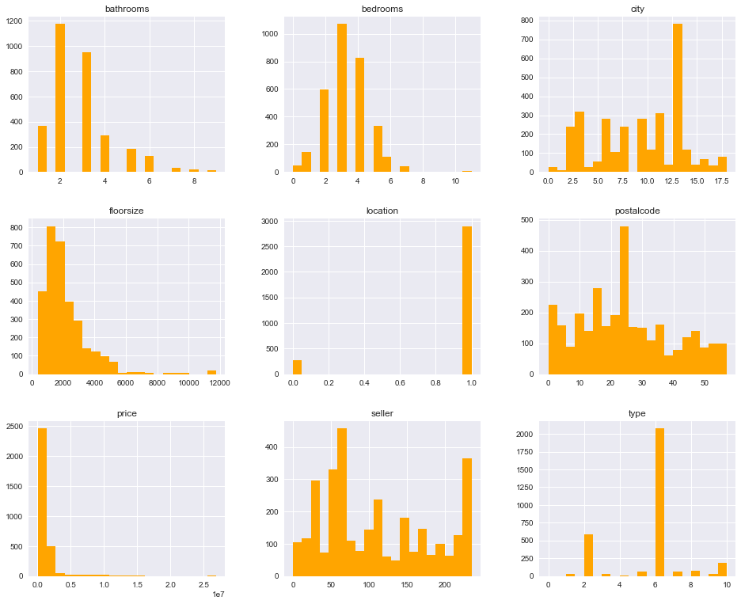
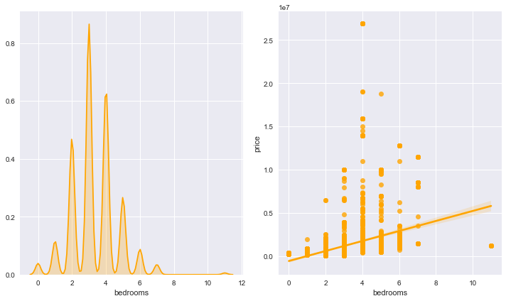
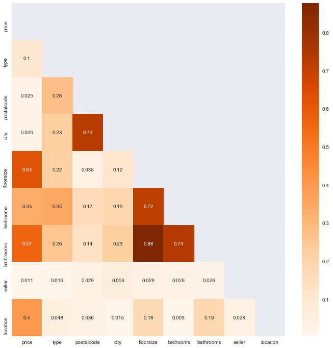
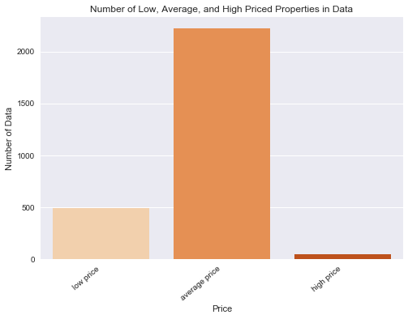
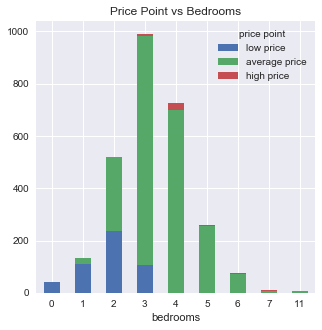
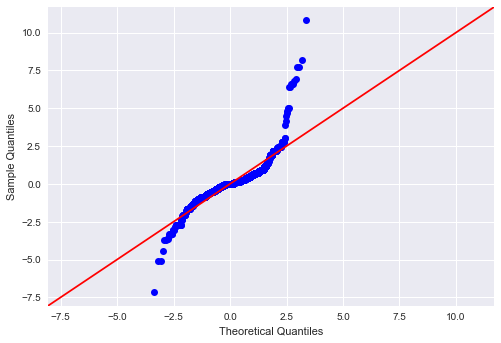
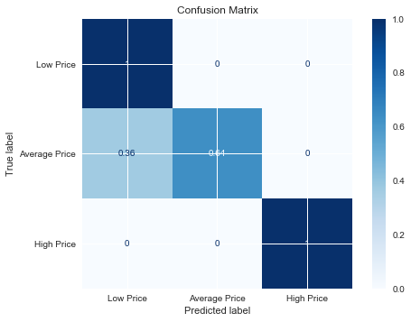
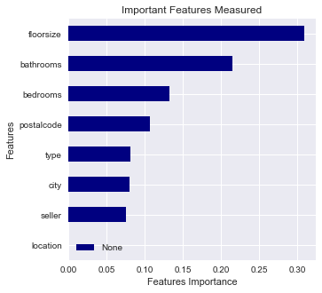

# Zillow Real Estate Pricing (San Diego, CA)

# Introduction

A linear regression model as well as the Random Forest method will be used to compare the relationship between the features and the price. The columns in our data frame are listed below.

    - price of property
    - type of property
    - postalcode
    - city
    - url to listing
    - floorsize in sqft
    - number of bedrooms
    - number of bathrooms
    - agent/company selling the property
    - location: suburb or city

The city and suburbs scrapped in this project are:
    - San Diego and La Jolla (city)
    - Chula Vista, La Mesa, El Cajon, Carlsbad, Escondido, Oceanside, Encinitas, Cardiff, San Marcos, 
      Solana Beach', Del Mar, Coronado, Poway, Santee, Vista, and Spring Valley. (suburbs)
      
The definition of the type of homes are listed below: 
    - House
    - Condo
    - Townhouse 
    - Multi-Family (apartments)
    - Pre-foreclosure (30-120 grace period for current tenents to pay overdue balance)
    - Foreclosure (owners selling the mortgaged property to recover the amount owed)
    - Auction (owned by bank or agent)

The two methods used are OLS and Random Forest Classifier using RandomizedSearchCV. Ordinary Least Squares is a method that estimates the relationship between every variable with the dependent variable. It minimizes the sum of the squares between the observed and predicited values often shown as a linear line. RandomizedSearchCV is an algorithm used to find the best combination of parameters in the model to increase the accuracy of the random forest method in making predictions.

## Functions and Libraries


```python
import requests
import json
import csv
from bs4 import BeautifulSoup
import time
```


```python
class ZillowScraper():
    
    results = []
    #creating list of data scraped from ZillowScrapper.
    
    def __init__ (self, url, params, headers):
        self.url = url
        self.params = params
        self.headers = headers
    #initialize attributes of class
        
    def pull(self, url, params):  
        response = requests.get(url, headers=self.headers, params=params)
        #pull information to scrape
        return response
     
        
    def analyze(self, response):
        
        content = BeautifulSoup(response,'lxml')
        #use Beautiful Soup to parse webpage.
        resident_cards = content.find('ul',{'class': 'photo-cards photo-cards_wow photo-cards_short'})
        for card in resident_cards.contents:
            script =  card.find('script', {'type':'application/ld+json'})
            
            if script:
                json_script = json.loads(script.contents[0])
                self.results.append({
                    'price': card.find('div',{'class':'list-card-price'}).text,
                    'type': card.find('div',{'class':'list-card-type'}).text,
                    'postalcode': json_script['address']['postalCode'],
                    'city': json_script['address']['addressLocality'],
                    'url': json_script['url'],
                    'floorsize': json_script['floorSize']['value'],
                    'bedrooms': card.find_all('li')[0].text,
                    'bathrooms': card.find_all('li')[1].text,
                    'seller': card.find('div',{'class':'list-card-truncate'})
                    })
        #scraping specific property information from search page.        

                    
    def open_csv(self):
    
        with open('sandiego_zillow.csv','w') as csv_file:
            writer = csv.DictWriter(csv_file, fieldnames=self.results[0].keys())
            writer.writeheader()
            
            for row in self.results:
                writer.writerow(row)
        #creating csv file. 
        
    def run(self,n):
               
        for page in range(1,n):

            res = self.pull(self.url, self.params)
            #pulling information
            self.analyze(res.text)
            #formatting information
            time.sleep(2)
            # 2 second time delay
        self.open_csv()   
        #running class through every page in search. 
    
```

## Scraping top San Diego City/Suburbs:


```python
san_diego_url = 'https://www.zillow.com/homes/San-Diego,-CA_rb/?searchQueryState=%7B%22pagination%22%3A%7B%7D%2C%22usersSearchTerm%22%3A%22San%20Diego%2C%20CA%22%2C%22mapBounds%22%3A%7B%22west%22%3A-117.96878306620977%2C%22east%22%3A-116.07364146464727%2C%22south%22%3A32.53452877593171%2C%22north%22%3A33.146047620910394%7D%2C%22regionSelection%22%3A%5B%7B%22regionId%22%3A54296%2C%22regionType%22%3A6%7D%5D%2C%22isMapVisible%22%3Atrue%2C%22filterState%22%3A%7B%22manu%22%3A%7B%22value%22%3Afalse%7D%2C%22land%22%3A%7B%22value%22%3Afalse%7D%7D%2C%22isListVisible%22%3Atrue%2C%22mapZoom%22%3A9%7D'
san_diego_params = {'searchQueryState': '{"pagination":{"currentPage": %s}:"San Diego, CA","mapBounds":{"west":-117.49774424785039,"east":-116.54468028300664,"south":32.66757437532881,"north":33.01371776913924},"regionSelection":[{"regionId":54296,"regionType":6}],"isMapVisible":true,"filterState":{},"isListVisible":true}'}
san_diego_headers = {'accept': 'text/html,application/xhtml+xml,application/xml;q=0.9,image/webp,image/apng,*/*;q=0.8,application/signed-exchange;v=b3;q=0.9',
                'accept-encoding': 'gzip, deflate, br',
                'accept-language': 'en-US,en;q=0.9',
                'cache-control': 'max-age=0',
                'cookie': 'zguid=23|%24bf6750d0-ffc4-4736-bc7c-737656f6257b; _ga=GA1.2.1587369970.1595271965; zjs_anonymous_id=%22bf6750d0-ffc4-4736-bc7c-737656f6257b%22; _pxvid=1053c55a-cabc-11ea-9cc4-0242ac120005; _gcl_au=1.1.944134186.1595271970; _fbp=fb.1.1595271970915.211190209; __gads=ID=e7ff6ce23c96776f:T=1595271971:S=ALNI_MY1JXF--UcnujtoZ-R53SS6jrBTJA; G_ENABLED_IDPS=google; zjs_user_id=%22X1-ZU12ozzrc6awumh_xpn1%22; OptanonConsent=isIABGlobal=false&datestamp=Mon Jul 20 2020 14:22:41 GMT-0500 (Central Daylight Time)&version=5.11.0&landingPath=NotLandingPage&groups=1%3A1%2C3%3A1%2C4%3A0; g_state={"i_p":1596095107745,"i_l":1}; userid=X|3|6f95515a87e0f877%7C5%7CabzX6KUnhr-u9h5VznTfYMD2lNbKaE0_W1xEnVG9dU0%3D; loginmemento=1|a29e259fbede38288d360dedb0645766d8d1d47f1f6e4366006988baa7d78157; ki_r=; optimizelyEndUserId=oeu1596088138433r0.5257272424942192; _pin_unauth=dWlkPU5qZzNNVGMyWm1ZdFpUUTJZaTAwWXpjd0xXRmhPV1V0WW1Kak1XRXdNakZsWW1NMSZycD1kSEoxWlE; ki_s=; zgsession=1|a6cb0293-619f-4881-b035-bbfb56f42169; KruxPixel=true; DoubleClickSession=true; KruxAddition=true; JSESSIONID=9D1E8FB0E97705D2BD01E93F00279956; ZILLOW_SID=1|AAAAAVVbFRIBVVsVEmmXstMaGWiied6mz220J%2BKfkPIImmw0tPVmDqCrXF4O%2Bk%2BmHiLQarmwkTlbt%2Fui0wsqo0MT9rMM; _gid=GA1.2.392708527.1597802195; _derived_epik=dj0yJnU9Q20tZlFlcUdnVWk4Y2hZZG83NzFYYnlPTkZUUnY1Nm4mbj1aVkQxX29UeUNRYjQyREdIcVBad0hBJm09NyZ0PUFBQUFBRjg4aHRj; _px3=d443be8b33272214a9d0d5e9d83d16e9184c6b01165dd354031ee05e5b424eab:4K7NoT3k3hdkjxZpClPQzJinV+uy97j0wctfHLO7G4d5eGZBbanA7nLK5Fh5OdUNJ6yuR/wH+c+NWtzDiInqsw==:1000:bLCztu3syHOoORmqu0976t2LNac2WsCrFVCVCTuoR6DOw2g8nqywpzTvuyRpunh5DRJOq4b9mut9WZb5ulOVfMIdTQIY6whdyJzeer41CWbNEkrzOTFoOTAWdHqcd8XQkUctCNyRJcACoqnMb/IUok4jcMDa9MiQWvmRi+wDbqQ=; intercom-session-xby8p85u=L1dPZDl0dUdGblpmMnovb0hyaUFlSEVEZWRxUmdtc1kzdnV5Q0RyeGpSYWIrWXRxd0w0UlQ5WUVyVVl4MFY1ai0tMUpqcHpyMFdnRzhscmluYjVYN3hxQT09--e5209d9540b33f016a0488c9b2eb8d829e4361a1; _uetsid=4776572acf731b04a40223ea1fd6f89f; _uetvid=c2047787b1af49647f427b434721efa6; _gat=1; ki_t=1596088052742%3B1597763731703%3B1597802794834%3B4%3B111; AWSALB=oOJqzKC5UYOGg4HKEeomCFPM24FL4KJonHAoOzl2mtEq3XzZYya0+1zfWPTASYXM1vNihaDPkxMOrQVKGL9+c+5AxcDoOOCZj12xBsyPI6uumIS0TWjZvdOXnGxe; AWSALBCORS=oOJqzKC5UYOGg4HKEeomCFPM24FL4KJonHAoOzl2mtEq3XzZYya0+1zfWPTASYXM1vNihaDPkxMOrQVKGL9+c+5AxcDoOOCZj12xBsyPI6uumIS0TWjZvdOXnGxe; search=6|1600394794987%7Crect%3D33.01371776913924%252C-116.54468028300664%252C32.66757437532881%252C-117.49774424785039%26rid%3D54296%26disp%3Dmap%26mdm%3Dauto%26p%3D1%26sort%3Ddays%26z%3D0%26pt%3Dpmf%252Cpf%26fs%3D1%26fr%3D0%26mmm%3D1%26rs%3D0%26ah%3D0%26singlestory%3D0%26housing-connector%3D0%26abo%3D0%26garage%3D0%26pool%3D0%26ac%3D0%26waterfront%3D0%26finished%3D0%26unfinished%3D0%26cityview%3D0%26mountainview%3D0%26parkview%3D0%26waterview%3D0%26hoadata%3D1%26zillow-owned%3D0%263dhome%3D0%09%0954296%09%09%09%09%09%09',
                'referer': 'https://www.zillow.com/homes/San-Diego,-CA_rb/?searchQueryState=%7B%22pagination%22%3A%7B%7D%2C%22usersSearchTerm%22%3A%22San%20Diego%2C%20CA%22%2C%22mapBounds%22%3A%7B%22west%22%3A-118.04841296484373%2C%22east%22%3A-116.14228503515623%2C%22south%22%3A32.41986096386817%2C%22north%22%3A33.2276724215883%7D%2C%22regionSelection%22%3A%5B%7B%22regionId%22%3A54296%2C%22regionType%22%3A6%7D%5D%2C%22isMapVisible%22%3Atrue%2C%22filterState%22%3A%7B%22fsba%22%3A%7B%22value%22%3Afalse%7D%2C%22fsbo%22%3A%7B%22value%22%3Afalse%7D%2C%22nc%22%3A%7B%22value%22%3Afalse%7D%2C%22fore%22%3A%7B%22value%22%3Afalse%7D%2C%22cmsn%22%3A%7B%22value%22%3Afalse%7D%2C%22auc%22%3A%7B%22value%22%3Afalse%7D%2C%22pmf%22%3A%7B%22value%22%3Afalse%7D%2C%22pf%22%3A%7B%22value%22%3Afalse%7D%2C%22fr%22%3A%7B%22value%22%3Atrue%7D%7D%2C%22isListVisible%22%3Atrue%2C%22mapZoom%22%3A9%7D',
                'sec-fetch-dest': 'document',
                'sec-fetch-mode': 'navigate',
                'sec-fetch-site': 'same-origin',
                'sec-fetch-user': '?1',
                'upgrade-insecure-requests': '1',
                'user-agent': 'Mozilla/5.0 (Macintosh; Intel Mac OS X 10_15_6) AppleWebKit/537.36 (KHTML, like Gecko) Chrome/84.0.4147.125 Safari/537.36'
              }
if __name__ == '__main__':
    sandiego = ZillowScraper(san_diego_url, san_diego_params, san_diego_headers)
    sandiego.run(21)
```


```python
lajolla_url = 'https://www.zillow.com/homes/la-jolla,-CA_rb/?searchQueryState=%7B%22pagination%22%3A%7B%7D%2C%22usersSearchTerm%22%3A%22la%20jolla%2C%20CA%22%2C%22mapBounds%22%3A%7B%22west%22%3A-117.31402417504884%2C%22east%22%3A-117.19557782495119%2C%22south%22%3A32.82885020178775%2C%22north%22%3A32.867067157909574%7D%2C%22regionSelection%22%3A%5B%7B%22regionId%22%3A46087%2C%22regionType%22%3A8%7D%5D%2C%22isMapVisible%22%3Atrue%2C%22filterState%22%3A%7B%22sch%22%3A%7B%22value%22%3Atrue%7D%2C%22sort%22%3A%7B%22value%22%3A%22globalrelevanceex%22%7D%2C%22manu%22%3A%7B%22value%22%3Afalse%7D%2C%22land%22%3A%7B%22value%22%3Afalse%7D%7D%2C%22isListVisible%22%3Atrue%2C%22mapZoom%22%3A13%7D'
lajolla_params = {
    'searchQueryState': '{"pagination":{},"usersSearchTerm":"la jolla, CA","mapBounds":{"west":-117.31402417504884,"east":-117.19557782495119,"south":32.82885020178775,"north":32.867067157909574},"regionSelection":[{"regionId":46087,"regionType":8}],"isMapVisible":true,"filterState":{"sch":{"value":true},"sort":{"value":"globalrelevanceex"},"manu":{"value":false},"land":{"value":false}},"isListVisible":true,"mapZoom":13}'
                    }
lajolla_headers = {
    'accept': 'text/html,application/xhtml+xml,application/xml;q=0.9,image/webp,image/apng,*/*;q=0.8,application/signed-exchange;v=b3;q=0.9',
    'accept-encoding': 'gzip, deflate, br',
    'accept-language': 'en-US,en;q=0.9',
    'cache-control': 'max-age=0',
    'cookie': 'zguid=23|%24bf6750d0-ffc4-4736-bc7c-737656f6257b; _ga=GA1.2.1587369970.1595271965; zjs_anonymous_id=%22bf6750d0-ffc4-4736-bc7c-737656f6257b%22; _pxvid=1053c55a-cabc-11ea-9cc4-0242ac120005; _gcl_au=1.1.944134186.1595271970; _fbp=fb.1.1595271970915.211190209; __gads=ID=e7ff6ce23c96776f:T=1595271971:S=ALNI_MY1JXF--UcnujtoZ-R53SS6jrBTJA; G_ENABLED_IDPS=google; zjs_user_id=%22X1-ZU12ozzrc6awumh_xpn1%22; OptanonConsent=isIABGlobal=false&datestamp=Mon Jul 20 2020 14:22:41 GMT-0500 (Central Daylight Time)&version=5.11.0&landingPath=NotLandingPage&groups=1%3A1%2C3%3A1%2C4%3A0; g_state={"i_p":1596095107745,"i_l":1}; userid=X|3|6f95515a87e0f877%7C5%7CabzX6KUnhr-u9h5VznTfYMD2lNbKaE0_W1xEnVG9dU0%3D; loginmemento=1|a29e259fbede38288d360dedb0645766d8d1d47f1f6e4366006988baa7d78157; ki_r=; optimizelyEndUserId=oeu1596088138433r0.5257272424942192; _pin_unauth=dWlkPU5qZzNNVGMyWm1ZdFpUUTJZaTAwWXpjd0xXRmhPV1V0WW1Kak1XRXdNakZsWW1NMSZycD1kSEoxWlE; ki_s=; ki_t=1596088052742%3B1597949095124%3B1597951429554%3B5%3B224; zgsession=1|86604a77-c96d-4a8a-b78c-095b42efcd76; _gid=GA1.2.422558928.1598197444; DoubleClickSession=true; KruxPixel=true; KruxAddition=true; ZILLOW_SID=1|AAAAAVVbFRIBVVsVEqAJX2RdwVo6bgahT3PUL4CD4yApNEmKum1WrkrJMrOxq3DheYoJkPkRX4rFeZ2kSfuwn3aVerE5; _gat=1; JSESSIONID=BD9EF2A91C38DF63A6B3755D0FEACB0D; _pxff_cc=U2FtZVNpdGU9TGF4Ow==; _pxff_bsco=1; _derived_epik=dj0yJnU9LThxMkZmTm01RFhtQVpOOGhMbWhZV203cVIya0FtYy0mbj0tTFowUmplU283a2JvaXRheUp0Q1p3Jm09NyZ0PUFBQUFBRjlESnZj; _px3=c0994670efadfe3da35a3e101edc45e101d7da4dae07415bf958b0d20ed92520:Dah3e1RP3mmQtUXNu5yvg1+UQ+QzGBTb+1+VpTfRM8DKFHUOoxwCIq/O/vz43YoMlyzyk1X9OPTTuywCD2Ki9A==:1000:Y/uTux4+ePgNKLkoSfNflNhojuom9eg9Sv4EY59oLm5zgxyqX93lLTRLen/6/emwB4myWFgNkTrL24qurhbQlOwOMsixvmRUhIN6/04OQ6rjJjxBqvGcSx+RyuTyt/o2m8PUbO/PKcQIPER4vJNwGpQdBvVhiCFIJy1OW8Vq6xQ=; intercom-session-xby8p85u=cmZsN2pZR1JuS0RXS1VoNzlJYjVsTjIxYS9LbTZYNWJETDY3T09SVDlUZ3FtamoxcXg3RTUzTWtJZkJBbC9IWi0tc3ZVa2VwS2Mwc2JnNUVTZ3o2TDBxQT09--851ac557faad20a1a53ec4bf8011cff2e35a8dc8; _uetsid=12165f4709e6d8c837d063c0e3be9cca; _uetvid=c2047787b1af49647f427b434721efa6; AWSALB=QUl/1FXi7T/iEOGHXLalqs/ARLXC/c8UNgupDkIAEhoNkDqCj+XuXNG/AWerHZFUI0kOGm4+aPvhVksSDwGGX1VlWuJO8E5pM4onYGKXETM7Ncp69jlgAQRO7jK7; AWSALBCORS=QUl/1FXi7T/iEOGHXLalqs/ARLXC/c8UNgupDkIAEhoNkDqCj+XuXNG/AWerHZFUI0kOGm4+aPvhVksSDwGGX1VlWuJO8E5pM4onYGKXETM7Ncp69jlgAQRO7jK7; search=6|1600828432098%7Crect%3D32.867067157909574%252C-117.19557782495119%252C32.82885020178775%252C-117.31402417504884%26rid%3D46087%26disp%3Dmap%26mdm%3Dauto%26p%3D1%26z%3D0%26sch%3Dprcemh1u%26type%3Dhouse%252Ccondo%252Capartment_duplex%252Ctownhouse%26pt%3Dpmf%252Cpf%26fs%3D1%26fr%3D0%26mmm%3D1%26rs%3D0%26ah%3D0%26singlestory%3D0%26housing-connector%3D0%26abo%3D0%26garage%3D0%26pool%3D0%26ac%3D0%26waterfront%3D0%26finished%3D0%26unfinished%3D0%26cityview%3D0%26mountainview%3D0%26parkview%3D0%26waterview%3D0%26hoadata%3D1%26zillow-owned%3D0%263dhome%3D0%09%0946087%09%09%09%09%09%09',
    'referer': 'https://www.zillow.com/homes/la-jolla,-CA_rb/',
    'sec-fetch-dest': 'document',
    'sec-fetch-mode': 'navigate',
    'sec-fetch-site': 'same-origin',
    'sec-fetch-user': '?1',
    'upgrade-insecure-requests': '1',
    'user-agent': 'Mozilla/5.0 (Macintosh; Intel Mac OS X 10_15_6) AppleWebKit/537.36 (KHTML, like Gecko) Chrome/84.0.4147.135 Safari/537.36'
                    }

if __name__ == '__main__':
    lajolla = ZillowScraper(lajolla_url, lajolla_params, lajolla_headers)
    lajolla.run(8)
```


```python
chulavista_url = 'https://www.zillow.com/homes/Chula-Vista,-CA_rb/?searchQueryState=%7B%22pagination%22%3A%7B%7D%2C%22usersSearchTerm%22%3A%22Chula%20Vista%2C%20CA%22%2C%22mapBounds%22%3A%7B%22west%22%3A-117.14297535009766%2C%22east%22%3A-116.90608264990234%2C%22south%22%3A32.59346421848647%2C%22north%22%3A32.67008377843765%7D%2C%22regionSelection%22%3A%5B%7B%22regionId%22%3A51405%2C%22regionType%22%3A6%7D%5D%2C%22isMapVisible%22%3Atrue%2C%22filterState%22%3A%7B%22sch%22%3A%7B%22value%22%3Atrue%7D%2C%22sort%22%3A%7B%22value%22%3A%22globalrelevanceex%22%7D%7D%2C%22isListVisible%22%3Atrue%2C%22mapZoom%22%3A12%7D'
chulavista_params = {
        'searchQueryState': '{"pagination":{},"usersSearchTerm":"Chula Vista, CA","mapBounds":{"west":-117.14297535009766,"east":-116.90608264990234,"south":32.59346421848647,"north":32.67008377843765},"regionSelection":[{"regionId":51405,"regionType":6}],"isMapVisible":true,"filterState":{"sch":{"value":true},"sort":{"value":"globalrelevanceex"}},"isListVisible":true,"mapZoom":12}'
                    }
chulavista_headers = {
        'accept': 'text/html,application/xhtml+xml,application/xml;q=0.9,image/webp,image/apng,*/*;q=0.8,application/signed-exchange;v=b3;q=0.9',
        'accept-encoding': 'gzip, deflate, br',
        'accept-language': 'en-US,en;q=0.9',
        'cache-control': 'max-age=0',
        'cookie': 'zguid=23|%24bf6750d0-ffc4-4736-bc7c-737656f6257b; _ga=GA1.2.1587369970.1595271965; zjs_anonymous_id=%22bf6750d0-ffc4-4736-bc7c-737656f6257b%22; _pxvid=1053c55a-cabc-11ea-9cc4-0242ac120005; _gcl_au=1.1.944134186.1595271970; _fbp=fb.1.1595271970915.211190209; __gads=ID=e7ff6ce23c96776f:T=1595271971:S=ALNI_MY1JXF--UcnujtoZ-R53SS6jrBTJA; G_ENABLED_IDPS=google; zjs_user_id=%22X1-ZU12ozzrc6awumh_xpn1%22; OptanonConsent=isIABGlobal=false&datestamp=Mon Jul 20 2020 14:22:41 GMT-0500 (Central Daylight Time)&version=5.11.0&landingPath=NotLandingPage&groups=1%3A1%2C3%3A1%2C4%3A0; g_state={"i_p":1596095107745,"i_l":1}; userid=X|3|6f95515a87e0f877%7C5%7CabzX6KUnhr-u9h5VznTfYMD2lNbKaE0_W1xEnVG9dU0%3D; loginmemento=1|a29e259fbede38288d360dedb0645766d8d1d47f1f6e4366006988baa7d78157; ki_r=; optimizelyEndUserId=oeu1596088138433r0.5257272424942192; _pin_unauth=dWlkPU5qZzNNVGMyWm1ZdFpUUTJZaTAwWXpjd0xXRmhPV1V0WW1Kak1XRXdNakZsWW1NMSZycD1kSEoxWlE; ki_s=; ki_t=1596088052742%3B1597949095124%3B1597951429554%3B5%3B224; zgsession=1|86604a77-c96d-4a8a-b78c-095b42efcd76; _gid=GA1.2.422558928.1598197444; DoubleClickSession=true; ZILLOW_SID=1|AAAAAVVbFRIBVVsVEmoVDil444xOoWriMVHhRnmZtTup%2BiaqpD90UpoS9nJtbLajmis2YvScdJMzJN%2FK2zAf8oFDCXMo; JSESSIONID=3CFED4545389AE56DDB19176989B1816; KruxPixel=true; KruxAddition=true; _derived_epik=dj0yJnU9V21iaEJ5ZkxBMFBFY3FfTzE1c1ozY2xIZkdrX19xeEQmbj1nSlJuZm5fVUlEWFdlcmM5anB2bXFnJm09NyZ0PUFBQUFBRjlDNktB; _gat=1; _pxff_cc=U2FtZVNpdGU9TGF4Ow==; _pxff_bsco=1; _px3=bdc7057e1f4f4687f992dba92a751634de7b914c02cb11554cf779524f53c915:JuC1ucon+WaUD6EnLaKGnRonxaHeNBOivYGbypqwZ/XPisZXPvw3AuUKD8Bs5UoeTRsop9oS5aQ4krnQ7Gh4gQ==:1000:Qx1QMh0Psym9qXowbpPlv0S87LUi7PVGWzmEoE5XNNjAd/4UybEMj4wdsEoLGxXoGf6V2QgxnXGA7i0gb6bcm3vyZ8I42p8VYCB3Yj1RzlO6yFyGwi7aYrwsoftvpoTGc3VXS+0UAhUbDsYa5omcHoRvygNErca2aOGgrvVog+w=; intercom-session-xby8p85u=Wk00MEhhaDBBRTcxbVpjTERJajVOeVg4amE4NnlpVnBYYVE2UUtFK1FaYlV6cW1SemZsT09oNVduYnppZE1RZi0teEgvdWNlV2F1VnlObUNtRWlZNUtVUT09--31eeeafafaede1a570ef927b08649ea62d7f64e5; _uetsid=12165f4709e6d8c837d063c0e3be9cca; _uetvid=c2047787b1af49647f427b434721efa6; AWSALB=FhDNcWc8hxtHDsdqb4jIfUZZKKNKhT9Uvu9UlaYDh3WaNj3Okeh7hDz7T5d8QGVZfH81SaPBv3KQSTpD71QTGfxCUQHu7exarDymES9u9VzrshS1wrjiDNDPIWhX; AWSALBCORS=FhDNcWc8hxtHDsdqb4jIfUZZKKNKhT9Uvu9UlaYDh3WaNj3Okeh7hDz7T5d8QGVZfH81SaPBv3KQSTpD71QTGfxCUQHu7exarDymES9u9VzrshS1wrjiDNDPIWhX; search=6|1600812635107%7Crect%3D32.67008377843765%252C-116.90608264990234%252C32.59346421848647%252C-117.14297535009766%26rid%3D51405%26disp%3Dmap%26mdm%3Dauto%26p%3D1%26z%3D0%26sch%3Dprcemh1u%26pt%3Dpmf%252Cpf%26fs%3D1%26fr%3D0%26mmm%3D1%26rs%3D0%26ah%3D0%26singlestory%3D0%26housing-connector%3D0%26abo%3D0%26garage%3D0%26pool%3D0%26ac%3D0%26waterfront%3D0%26finished%3D0%26unfinished%3D0%26cityview%3D0%26mountainview%3D0%26parkview%3D0%26waterview%3D0%26hoadata%3D1%26zillow-owned%3D0%263dhome%3D0%09%0951405%09%09%09%09%09%09',
        'referer': 'https://www.zillow.com/homes/Chula-Vista,-CA_rb/',
        'sec-fetch-dest': 'document',
        'sec-fetch-mode': 'navigate',
        'sec-fetch-site': 'same-origin',
        'sec-fetch-user': '?1',
        'upgrade-insecure-requests': '1',
        'user-agent': 'Mozilla/5.0 (Macintosh; Intel Mac OS X 10_15_6) AppleWebKit/537.36 (KHTML, like Gecko) Chrome/84.0.4147.135 Safari/537.36'
                    }

if __name__ == '__main__':
    chulavista = ZillowScraper(chulavista_url, chulavista_params, chulavista_headers)
    chulavista.run(9)
```


```python
lamesa_url = 'https://www.zillow.com/homes/La-Mesa,-CA_rb/?searchQueryState=%7B%22pagination%22%3A%7B%7D%2C%22usersSearchTerm%22%3A%22La%20Mesa%2C%20CA%22%2C%22mapBounds%22%3A%7B%22west%22%3A-117.11242935009767%2C%22east%22%3A-116.87553664990236%2C%22south%22%3A32.72962949424513%2C%22north%22%3A32.806132295074505%7D%2C%22regionSelection%22%3A%5B%7B%22regionId%22%3A46089%2C%22regionType%22%3A6%7D%5D%2C%22isMapVisible%22%3Atrue%2C%22filterState%22%3A%7B%22sch%22%3A%7B%22value%22%3Atrue%7D%2C%22sort%22%3A%7B%22value%22%3A%22globalrelevanceex%22%7D%7D%2C%22isListVisible%22%3Atrue%2C%22mapZoom%22%3A12%7D'
lamesa_params = {'searchQueryState': '{"pagination":{},"usersSearchTerm":"La Mesa, CA","mapBounds":{"west":-117.11242935009767,"east":-116.87553664990236,"south":32.72962949424513,"north":32.806132295074505},"regionSelection":[{"regionId":46089,"regionType":6}],"isMapVisible":true,"filterState":{"sch":{"value":true},"sort":{"value":"globalrelevanceex"}},"isListVisible":true,"mapZoom":12}'}
lamesa_headers = {
    'accept': 'text/html,application/xhtml+xml,application/xml;q=0.9,image/webp,image/apng,*/*;q=0.8,application/signed-exchange;v=b3;q=0.9',
    'accept-encoding': 'gzip, deflate, br',
    'accept-language': 'en-US,en;q=0.9',
    'cache-control': 'max-age=0',
    'cookie': 'zguid=23|%24bf6750d0-ffc4-4736-bc7c-737656f6257b; _ga=GA1.2.1587369970.1595271965; zjs_anonymous_id=%22bf6750d0-ffc4-4736-bc7c-737656f6257b%22; _pxvid=1053c55a-cabc-11ea-9cc4-0242ac120005; _gcl_au=1.1.944134186.1595271970; _fbp=fb.1.1595271970915.211190209; __gads=ID=e7ff6ce23c96776f:T=1595271971:S=ALNI_MY1JXF--UcnujtoZ-R53SS6jrBTJA; G_ENABLED_IDPS=google; zjs_user_id=%22X1-ZU12ozzrc6awumh_xpn1%22; OptanonConsent=isIABGlobal=false&datestamp=Mon Jul 20 2020 14:22:41 GMT-0500 (Central Daylight Time)&version=5.11.0&landingPath=NotLandingPage&groups=1%3A1%2C3%3A1%2C4%3A0; g_state={"i_p":1596095107745,"i_l":1}; userid=X|3|6f95515a87e0f877%7C5%7CabzX6KUnhr-u9h5VznTfYMD2lNbKaE0_W1xEnVG9dU0%3D; loginmemento=1|a29e259fbede38288d360dedb0645766d8d1d47f1f6e4366006988baa7d78157; ki_r=; optimizelyEndUserId=oeu1596088138433r0.5257272424942192; _pin_unauth=dWlkPU5qZzNNVGMyWm1ZdFpUUTJZaTAwWXpjd0xXRmhPV1V0WW1Kak1XRXdNakZsWW1NMSZycD1kSEoxWlE; ki_s=; ki_t=1596088052742%3B1597949095124%3B1597951429554%3B5%3B224; zgsession=1|86604a77-c96d-4a8a-b78c-095b42efcd76; _gid=GA1.2.422558928.1598197444; DoubleClickSession=true; ZILLOW_SID=1|AAAAAVVbFRIBVVsVEmoVDil444xOoWriMVHhRnmZtTup%2BiaqpD90UpoS9nJtbLajmis2YvScdJMzJN%2FK2zAf8oFDCXMo; JSESSIONID=3CFED4545389AE56DDB19176989B1816; KruxPixel=true; KruxAddition=true; _gat=1; _pxff_cc=U2FtZVNpdGU9TGF4Ow==; _pxff_bsco=1; _derived_epik=dj0yJnU9cFZpbWtYMjJUQmZIRlF6TURpb2pzTU4zUEVRTElONUYmbj1YZWFlX2RYVnFVN3FOa0Q0ZWZvTjRRJm09NyZ0PUFBQUFBRjlDNzlR; _px3=dd510856a30ffe4f2f906f2fe8c9e3de0aec946a88e3685b69f027515cee9335:8hrxMCfdeyls5vfcPxFiUo8ePoHe15yGQIrrGKmwqliWlPlFb8VDE3dKj322LnFqIPuTKYk0YUHvaZbpesH5xg==:1000:fY4RBvP1jUCkF+XW0mfIvZx6NdIP8Mq35VV6Whrku9wu/5ypH2ln37Q+AeDis+MyPDm4ycw2YNwycO1F9yCxVrDNljCR+WnLcFuE6P2a+z/2JR8po6jKgm5yRMqpnpmcDuO0qT8QXnS8CTjNk/Z64lo05XeWmTukrq+rNIODwr8=; intercom-session-xby8p85u=MGJWdTU0TDJlR2N0ZGdGUzZYTHZxcWxhQVhsM1dxRU4ydDJRemN0eHJ1TTR1MHQrUGRURSszUnNHK05rT2pITi0tMzdKVWUwMFNtbThHZGJwRVpJSDdmdz09--d13189df1f2b9ae11f5bc50a186619727fc64250; _uetsid=12165f4709e6d8c837d063c0e3be9cca; _uetvid=c2047787b1af49647f427b434721efa6; AWSALB=Ex/ROIJL7p2MJA6DBQAv9MZbqa9rLoBh470ey4mGy53kTkGQUMmCZDFNkopttYN4J2T5aySBpgAAhkJtSJxpCxThoSYhZHRo5QNLWxsZMW8MJwUiBXpVnG2umxCb; AWSALBCORS=Ex/ROIJL7p2MJA6DBQAv9MZbqa9rLoBh470ey4mGy53kTkGQUMmCZDFNkopttYN4J2T5aySBpgAAhkJtSJxpCxThoSYhZHRo5QNLWxsZMW8MJwUiBXpVnG2umxCb; search=6|1600814302472%7Crect%3D32.806132295074505%252C-116.87553664990236%252C32.72962949424513%252C-117.11242935009767%26rid%3D46089%26disp%3Dmap%26mdm%3Dauto%26p%3D1%26z%3D0%26sch%3Dprcemh1u%26pt%3Dpmf%252Cpf%26fs%3D1%26fr%3D0%26mmm%3D1%26rs%3D0%26ah%3D0%26singlestory%3D0%26housing-connector%3D0%26abo%3D0%26garage%3D0%26pool%3D0%26ac%3D0%26waterfront%3D0%26finished%3D0%26unfinished%3D0%26cityview%3D0%26mountainview%3D0%26parkview%3D0%26waterview%3D0%26hoadata%3D1%26zillow-owned%3D0%263dhome%3D0%09%0946089%09%09%09%09%09%09',
    'referer': 'https://www.zillow.com/homes/Escondido,-CA_rb/?searchQueryState=%7B%22pagination%22%3A%7B%7D%2C%22usersSearchTerm%22%3A%22Escondido%2C%20CA%22%2C%22mapBounds%22%3A%7B%22west%22%3A-117.51274940039063%2C%22east%22%3A-116.56517859960938%2C%22south%22%3A32.99677584858403%2C%22north%22%3A33.358839537831976%7D%2C%22regionSelection%22%3A%5B%7B%22regionId%22%3A11337%2C%22regionType%22%3A6%7D%5D%2C%22isMapVisible%22%3Atrue%2C%22filterState%22%3A%7B%22sch%22%3A%7B%22value%22%3Atrue%7D%2C%22sort%22%3A%7B%22value%22%3A%22globalrelevanceex%22%7D%7D%2C%22isListVisible%22%3Atrue%7D',
    'sec-fetch-dest': 'document',
    'sec-fetch-mode': 'navigate',
    'sec-fetch-site': 'same-origin',
    'sec-fetch-user': '?1',
    'upgrade-insecure-requests': '1',
    'user-agent': 'Mozilla/5.0 (Macintosh; Intel Mac OS X 10_15_6) AppleWebKit/537.36 (KHTML, like Gecko) Chrome/84.0.4147.135 Safari/537.36'
                    }

if __name__ == '__main__':
    lamesa = ZillowScraper(lamesa_url,lamesa_params,lamesa_headers)
    lamesa.run(4)
```


```python
elcajon_url = 'https://www.zillow.com/homes/El-Cajon,-CA_rb/?searchQueryState=%7B%22pagination%22%3A%7B%7D%2C%22usersSearchTerm%22%3A%22El%20Cajon%2C%20CA%22%2C%22mapBounds%22%3A%7B%22west%22%3A-117.01434835009763%2C%22east%22%3A-116.77745564990232%2C%22south%22%3A32.77151445525491%2C%22north%22%3A32.84798125371526%7D%2C%22regionSelection%22%3A%5B%7B%22regionId%22%3A38333%2C%22regionType%22%3A6%7D%5D%2C%22isMapVisible%22%3Atrue%2C%22filterState%22%3A%7B%22sch%22%3A%7B%22value%22%3Atrue%7D%2C%22sort%22%3A%7B%22value%22%3A%22globalrelevanceex%22%7D%7D%2C%22isListVisible%22%3Atrue%2C%22mapZoom%22%3A12%7D'
elcajon_params = {
    'searchQueryState': '{"pagination":{},"usersSearchTerm":"El Cajon, CA","mapBounds":{"west":-117.01434835009763,"east":-116.77745564990232,"south":32.77151445525491,"north":32.84798125371526},"regionSelection":[{"regionId":38333,"regionType":6}],"isMapVisible":true,"filterState":{"sch":{"value":true},"sort":{"value":"globalrelevanceex"}},"isListVisible":true,"mapZoom":12}'
                }
elcajon_headers = {
    'accept': 'text/html,application/xhtml+xml,application/xml;q=0.9,image/webp,image/apng,*/*;q=0.8,application/signed-exchange;v=b3;q=0.9',
    'accept-encoding': 'gzip, deflate, br',
    'accept-language': 'en-US,en;q=0.9',
    'cache-control': 'max-age=0',
    'cookie': 'zguid=23|%24bf6750d0-ffc4-4736-bc7c-737656f6257b; _ga=GA1.2.1587369970.1595271965; zjs_anonymous_id=%22bf6750d0-ffc4-4736-bc7c-737656f6257b%22; _pxvid=1053c55a-cabc-11ea-9cc4-0242ac120005; _gcl_au=1.1.944134186.1595271970; _fbp=fb.1.1595271970915.211190209; __gads=ID=e7ff6ce23c96776f:T=1595271971:S=ALNI_MY1JXF--UcnujtoZ-R53SS6jrBTJA; G_ENABLED_IDPS=google; zjs_user_id=%22X1-ZU12ozzrc6awumh_xpn1%22; OptanonConsent=isIABGlobal=false&datestamp=Mon Jul 20 2020 14:22:41 GMT-0500 (Central Daylight Time)&version=5.11.0&landingPath=NotLandingPage&groups=1%3A1%2C3%3A1%2C4%3A0; g_state={"i_p":1596095107745,"i_l":1}; userid=X|3|6f95515a87e0f877%7C5%7CabzX6KUnhr-u9h5VznTfYMD2lNbKaE0_W1xEnVG9dU0%3D; loginmemento=1|a29e259fbede38288d360dedb0645766d8d1d47f1f6e4366006988baa7d78157; ki_r=; optimizelyEndUserId=oeu1596088138433r0.5257272424942192; _pin_unauth=dWlkPU5qZzNNVGMyWm1ZdFpUUTJZaTAwWXpjd0xXRmhPV1V0WW1Kak1XRXdNakZsWW1NMSZycD1kSEoxWlE; ki_s=; ki_t=1596088052742%3B1597949095124%3B1597951429554%3B5%3B224; zgsession=1|86604a77-c96d-4a8a-b78c-095b42efcd76; _gid=GA1.2.422558928.1598197444; DoubleClickSession=true; ZILLOW_SID=1|AAAAAVVbFRIBVVsVEmoVDil444xOoWriMVHhRnmZtTup%2BiaqpD90UpoS9nJtbLajmis2YvScdJMzJN%2FK2zAf8oFDCXMo; JSESSIONID=3CFED4545389AE56DDB19176989B1816; KruxPixel=true; KruxAddition=true; _derived_epik=dj0yJnU9YjVRMTRpb0JSYlpxQjNpUVE5Qm9zS1A4SGZoSGlpZGgmbj1lbTktcEFQUFBYZkRZSjAwZENoTXZBJm09NyZ0PUFBQUFBRjlDLWZJ; _gat=1; _pxff_cc=U2FtZVNpdGU9TGF4Ow==; _pxff_bsco=1; _px3=3d2421128708e90c4ad312b5bc7c1b430bc50d3cf07ee06e0305d089b4d447f5:ZLC14YV8SC+anaO1YRAskCWn9JNTz3HLEh5X4yBkmb4O2cI3qASRUElUzpyb5JbHf+TJAPi4+ramu800XOXTPQ==:1000:KvlW71KACBYgdYtIE8tDoZFu+mNqJEx3Q5tUE+QNYfj36FUPZwAkNLF7+xyJTClh9QMbL/dVSg27V2MlKMuCjKrNegP7VguZR7plrXkO+llgF05j2xeMoLRqGQYchhXntMf5MmlDtu1paOuRKXJlL4v5UyJ9VfS7HMH1KqE34U4=; intercom-session-xby8p85u=WkhIQk9CTzdYMndpdUJ0bUsyd1dPa2ZlTDBESUpVVFBhT0xpMlRtaDhidzM4QnBxUnpPVVIrVGpPNkZ4bGFFZC0tMUdaaVZGMzZhM0FBb0R3b3N3Q2ludz09--1564ad215ec7376d84aba1febf67d680b596a97a; _uetsid=12165f4709e6d8c837d063c0e3be9cca; _uetvid=c2047787b1af49647f427b434721efa6; AWSALB=HHbLgsrwuunD9m5iLeeV6Z1ybcFWLtOY/Kbt0d7Uc3iSq4FN+Km6u/jkweWYdehrmbt2AD26VjNvQE5qTkRWoOyg/vP++H0o4VbWcM3jSsxcU+H/UhNuEVcA0vYs; AWSALBCORS=HHbLgsrwuunD9m5iLeeV6Z1ybcFWLtOY/Kbt0d7Uc3iSq4FN+Km6u/jkweWYdehrmbt2AD26VjNvQE5qTkRWoOyg/vP++H0o4VbWcM3jSsxcU+H/UhNuEVcA0vYs; search=6|1600817011174%7Crect%3D32.84798125371526%252C-116.77745564990232%252C32.77151445525491%252C-117.01434835009763%26rid%3D38333%26disp%3Dmap%26mdm%3Dauto%26p%3D1%26z%3D0%26sch%3Dprcemh1u%26pt%3Dpmf%252Cpf%26fs%3D1%26fr%3D0%26mmm%3D1%26rs%3D0%26ah%3D0%26singlestory%3D0%26housing-connector%3D0%26abo%3D0%26garage%3D0%26pool%3D0%26ac%3D0%26waterfront%3D0%26finished%3D0%26unfinished%3D0%26cityview%3D0%26mountainview%3D0%26parkview%3D0%26waterview%3D0%26hoadata%3D1%26zillow-owned%3D0%263dhome%3D0%09%0938333%09%09%09%09%09%09',
    'referer': 'https://www.zillow.com/homes/El-Cajon,-CA_rb/',
    'sec-fetch-dest': 'document',
    'sec-fetch-mode': 'navigate',
    'sec-fetch-site': 'same-origin',
    'sec-fetch-user': '?1',
    'upgrade-insecure-requests': '1',
    'user-agent': 'Mozilla/5.0 (Macintosh; Intel Mac OS X 10_15_6) AppleWebKit/537.36 (KHTML, like Gecko) Chrome/84.0.4147.135 Safari/537.36'
                    }

if __name__ == '__main__':
    elcajon = ZillowScraper(elcajon_url, elcajon_params,elcajon_headers)
    elcajon.run(8)
```


```python
carlsbad_url = 'https://www.zillow.com/homes/Carlsbad,-CA_rb/?searchQueryState=%7B%22pagination%22%3A%7B%7D%2C%22usersSearchTerm%22%3A%22Carlsbad%2C%20CA%22%2C%22mapBounds%22%3A%7B%22west%22%3A-117.39995085009765%2C%22east%22%3A-117.16305814990234%2C%22south%22%3A33.08372161714682%2C%22north%22%3A33.159918772259466%7D%2C%22regionSelection%22%3A%5B%7B%22regionId%22%3A3975%2C%22regionType%22%3A6%7D%5D%2C%22isMapVisible%22%3Atrue%2C%22filterState%22%3A%7B%22sch%22%3A%7B%22value%22%3Atrue%7D%2C%22manu%22%3A%7B%22value%22%3Afalse%7D%2C%22land%22%3A%7B%22value%22%3Afalse%7D%7D%2C%22isListVisible%22%3Atrue%2C%22mapZoom%22%3A12%7D'
carlsbad_params = {
    'searchQueryState': '{"pagination":{},"usersSearchTerm":"Carlsbad, CA","mapBounds":{"west":-117.39995085009765,"east":-117.16305814990234,"south":33.08372161714682,"north":33.159918772259466},"regionSelection":[{"regionId":3975,"regionType":6}],"isMapVisible":true,"filterState":{"sch":{"value":true},"manu":{"value":false},"land":{"value":false}},"isListVisible":true,"mapZoom":12}'
                    }
carlsbad_headers = {
    'accept': 'text/html,application/xhtml+xml,application/xml;q=0.9,image/webp,image/apng,*/*;q=0.8,application/signed-exchange;v=b3;q=0.9',
    'accept-encoding': 'gzip, deflate, br',
    'accept-language': 'en-US,en;q=0.9',
    'cache-control': 'max-age=0',
    'cookie': 'zguid=23|%24bf6750d0-ffc4-4736-bc7c-737656f6257b; _ga=GA1.2.1587369970.1595271965; zjs_anonymous_id=%22bf6750d0-ffc4-4736-bc7c-737656f6257b%22; _pxvid=1053c55a-cabc-11ea-9cc4-0242ac120005; _gcl_au=1.1.944134186.1595271970; _fbp=fb.1.1595271970915.211190209; __gads=ID=e7ff6ce23c96776f:T=1595271971:S=ALNI_MY1JXF--UcnujtoZ-R53SS6jrBTJA; G_ENABLED_IDPS=google; zjs_user_id=%22X1-ZU12ozzrc6awumh_xpn1%22; OptanonConsent=isIABGlobal=false&datestamp=Mon Jul 20 2020 14:22:41 GMT-0500 (Central Daylight Time)&version=5.11.0&landingPath=NotLandingPage&groups=1%3A1%2C3%3A1%2C4%3A0; g_state={"i_p":1596095107745,"i_l":1}; userid=X|3|6f95515a87e0f877%7C5%7CabzX6KUnhr-u9h5VznTfYMD2lNbKaE0_W1xEnVG9dU0%3D; loginmemento=1|a29e259fbede38288d360dedb0645766d8d1d47f1f6e4366006988baa7d78157; ki_r=; optimizelyEndUserId=oeu1596088138433r0.5257272424942192; _pin_unauth=dWlkPU5qZzNNVGMyWm1ZdFpUUTJZaTAwWXpjd0xXRmhPV1V0WW1Kak1XRXdNakZsWW1NMSZycD1kSEoxWlE; ki_s=; ki_t=1596088052742%3B1597949095124%3B1597951429554%3B5%3B224; zgsession=1|86604a77-c96d-4a8a-b78c-095b42efcd76; DoubleClickSession=true; KruxPixel=true; KruxAddition=true; _gid=GA1.2.612872810.1598407954; JSESSIONID=89B940B5E855310E6E0F52F0B99622DB; ZILLOW_SID=1|AAAAAVVbFRIBVVsVEtTcb3iksrkhx1yTFnFnp8o2IZp4XX0ywk1a4aJenH7ifsHeorNmdZcF4oRi2wxG3eH2OEFmUYmr; _derived_epik=dj0yJnU9MDMtdFlJV2haWE11YUM3emFTMV9KOHo4dUtDQjZORk8mbj1DOEo0TjQ4ZWsyUmRZZnprbjNELTJBJm09NyZ0PUFBQUFBRjlGOXFJ; _gat=1; _pxff_cc=U2FtZVNpdGU9TGF4Ow==; _pxff_bsco=1; _px3=45163a2f6217520769e17355705f65072a3adac621f6e906671fb1eb128236da:yUaqp95JauJATd35c5U8I0mACyuiD6X4COR9n7lmhfl/utfIlvsh9skudqjIgB+U+GmXlhe31RIYUfKAdvwgbw==:1000:Y4ZwpBfqScw9B2vSyNgi8bsOSgbke2mPaJBYeiJvPKgXStAfweY3ORM3f9rHmKyOhygRzL5/JXV56vMOdBM9YsSvXpaYsKZfRID4qPW7L4RpMKmGMTDEBTHzDZd+HfQ6+TwqQbSIJslCMpsGFzaT3agByvFky/Z4Nnv/LRaAiyU=; intercom-session-xby8p85u=cDdFeis3WnAvdDhObzdWeFBTbVE0YXFySENqMHJNSGZSL0R5dVBnbTBXaHkxdjdrY3R2eENrK2FrTzhPNGtVRS0tQW5DV2RlekQydFBiYksxTitCbkw2QT09--5ebd9c1ec18c532a9685f9ebb98dd95af2adf613; _uetsid=0d2e531968d37437d5cce675ebb2eb1c; _uetvid=c2047787b1af49647f427b434721efa6; AWSALB=UWz20lxLyFSlRRblRFEPVEtSQEyp9ZwiAzRcbPDksemjPxTaSKRP3mIJrBYYPSAJbq5Sg1BP7JFjUsWhAg1rmH6hcFVW4KiQz9r2F7fDnh9qwWUXVujXrmIz3adG; AWSALBCORS=UWz20lxLyFSlRRblRFEPVEtSQEyp9ZwiAzRcbPDksemjPxTaSKRP3mIJrBYYPSAJbq5Sg1BP7JFjUsWhAg1rmH6hcFVW4KiQz9r2F7fDnh9qwWUXVujXrmIz3adG; search=6|1601013907419%7Crect%3D33.159918772259466%252C-117.16305814990234%252C33.08372161714682%252C-117.39995085009765%26rid%3D3975%26disp%3Dmap%26mdm%3Dauto%26p%3D1%26sort%3Ddays%26z%3D0%26sch%3Dprcemh1u%26type%3Dhouse%252Ccondo%252Capartment_duplex%252Ctownhouse%26pt%3Dpmf%252Cpf%26fs%3D1%26fr%3D0%26mmm%3D1%26rs%3D0%26ah%3D0%26singlestory%3D0%26housing-connector%3D0%26abo%3D0%26garage%3D0%26pool%3D0%26ac%3D0%26waterfront%3D0%26finished%3D0%26unfinished%3D0%26cityview%3D0%26mountainview%3D0%26parkview%3D0%26waterview%3D0%26hoadata%3D1%26zillow-owned%3D0%263dhome%3D0%09%093975%09%09%09%09%09%09',
    'referer': 'https://www.zillow.com/homes/Carlsbad,-CA_rb/',
    'sec-fetch-dest': 'document',
    'sec-fetch-mode': 'navigate',
    'sec-fetch-site': 'same-origin',
    'sec-fetch-user': '?1',
    'upgrade-insecure-requests': '1',
    'user-agent': 'Mozilla/5.0 (Macintosh; Intel Mac OS X 10_15_6) AppleWebKit/537.36 (KHTML, like Gecko) Chrome/84.0.4147.135 Safari/537.36'
                    }

if __name__ == '__main__':
    carlsbad = ZillowScraper(carlsbad_url,carlsbad_params,carlsbad_headers)
    carlsbad.run(7)
```


```python
escondido_url = 'https://www.zillow.com/homes/Escondido,-CA_rb/?searchQueryState=%7B%22pagination%22%3A%7B%7D%2C%22usersSearchTerm%22%3A%22Escondido%2C%20CA%22%2C%22mapBounds%22%3A%7B%22west%22%3A-117.27585670019532%2C%22east%22%3A-116.8020712998047%2C%22south%22%3A33.10181322478786%2C%22north%22%3A33.25410997538318%7D%2C%22regionSelection%22%3A%5B%7B%22regionId%22%3A11337%2C%22regionType%22%3A6%7D%5D%2C%22isMapVisible%22%3Atrue%2C%22filterState%22%3A%7B%22sch%22%3A%7B%22value%22%3Atrue%7D%2C%22sort%22%3A%7B%22value%22%3A%22globalrelevanceex%22%7D%2C%22manu%22%3A%7B%22value%22%3Afalse%7D%2C%22land%22%3A%7B%22value%22%3Afalse%7D%7D%2C%22isListVisible%22%3Atrue%2C%22mapZoom%22%3A11%7D'
escondido_params = {
    'searchQueryState': '{"pagination":{},"usersSearchTerm":"Escondido, CA","mapBounds":{"west":-117.51274940039063,"east":-116.56517859960938,"south":33.0255656707587,"north":33.33015901794086},"regionSelection":[{"regionId":11337,"regionType":6}],"isMapVisible":true,"filterState":{"sch":{"value":true},"sort":{"value":"globalrelevanceex"}},"isListVisible":true}'
} 
escondido_headers = {
    'accept': 'text/html,application/xhtml+xml,application/xml;q=0.9,image/webp,image/apng,*/*;q=0.8,application/signed-exchange;v=b3;q=0.9',
    'accept-encoding': 'gzip, deflate, br',
    'accept-language': 'en-US,en;q=0.9',
    'cache-control': 'max-age=0',
    'cookie': 'zguid=23|%24bf6750d0-ffc4-4736-bc7c-737656f6257b; _ga=GA1.2.1587369970.1595271965; zjs_anonymous_id=%22bf6750d0-ffc4-4736-bc7c-737656f6257b%22; _pxvid=1053c55a-cabc-11ea-9cc4-0242ac120005; _gcl_au=1.1.944134186.1595271970; _fbp=fb.1.1595271970915.211190209; __gads=ID=e7ff6ce23c96776f:T=1595271971:S=ALNI_MY1JXF--UcnujtoZ-R53SS6jrBTJA; G_ENABLED_IDPS=google; zjs_user_id=%22X1-ZU12ozzrc6awumh_xpn1%22; OptanonConsent=isIABGlobal=false&datestamp=Mon Jul 20 2020 14:22:41 GMT-0500 (Central Daylight Time)&version=5.11.0&landingPath=NotLandingPage&groups=1%3A1%2C3%3A1%2C4%3A0; g_state={"i_p":1596095107745,"i_l":1}; userid=X|3|6f95515a87e0f877%7C5%7CabzX6KUnhr-u9h5VznTfYMD2lNbKaE0_W1xEnVG9dU0%3D; loginmemento=1|a29e259fbede38288d360dedb0645766d8d1d47f1f6e4366006988baa7d78157; ki_r=; optimizelyEndUserId=oeu1596088138433r0.5257272424942192; _pin_unauth=dWlkPU5qZzNNVGMyWm1ZdFpUUTJZaTAwWXpjd0xXRmhPV1V0WW1Kak1XRXdNakZsWW1NMSZycD1kSEoxWlE; ki_s=; ki_t=1596088052742%3B1597949095124%3B1597951429554%3B5%3B224; zgsession=1|86604a77-c96d-4a8a-b78c-095b42efcd76; _gid=GA1.2.422558928.1598197444; DoubleClickSession=true; ZILLOW_SID=1|AAAAAVVbFRIBVVsVEmoVDil444xOoWriMVHhRnmZtTup%2BiaqpD90UpoS9nJtbLajmis2YvScdJMzJN%2FK2zAf8oFDCXMo; JSESSIONID=3CFED4545389AE56DDB19176989B1816; KruxPixel=true; KruxAddition=true; _derived_epik=dj0yJnU9V21iaEJ5ZkxBMFBFY3FfTzE1c1ozY2xIZkdrX19xeEQmbj1nSlJuZm5fVUlEWFdlcmM5anB2bXFnJm09NyZ0PUFBQUFBRjlDNktB; _pxff_tm=1; _px3=dcd75056dbf9f561e239b35cd1220160fc282537c47cfc8b2f1af1775c591b6e:+4TvqdKBusabF4mlWbIZgxjgOmhUMzAUVgbXKk9NQC+xl/UbpszhqPfcVvkj4Uy8DXEnOHiS83orpPkgKVQl2w==:1000:pJp+UY3z5FoAocoC1nq0lvw1anuSi7dKoX6v9f44R42OKWAve0sIXqWbQZBCzZUlOAbOe6tqTSnQgjoB1aBwA9qUJ9B9hCr0T7Xr8Z394P7y2BD8yhJjvI25R0CM6uRwcgUWccAhHiq3/kGJqcb00bqKwpIgHPHS5Vi63T8iLHg=; _uetsid=12165f4709e6d8c837d063c0e3be9cca; _uetvid=c2047787b1af49647f427b434721efa6; intercom-session-xby8p85u=UjV3TkNNYi9XWTZEdGl4RTkvcWZHM0I5T2s1Y1dJc0lxNEVNNHJneUk2Q2tidTJzclRTZTBDckFnOXUraEx2Qy0tQ3JjbGxLWmF2andDc1JWZlY5SEVmQT09--f1af0facef2b02fe8efc8bfd3b9448e57375b7ec; AWSALB=EUBOhfIXVhnrLpZkrZZHdOOYhjjyZnGmU0Xwl66CQOX5vA54p/Xs1TqDsFt91zEZn77ObMf1/+IoR5gxa3D6g8+ux8d/sYaa2HYeKs80o65Fa/48pLKmNxQo/4/N; AWSALBCORS=EUBOhfIXVhnrLpZkrZZHdOOYhjjyZnGmU0Xwl66CQOX5vA54p/Xs1TqDsFt91zEZn77ObMf1/+IoR5gxa3D6g8+ux8d/sYaa2HYeKs80o65Fa/48pLKmNxQo/4/N; search=6|1600813122433%7Crect%3D33.33015901794086%252C-116.56517859960938%252C33.0255656707587%252C-117.51274940039063%26rid%3D11337%26disp%3Dmap%26mdm%3Dauto%26p%3D1%26z%3D0%26sch%3Dprcemh1u%26pt%3Dpmf%252Cpf%26fs%3D1%26fr%3D0%26mmm%3D1%26rs%3D0%26ah%3D0%26singlestory%3D0%26housing-connector%3D0%26abo%3D0%26garage%3D0%26pool%3D0%26ac%3D0%26waterfront%3D0%26finished%3D0%26unfinished%3D0%26cityview%3D0%26mountainview%3D0%26parkview%3D0%26waterview%3D0%26hoadata%3D1%26zillow-owned%3D0%263dhome%3D0%09%0911337%09%09%09%09%09%09; _gat=1',
    'referer': 'https://www.zillow.com/homes/Escondido,-CA_rb/?searchQueryState=%7B%22pagination%22%3A%7B%7D%2C%22usersSearchTerm%22%3A%22Escondido%2C%20CA%22%2C%22mapBounds%22%3A%7B%22west%22%3A-117.51274940039063%2C%22east%22%3A-116.56517859960938%2C%22south%22%3A32.81460699597056%2C%22north%22%3A33.53988170159496%7D%2C%22regionSelection%22%3A%5B%7B%22regionId%22%3A11337%2C%22regionType%22%3A6%7D%5D%2C%22isMapVisible%22%3Atrue%2C%22filterState%22%3A%7B%22sch%22%3A%7B%22value%22%3Atrue%7D%2C%22sort%22%3A%7B%22value%22%3A%22globalrelevanceex%22%7D%7D%2C%22isListVisible%22%3Atrue%7D',
    'sec-fetch-dest': 'document',
    'sec-fetch-mode': 'navigate',
    'sec-fetch-site': 'same-origin',
    'sec-fetch-user': '?1',
    'upgrade-insecure-requests': '1',
    'user-agent': 'Mozilla/5.0 (Macintosh; Intel Mac OS X 10_15_6) AppleWebKit/537.36 (KHTML, like Gecko) Chrome/84.0.4147.135 Safari/537.36'
                    }

if __name__ == '__main__':
    escondido = ZillowScraper(escondido_url,escondido_params,escondido_headers)
    escondido.run(7)
```


```python
oceanside_url = 'https://www.zillow.com/homes/Oceanside,-CA_rb/?searchQueryState=%7B%22pagination%22%3A%7B%7D%2C%22usersSearchTerm%22%3A%22Oceanside%2C%20CA%22%2C%22mapBounds%22%3A%7B%22west%22%3A-118.36493880078126%2C%22east%22%3A-116.46979719921876%2C%22south%22%3A33.023607227575525%2C%22north%22%3A33.63174637667549%7D%2C%22regionSelection%22%3A%5B%7B%22regionId%22%3A6285%2C%22regionType%22%3A6%7D%5D%2C%22isMapVisible%22%3Atrue%2C%22filterState%22%3A%7B%22sch%22%3A%7B%22value%22%3Atrue%7D%2C%22sort%22%3A%7B%22value%22%3A%22globalrelevanceex%22%7D%2C%22manu%22%3A%7B%22value%22%3Afalse%7D%2C%22land%22%3A%7B%22value%22%3Afalse%7D%7D%2C%22isListVisible%22%3Atrue%2C%22mapZoom%22%3A9%7D'
oceanside_params = {'searchQueryState': '{"pagination":{},"usersSearchTerm":"Oceanside, CA","mapBounds":{"west":-117.65426070019532,"east":-117.1804752998047,"south":33.25215662572245,"north":33.4041917927507},"regionSelection":[{"regionId":6285,"regionType":6}],"isMapVisible":true,"filterState":{"sch":{"value":true},"sort":{"value":"globalrelevanceex"}},"isListVisible":true,"mapZoom":11}'}
oceanside_headers = {'accept': 'text/html,application/xhtml+xml,application/xml;q=0.9,image/webp,image/apng,*/*;q=0.8,application/signed-exchange;v=b3;q=0.9',
                    'accept-encoding': 'gzip, deflate, br',
                    'accept-language': 'en-US,en;q=0.9',
                    'cache-control': 'max-age=0',
                    'cookie': 'zguid=23|%24bf6750d0-ffc4-4736-bc7c-737656f6257b; _ga=GA1.2.1587369970.1595271965; zjs_anonymous_id=%22bf6750d0-ffc4-4736-bc7c-737656f6257b%22; _pxvid=1053c55a-cabc-11ea-9cc4-0242ac120005; _gcl_au=1.1.944134186.1595271970; _fbp=fb.1.1595271970915.211190209; __gads=ID=e7ff6ce23c96776f:T=1595271971:S=ALNI_MY1JXF--UcnujtoZ-R53SS6jrBTJA; G_ENABLED_IDPS=google; zjs_user_id=%22X1-ZU12ozzrc6awumh_xpn1%22; OptanonConsent=isIABGlobal=false&datestamp=Mon Jul 20 2020 14:22:41 GMT-0500 (Central Daylight Time)&version=5.11.0&landingPath=NotLandingPage&groups=1%3A1%2C3%3A1%2C4%3A0; g_state={"i_p":1596095107745,"i_l":1}; userid=X|3|6f95515a87e0f877%7C5%7CabzX6KUnhr-u9h5VznTfYMD2lNbKaE0_W1xEnVG9dU0%3D; loginmemento=1|a29e259fbede38288d360dedb0645766d8d1d47f1f6e4366006988baa7d78157; ki_r=; optimizelyEndUserId=oeu1596088138433r0.5257272424942192; _pin_unauth=dWlkPU5qZzNNVGMyWm1ZdFpUUTJZaTAwWXpjd0xXRmhPV1V0WW1Kak1XRXdNakZsWW1NMSZycD1kSEoxWlE; ki_s=; ki_t=1596088052742%3B1597949095124%3B1597951429554%3B5%3B224; zgsession=1|86604a77-c96d-4a8a-b78c-095b42efcd76; _gid=GA1.2.422558928.1598197444; DoubleClickSession=true; ZILLOW_SID=1|AAAAAVVbFRIBVVsVEmoVDil444xOoWriMVHhRnmZtTup%2BiaqpD90UpoS9nJtbLajmis2YvScdJMzJN%2FK2zAf8oFDCXMo; JSESSIONID=3CFED4545389AE56DDB19176989B1816; KruxPixel=true; _derived_epik=dj0yJnU9UWxZOXFYNm4zNkJ4UE95T28xQXFVeXlSdlNpdWstTm8mbj1fRmVpakRjSUo0bUc5dlR0SlcwRFNnJm09NyZ0PUFBQUFBRjlDM21F; KruxAddition=true; _gat=1; _pxff_cc=U2FtZVNpdGU9TGF4Ow==; _pxff_bsco=1; _px3=6de23c6f4b310ad654679ffc11f3130ccc4b8aff3664a96b8b574a408a2871df:2AaLwE+EOJEo5Efa9iV0Q39GT2a2PZf/G3qcDyPsvR7y8a5/uCpIL1PsaLtyOvXwhAlwMWH23ynvQGCipZvnNA==:1000:e2D4rk6dvINd9vzwA5cVwTIgUcFDvatjAZO42QxrDUyBPhcsDlLSn2tQShPqIQBbx0d4/ccbpFgALCFymTso2qpbe4mme8fFq+jdErZ42vy86suFZbU+r+Ksvy6DKHDk0LLCM/6S3O7GepunTrPzP6C6rB8xdvv7tbcWmJDthoI=; intercom-session-xby8p85u=dHZBS3cwUU9iR0lTOEl4dVFPTjY1Sld2VUZYNzcyVXY0YThoTWRHMmdQVHNqSU95VHRQVmFxZTV0OWlIYTFhTy0tUVlOTHN2OERrM2RQMSthWnY3eWRTdz09--c085ca368f0cf1c92cd0fb78e7c54cab735ca39c; _uetsid=12165f4709e6d8c837d063c0e3be9cca; _uetvid=c2047787b1af49647f427b434721efa6; AWSALB=9Jiy6UtmIc9YdBXs1K/SHNXgbXYIBGhGnaz/LghsGpnRVpo0VZqLJZJGJGTP18U0lFha3bLxBKcZBDgv6Y9/yqIjBwly7gVucNIREvKr5QG6DE+s0DTHfBHx98wB; AWSALBCORS=9Jiy6UtmIc9YdBXs1K/SHNXgbXYIBGhGnaz/LghsGpnRVpo0VZqLJZJGJGTP18U0lFha3bLxBKcZBDgv6Y9/yqIjBwly7gVucNIREvKr5QG6DE+s0DTHfBHx98wB; search=6|1600811038773%7Crect%3D33.4041917927507%252C-117.1804752998047%252C33.25215662572245%252C-117.65426070019532%26rid%3D6285%26disp%3Dmap%26mdm%3Dauto%26p%3D1%26z%3D0%26sch%3Dprcemh1u%26pt%3Dpmf%252Cpf%26fs%3D1%26fr%3D0%26mmm%3D1%26rs%3D0%26ah%3D0%26singlestory%3D0%26housing-connector%3D0%26abo%3D0%26garage%3D0%26pool%3D0%26ac%3D0%26waterfront%3D0%26finished%3D0%26unfinished%3D0%26cityview%3D0%26mountainview%3D0%26parkview%3D0%26waterview%3D0%26hoadata%3D1%26zillow-owned%3D0%263dhome%3D0%09%096285%09%09%09%09%09%09',
                    'referer': 'https://www.zillow.com/homes/Oceanside,-CA_rb/',
                    'sec-fetch-dest': 'document',
                    'sec-fetch-mode': 'navigate',
                    'sec-fetch-site': 'same-origin',
                    'sec-fetch-user': '?1',
                    'upgrade-insecure-requests': '1',
                    'user-agent': 'Mozilla/5.0 (Macintosh; Intel Mac OS X 10_15_6) AppleWebKit/537.36 (KHTML, like Gecko) Chrome/84.0.4147.135 Safari/537.36'
                    }

if __name__ == '__main__':
    oceanside = ZillowScraper(oceanside_url,oceanside_params,oceanside_headers)
    oceanside.run(9)
```


```python
encinitas_url = 'https://www.zillow.com/homes/Encinitas,-CA_rb/?searchQueryState=%7B%22pagination%22%3A%7B%7D%2C%22usersSearchTerm%22%3A%22Encinitas%2C%20CA%22%2C%22mapBounds%22%3A%7B%22west%22%3A-117.37194085009766%2C%22east%22%3A-117.13504814990235%2C%22south%22%3A33.01150362015394%2C%22north%22%3A33.08776334881521%7D%2C%22regionSelection%22%3A%5B%7B%22regionId%22%3A45164%2C%22regionType%22%3A6%7D%5D%2C%22isMapVisible%22%3Atrue%2C%22filterState%22%3A%7B%22sch%22%3A%7B%22value%22%3Atrue%7D%2C%22manu%22%3A%7B%22value%22%3Afalse%7D%2C%22land%22%3A%7B%22value%22%3Afalse%7D%7D%2C%22isListVisible%22%3Atrue%2C%22mapZoom%22%3A12%7D'
encinitas_params = {
    'searchQueryState': '{"pagination":{},"usersSearchTerm":"Encinitas, CA","mapBounds":{"west":-117.37194085009766,"east":-117.13504814990235,"south":33.01150362015394,"north":33.08776334881521},"regionSelection":[{"regionId":45164,"regionType":6}],"isMapVisible":true,"filterState":{"sch":{"value":true},"manu":{"value":false},"land":{"value":false}},"isListVisible":true,"mapZoom":12}'
                    }
encinitas_headers = {
                    'accept': 'text/html,application/xhtml+xml,application/xml;q=0.9,image/webp,image/apng,*/*;q=0.8,application/signed-exchange;v=b3;q=0.9',
                    'accept-encoding': 'gzip, deflate, br',
                    'accept-language': 'en-US,en;q=0.9',
                    'cache-control': 'max-age=0',
                    'cookie': 'zguid=23|%24bf6750d0-ffc4-4736-bc7c-737656f6257b; _ga=GA1.2.1587369970.1595271965; zjs_anonymous_id=%22bf6750d0-ffc4-4736-bc7c-737656f6257b%22; _pxvid=1053c55a-cabc-11ea-9cc4-0242ac120005; _gcl_au=1.1.944134186.1595271970; _fbp=fb.1.1595271970915.211190209; __gads=ID=e7ff6ce23c96776f:T=1595271971:S=ALNI_MY1JXF--UcnujtoZ-R53SS6jrBTJA; G_ENABLED_IDPS=google; zjs_user_id=%22X1-ZU12ozzrc6awumh_xpn1%22; OptanonConsent=isIABGlobal=false&datestamp=Mon Jul 20 2020 14:22:41 GMT-0500 (Central Daylight Time)&version=5.11.0&landingPath=NotLandingPage&groups=1%3A1%2C3%3A1%2C4%3A0; g_state={"i_p":1596095107745,"i_l":1}; userid=X|3|6f95515a87e0f877%7C5%7CabzX6KUnhr-u9h5VznTfYMD2lNbKaE0_W1xEnVG9dU0%3D; loginmemento=1|a29e259fbede38288d360dedb0645766d8d1d47f1f6e4366006988baa7d78157; ki_r=; optimizelyEndUserId=oeu1596088138433r0.5257272424942192; _pin_unauth=dWlkPU5qZzNNVGMyWm1ZdFpUUTJZaTAwWXpjd0xXRmhPV1V0WW1Kak1XRXdNakZsWW1NMSZycD1kSEoxWlE; ki_s=; ki_t=1596088052742%3B1597949095124%3B1597951429554%3B5%3B224; zgsession=1|86604a77-c96d-4a8a-b78c-095b42efcd76; DoubleClickSession=true; KruxPixel=true; KruxAddition=true; _gid=GA1.2.612872810.1598407954; JSESSIONID=89B940B5E855310E6E0F52F0B99622DB; ZILLOW_SID=1|AAAAAVVbFRIBVVsVEtTcb3iksrkhx1yTFnFnp8o2IZp4XX0ywk1a4aJenH7ifsHeorNmdZcF4oRi2wxG3eH2OEFmUYmr; _derived_epik=dj0yJnU9MDMtdFlJV2haWE11YUM3emFTMV9KOHo4dUtDQjZORk8mbj1DOEo0TjQ4ZWsyUmRZZnprbjNELTJBJm09NyZ0PUFBQUFBRjlGOXFJ; _gat=1; _pxff_cc=U2FtZVNpdGU9TGF4Ow==; _pxff_bsco=1; _px3=630bf8c71b4898e81db20432e92eae84a473e38156f4a2bc518d3b349c306a7a:UmgL6SdkDzGH3TLKiS9uANxZu6TrSZinj4id9IYplsgAgFeOsLkqlyM79Pd2wV3EVr1XCXJ7B+BYdnNZThmhsA==:1000:0URPz0JeKaD7gg8p6uzQHbbjbupyTlpdHwfiHJI0CYX8XXMEwv6nYYiY8lr8AhJ9FyIHlt8YJ1Bo3l7neSJzNRqritr65hIfprwTUsWLLypSYmvTph8IaVylA98RaT7ceFJ62ssHW9XqYBc3XCPDMXLzfyp6PuHXESc8xzsf3O4=; intercom-session-xby8p85u=WmsvVDFXNkhPVXJLVm9FVTF3RjJONUhsc3NqeEYvN1ZVSUFHQ2UyK1NXYm1jbGVqemYvU3A0Rkc3MmUwdk9hVi0tbFhIYXRjWVVpQmcvOVNvV0E0SWk1dz09--f823c7997dba353486cf0a29637a7605309860b9; _uetsid=0d2e531968d37437d5cce675ebb2eb1c; _uetvid=c2047787b1af49647f427b434721efa6; AWSALB=4vsICRcAJmnZNOoNymP816jjVxJ+gYsrgGRyDE2eo2P6vXyAls9Lk/5ccZiPrSmHvNsdLWf67Rq17Q7XJv9oNiK2dYoUhcrJVKrVkgfV2WDjomuUyZhLnmjsvS6S; AWSALBCORS=4vsICRcAJmnZNOoNymP816jjVxJ+gYsrgGRyDE2eo2P6vXyAls9Lk/5ccZiPrSmHvNsdLWf67Rq17Q7XJv9oNiK2dYoUhcrJVKrVkgfV2WDjomuUyZhLnmjsvS6S; search=6|1601013598717%7Crect%3D33.08776334881521%252C-117.13504814990235%252C33.01150362015394%252C-117.37194085009766%26rid%3D45164%26disp%3Dmap%26mdm%3Dauto%26p%3D1%26sort%3Ddays%26z%3D0%26sch%3Dprcemh1u%26type%3Dhouse%252Ccondo%252Capartment_duplex%252Ctownhouse%26pt%3Dpmf%252Cpf%26fs%3D1%26fr%3D0%26mmm%3D1%26rs%3D0%26ah%3D0%26singlestory%3D0%26housing-connector%3D0%26abo%3D0%26garage%3D0%26pool%3D0%26ac%3D0%26waterfront%3D0%26finished%3D0%26unfinished%3D0%26cityview%3D0%26mountainview%3D0%26parkview%3D0%26waterview%3D0%26hoadata%3D1%26zillow-owned%3D0%263dhome%3D0%09%0945164%09%09%09%09%09%09',
                    'referer': 'https://www.zillow.com/homes/Encinitas,-CA_rb/',
                    'sec-fetch-dest': 'document',
                    'sec-fetch-mode': 'navigate',
                    'sec-fetch-site': 'same-origin',
                    'sec-fetch-user': '?1',
                    'upgrade-insecure-requests': '1',
                    'user-agent': 'Mozilla/5.0 (Macintosh; Intel Mac OS X 10_15_6) AppleWebKit/537.36 (KHTML, like Gecko) Chrome/84.0.4147.135 Safari/537.36'
                    }

if __name__ == '__main__':
    encinitas = ZillowScraper(encinitas_url, encinitas_params, encinitas_headers)
    encinitas.run(5)
```


```python
sanmarcos_url = 'https://www.zillow.com/homes/San-Marcos,-CA_rb/?searchQueryState=%7B%22pagination%22%3A%7B%7D%2C%22usersSearchTerm%22%3A%22San%20Marcos%2C%20CA%22%2C%22mapBounds%22%3A%7B%22west%22%3A-117.28933135009765%2C%22east%22%3A-117.05243864990234%2C%22south%22%3A33.1214026985497%2C%22north%22%3A33.197567156747546%7D%2C%22regionSelection%22%3A%5B%7B%22regionId%22%3A40737%2C%22regionType%22%3A6%7D%5D%2C%22isMapVisible%22%3Atrue%2C%22filterState%22%3A%7B%22sch%22%3A%7B%22value%22%3Atrue%7D%2C%22manu%22%3A%7B%22value%22%3Afalse%7D%2C%22land%22%3A%7B%22value%22%3Afalse%7D%7D%2C%22isListVisible%22%3Atrue%2C%22mapZoom%22%3A12%7D'
sanmarcos_params = {
    'searchQueryState': '{"pagination":{},"usersSearchTerm":"San Marcos, CA","mapBounds":{"west":-117.28933135009765,"east":-117.05243864990234,"south":33.1214026985497,"north":33.197567156747546},"regionSelection":[{"regionId":40737,"regionType":6}],"isMapVisible":true,"filterState":{"sch":{"value":true},"manu":{"value":false},"land":{"value":false}},"isListVisible":true,"mapZoom":12}'
                    }
sanmarcos_headers = {
    'accept': 'text/html,application/xhtml+xml,application/xml;q=0.9,image/webp,image/apng,*/*;q=0.8,application/signed-exchange;v=b3;q=0.9',
    'accept-encoding': 'gzip, deflate, br',
    'accept-language': 'en-US,en;q=0.9',
    'cache-control': 'max-age=0',
    'cookie': 'zguid=23|%24bf6750d0-ffc4-4736-bc7c-737656f6257b; _ga=GA1.2.1587369970.1595271965; zjs_anonymous_id=%22bf6750d0-ffc4-4736-bc7c-737656f6257b%22; _pxvid=1053c55a-cabc-11ea-9cc4-0242ac120005; _gcl_au=1.1.944134186.1595271970; _fbp=fb.1.1595271970915.211190209; __gads=ID=e7ff6ce23c96776f:T=1595271971:S=ALNI_MY1JXF--UcnujtoZ-R53SS6jrBTJA; G_ENABLED_IDPS=google; zjs_user_id=%22X1-ZU12ozzrc6awumh_xpn1%22; OptanonConsent=isIABGlobal=false&datestamp=Mon Jul 20 2020 14:22:41 GMT-0500 (Central Daylight Time)&version=5.11.0&landingPath=NotLandingPage&groups=1%3A1%2C3%3A1%2C4%3A0; g_state={"i_p":1596095107745,"i_l":1}; userid=X|3|6f95515a87e0f877%7C5%7CabzX6KUnhr-u9h5VznTfYMD2lNbKaE0_W1xEnVG9dU0%3D; loginmemento=1|a29e259fbede38288d360dedb0645766d8d1d47f1f6e4366006988baa7d78157; ki_r=; optimizelyEndUserId=oeu1596088138433r0.5257272424942192; _pin_unauth=dWlkPU5qZzNNVGMyWm1ZdFpUUTJZaTAwWXpjd0xXRmhPV1V0WW1Kak1XRXdNakZsWW1NMSZycD1kSEoxWlE; ki_s=; ki_t=1596088052742%3B1597949095124%3B1597951429554%3B5%3B224; zgsession=1|86604a77-c96d-4a8a-b78c-095b42efcd76; DoubleClickSession=true; KruxPixel=true; KruxAddition=true; _gid=GA1.2.612872810.1598407954; JSESSIONID=89B940B5E855310E6E0F52F0B99622DB; ZILLOW_SID=1|AAAAAVVbFRIBVVsVEtTcb3iksrkhx1yTFnFnp8o2IZp4XX0ywk1a4aJenH7ifsHeorNmdZcF4oRi2wxG3eH2OEFmUYmr; _derived_epik=dj0yJnU9MDMtdFlJV2haWE11YUM3emFTMV9KOHo4dUtDQjZORk8mbj1DOEo0TjQ4ZWsyUmRZZnprbjNELTJBJm09NyZ0PUFBQUFBRjlGOXFJ; _gat=1; _pxff_cc=U2FtZVNpdGU9TGF4Ow==; _pxff_bsco=1; _px3=7170651eb13a862800f3ad579a0d37e10b3072b6a4f04d0f5b46fe3fbcec638a:l70r51Hu2PrGPJEZxqiSvm1hDBCQN3+DRTkOjNwVWSkUE79U5j6nqmOFcx12Ee8zJjFfcEXrwFsgVZ3uzL1ugQ==:1000:UzrqbkWHKFTmT7JEkofsDOxufWL5MhAMehRQh7GcUfVmAmKBQDaYAjUb8tDfErOO/GlHr3KZ89IvhGoOz26HZxWnWMeZYxjXL9gDiIzT7KMy7UYNaORgbA7mjMLobkQk2jxzmTfqBZVv0GwmfbEdAISHWQTMJ8NBeOH/jDCXT/E=; intercom-session-xby8p85u=NFdjTDBBTnFUcmRoZjdicGRNOE43ZHpRWHduaXJESmF4YzJIMUo5QnVLMFYwN1pkdi9tZXoxMFp5OEs5MWhhZi0tWVVxMlBDbXFQVXdMTlMxd2JJRG5CUT09--4c34463d136bace70432f430db5fe624944bc736; _uetsid=0d2e531968d37437d5cce675ebb2eb1c; _uetvid=c2047787b1af49647f427b434721efa6; AWSALB=NT4yVDr1qXAt8KamFA8HSc3wuZRYgYOLRVQz8AT1KutY3yohq4KU3Pfu7vySiTG8Qhoqb34SmEjcTBlc10ixZU3W5a9asY4QoXAhH9ZWUdr017sxII21LjoMh63b; AWSALBCORS=NT4yVDr1qXAt8KamFA8HSc3wuZRYgYOLRVQz8AT1KutY3yohq4KU3Pfu7vySiTG8Qhoqb34SmEjcTBlc10ixZU3W5a9asY4QoXAhH9ZWUdr017sxII21LjoMh63b; search=6|1601014251765%7Crect%3D33.197567156747546%252C-117.05243864990234%252C33.1214026985497%252C-117.28933135009765%26rid%3D40737%26disp%3Dmap%26mdm%3Dauto%26p%3D1%26sort%3Ddays%26z%3D0%26sch%3Dprcemh1u%26type%3Dhouse%252Ccondo%252Capartment_duplex%252Ctownhouse%26pt%3Dpmf%252Cpf%26fs%3D1%26fr%3D0%26mmm%3D1%26rs%3D0%26ah%3D0%26singlestory%3D0%26housing-connector%3D0%26abo%3D0%26garage%3D0%26pool%3D0%26ac%3D0%26waterfront%3D0%26finished%3D0%26unfinished%3D0%26cityview%3D0%26mountainview%3D0%26parkview%3D0%26waterview%3D0%26hoadata%3D1%26zillow-owned%3D0%263dhome%3D0%09%0940737%09%09%09%09%09%09',
    'referer': 'https://www.zillow.com/homes/San-Marcos,-CA_rb/',
    'sec-fetch-dest': 'document',
    'sec-fetch-mode': 'navigate',
    'sec-fetch-site': 'same-origin',
    'sec-fetch-user': '?1',
    'upgrade-insecure-requests': '1',
    'user-agent': 'Mozilla/5.0 (Macintosh; Intel Mac OS X 10_15_6) AppleWebKit/537.36 (KHTML, like Gecko) Chrome/84.0.4147.135 Safari/537.36'
                    }

if __name__ == '__main__':
    sanmarcos = ZillowScraper(sanmarcos_url,sanmarcos_params,sanmarcos_headers)
    sanmarcos.run(4)

```


```python
solanabeach_url = 'https://www.zillow.com/homes/Solana-Beach,-CA_rb/?searchQueryState=%7B%22pagination%22%3A%7B%7D%2C%22usersSearchTerm%22%3A%22Solana%20Beach%2C%20CA%22%2C%22mapBounds%22%3A%7B%22west%22%3A-117.28874408752442%2C%22east%22%3A-117.22952091247559%2C%22south%22%3A32.988193312083624%2C%22north%22%3A33.00726947554699%7D%2C%22regionSelection%22%3A%5B%7B%22regionId%22%3A20544%2C%22regionType%22%3A6%7D%5D%2C%22isMapVisible%22%3Atrue%2C%22filterState%22%3A%7B%22sch%22%3A%7B%22value%22%3Atrue%7D%2C%22manu%22%3A%7B%22value%22%3Afalse%7D%2C%22land%22%3A%7B%22value%22%3Afalse%7D%7D%2C%22isListVisible%22%3Atrue%2C%22mapZoom%22%3A14%7D'
solanabeach_params = {
    'searchQueryState': '{"pagination":{},"usersSearchTerm":"Solana Beach, CA","mapBounds":{"west":-117.28874408752442,"east":-117.22952091247559,"south":32.988193312083624,"north":33.00726947554699},"regionSelection":[{"regionId":20544,"regionType":6}],"isMapVisible":true,"filterState":{"sch":{"value":true},"manu":{"value":false},"land":{"value":false}},"isListVisible":true,"mapZoom":14}'
                    }
solanabeach_headers = {
    'accept': 'text/html,application/xhtml+xml,application/xml;q=0.9,image/webp,image/apng,*/*;q=0.8,application/signed-exchange;v=b3;q=0.9',
    'accept-encoding': 'gzip, deflate, br',
    'accept-language': 'en-US,en;q=0.9',
    'cache-control': 'max-age=0',
    'cookie': 'zguid=23|%24bf6750d0-ffc4-4736-bc7c-737656f6257b; _ga=GA1.2.1587369970.1595271965; zjs_anonymous_id=%22bf6750d0-ffc4-4736-bc7c-737656f6257b%22; _pxvid=1053c55a-cabc-11ea-9cc4-0242ac120005; _gcl_au=1.1.944134186.1595271970; _fbp=fb.1.1595271970915.211190209; __gads=ID=e7ff6ce23c96776f:T=1595271971:S=ALNI_MY1JXF--UcnujtoZ-R53SS6jrBTJA; G_ENABLED_IDPS=google; zjs_user_id=%22X1-ZU12ozzrc6awumh_xpn1%22; OptanonConsent=isIABGlobal=false&datestamp=Mon Jul 20 2020 14:22:41 GMT-0500 (Central Daylight Time)&version=5.11.0&landingPath=NotLandingPage&groups=1%3A1%2C3%3A1%2C4%3A0; g_state={"i_p":1596095107745,"i_l":1}; userid=X|3|6f95515a87e0f877%7C5%7CabzX6KUnhr-u9h5VznTfYMD2lNbKaE0_W1xEnVG9dU0%3D; loginmemento=1|a29e259fbede38288d360dedb0645766d8d1d47f1f6e4366006988baa7d78157; ki_r=; optimizelyEndUserId=oeu1596088138433r0.5257272424942192; _pin_unauth=dWlkPU5qZzNNVGMyWm1ZdFpUUTJZaTAwWXpjd0xXRmhPV1V0WW1Kak1XRXdNakZsWW1NMSZycD1kSEoxWlE; ki_s=; ki_t=1596088052742%3B1597949095124%3B1597951429554%3B5%3B224; zgsession=1|86604a77-c96d-4a8a-b78c-095b42efcd76; DoubleClickSession=true; KruxPixel=true; KruxAddition=true; _gid=GA1.2.612872810.1598407954; JSESSIONID=89B940B5E855310E6E0F52F0B99622DB; ZILLOW_SID=1|AAAAAVVbFRIBVVsVEtTcb3iksrkhx1yTFnFnp8o2IZp4XX0ywk1a4aJenH7ifsHeorNmdZcF4oRi2wxG3eH2OEFmUYmr; _derived_epik=dj0yJnU9a2VyVzhRb1hINHlJbnNhbnFkMFREWU51VlRxSlNiV3Qmbj0wbGdONzVaLXIxV01KZ2NVQksyNUFRJm09NyZ0PUFBQUFBRjlGX3Ew; _pxff_cc=U2FtZVNpdGU9TGF4Ow==; _pxff_bsco=1; _gat=1; intercom-session-xby8p85u=VklSMTFoSGN1TEZBS1hTM0hSTGZpa3hwamkwV0tCMWo0NzYrUERMbFFRTWtFaWZEUWE3MDczWmNOdUp1ajZWVC0tZk1xOUVkWjlpWk00WGI5bFkyTm9QZz09--bb7771a4cde88f564d1c46cdf1d3ec4723d8ee74; _px3=b113d0a70641bbdf184a10798880562fbf62cbf8117b76f6e74b4744adfa6b13:XcEhr2Z6dYMIGQoLdpUadNFpEzLZZ+INXBLg0s6XD2POfHZsPBt5KizZLSiaLkWSnDtsGND2ic5fUKWLRN9YRQ==:1000:kc5TTucPjEF8Og7194pwqpyf/Soax84F6hWDePDfrer7dBSBgMdxtlk0mJEHQGtGXNF1fop9jCKMBzP63b79osOEtOniZbhR12JjwaFn7EHkwCzUp+Xx/WUrOzAKJkJ40ntGx5+B/jVI7zgruwIE0HAa0rf7Zq8f91hskJOYRfs=; _uetsid=0d2e531968d37437d5cce675ebb2eb1c; _uetvid=c2047787b1af49647f427b434721efa6; AWSALB=ZEJGc6axIJrZ1hDPD39Mn6iiaRCVCAVpZu+Jm7OUPCbWFotLFIgEOkKSnJyJnB1FkF6+q/gMYoqGXXyM+ajU9Mih+lcxAXmgcweNy5oEXMLSu5haiDRFF8wV9T7+; AWSALBCORS=ZEJGc6axIJrZ1hDPD39Mn6iiaRCVCAVpZu+Jm7OUPCbWFotLFIgEOkKSnJyJnB1FkF6+q/gMYoqGXXyM+ajU9Mih+lcxAXmgcweNy5oEXMLSu5haiDRFF8wV9T7+; search=6|1601015263064%7Crect%3D33.00726947554699%252C-117.22952091247559%252C32.988193312083624%252C-117.28874408752442%26rid%3D20544%26disp%3Dmap%26mdm%3Dauto%26p%3D1%26sort%3Ddays%26z%3D0%26sch%3Dprcemh1u%26type%3Dhouse%252Ccondo%252Capartment_duplex%252Ctownhouse%26pt%3Dpmf%252Cpf%26fs%3D1%26fr%3D0%26mmm%3D1%26rs%3D0%26ah%3D0%26singlestory%3D0%26housing-connector%3D0%26abo%3D0%26garage%3D0%26pool%3D0%26ac%3D0%26waterfront%3D0%26finished%3D0%26unfinished%3D0%26cityview%3D0%26mountainview%3D0%26parkview%3D0%26waterview%3D0%26hoadata%3D1%26zillow-owned%3D0%263dhome%3D0%09%0920544%09%09%09%09%09%09',
    'referer': 'https://www.zillow.com/homes/Solana-Beach,-CA_rb/',
    'sec-fetch-dest': 'document',
    'sec-fetch-mode': 'navigate',
    'sec-fetch-site': 'same-origin',
    'sec-fetch-user': '?1',
    'upgrade-insecure-requests': '1',
    'user-agent': 'Mozilla/5.0 (Macintosh; Intel Mac OS X 10_15_6) AppleWebKit/537.36 (KHTML, like Gecko) Chrome/84.0.4147.135 Safari/537.36'
                    }

if __name__ == '__main__':
    solanabeach = ZillowScraper(solanabeach_url,solanabeach_params,solanabeach_headers)
    solanabeach.run(3)
```


```python
coronado_url = 'https://www.zillow.com/coronado-ca/houses/?searchQueryState=%7B%22pagination%22%3A%7B%7D%2C%22usersSearchTerm%22%3A%22Coronado%2C%20CA%22%2C%22mapBounds%22%3A%7B%22west%22%3A-117.31108916772462%2C%22east%22%3A-117.0299078322754%2C%22south%22%3A32.61199070625587%2C%22north%22%3A32.68859440548415%7D%2C%22regionSelection%22%3A%5B%7B%22regionId%22%3A17587%2C%22regionType%22%3A6%7D%5D%2C%22isMapVisible%22%3Atrue%2C%22filterState%22%3A%7B%22sort%22%3A%7B%22value%22%3A%22globalrelevanceex%22%7D%2C%22ah%22%3A%7B%22value%22%3Atrue%7D%2C%22con%22%3A%7B%22value%22%3Afalse%7D%2C%22mf%22%3A%7B%22value%22%3Afalse%7D%2C%22manu%22%3A%7B%22value%22%3Afalse%7D%2C%22land%22%3A%7B%22value%22%3Afalse%7D%2C%22tow%22%3A%7B%22value%22%3Afalse%7D%2C%22apa%22%3A%7B%22value%22%3Afalse%7D%7D%2C%22isListVisible%22%3Atrue%2C%22mapZoom%22%3A12%7D'
coronado_params = {
    'searchQueryState': '{"pagination":{},"usersSearchTerm":"Coronado, CA","mapBounds":{"west":-117.31108916772462,"east":-117.0299078322754,"south":32.61199070625587,"north":32.68859440548415},"regionSelection":[{"regionId":17587,"regionType":6}],"isMapVisible":true,"filterState":{"sort":{"value":"globalrelevanceex"},"ah":{"value":true},"con":{"value":false},"mf":{"value":false},"manu":{"value":false},"land":{"value":false},"tow":{"value":false},"apa":{"value":false}},"isListVisible":true,"mapZoom":12}'
}
coronado_headers ={
    'accept': 'text/html,application/xhtml+xml,application/xml;q=0.9,image/avif,image/webp,image/apng,*/*;q=0.8,application/signed-exchange;v=b3;q=0.9',
    'accept-encoding': 'gzip, deflate, br',
    'accept-language': 'en-US,en;q=0.9',
    'cache-control': 'max-age=0',
    'cookie': 'zguid=23|%24bf6750d0-ffc4-4736-bc7c-737656f6257b; _ga=GA1.2.1587369970.1595271965; zjs_anonymous_id=%22bf6750d0-ffc4-4736-bc7c-737656f6257b%22; _pxvid=1053c55a-cabc-11ea-9cc4-0242ac120005; _gcl_au=1.1.944134186.1595271970; _fbp=fb.1.1595271970915.211190209; __gads=ID=e7ff6ce23c96776f:T=1595271971:S=ALNI_MY1JXF--UcnujtoZ-R53SS6jrBTJA; G_ENABLED_IDPS=google; zjs_user_id=%22X1-ZU12ozzrc6awumh_xpn1%22; OptanonConsent=isIABGlobal=false&datestamp=Mon Jul 20 2020 14:22:41 GMT-0500 (Central Daylight Time)&version=5.11.0&landingPath=NotLandingPage&groups=1%3A1%2C3%3A1%2C4%3A0; g_state={"i_p":1596095107745,"i_l":1}; userid=X|3|6f95515a87e0f877%7C5%7CabzX6KUnhr-u9h5VznTfYMD2lNbKaE0_W1xEnVG9dU0%3D; loginmemento=1|a29e259fbede38288d360dedb0645766d8d1d47f1f6e4366006988baa7d78157; ki_r=; optimizelyEndUserId=oeu1596088138433r0.5257272424942192; ki_s=210235%3A0.0.0.0.0; _pin_unauth=dWlkPU5qZzNNVGMyWm1ZdFpUUTJZaTAwWXpjd0xXRmhPV1V0WW1Kak1XRXdNakZsWW1NMQ; ZG_MOCK_USER_IS_AUTHENTICATED=true; ZG_MOCK_USER_HAS_STRONG_PASSWORD=true; zgcus_lbut=; zgcus_aeut=112071170; zgcus_ludi=0611f018-0904-11eb-aeca-0e1559f58662-11207; FSsampler=1100889374; ki_t=1596088052742%3B1602177943436%3B1602183966653%3B8%3B250; zgsession=1|91cf00a2-158f-478d-9500-ff10470c38f0; ZILLOW_SID=1|AAAAAVVbFRIBVVsVEl9xeWi1Poc0kbumXSBK%2BbIpS1USssVihX%2BC59iu8VAlovWfidqHXeqiUpqbVF88TUJp%2BSA76HEM; _gid=GA1.2.2095342277.1602588707; JSESSIONID=463141FD4A42643258A394747599FE9C; KruxPixel=true; DoubleClickSession=true; KruxAddition=true; _px3=dcc0fa1817ab0e95977c6bdb30fd190c27ac1a10bf9c4d3cb109b5d5ffcff712:rR94i+KHBl7itadymETSWuvBgheZVACgZjxJn2kgM7uDdPRPWEaSGDpQFauiJA9BDQn+nkHt0bfL4tUeW42RSg==:1000:9OgkuRo8YGJgh0nu95vh2aG21GCU2dkVp75z2RA31qrhIETsvdWBUckUuJXwaSJceHLD3KWVoY41COyB6jvri9ZYjZwlijMQqIm5BPOWlBsdU79y69fcbh8I73+OChhWDmxlMlPJYi0Pn3iiIq9Owl41R5xuvr9xh/pdK7I884E=; intercom-session-xby8p85u=aTQ3Z2lrcitXMTZCUW54cGNnKzBuOUtiQzFnTkEraUFGcjd5dmp2aDg2dkR6OFB2TnlhdTJiMU5MV1BiL0hBNS0tWGJZTm54VE1GYStSUEpucGN5UHppdz09--fa28cb9124a60924a4354c29d4ee727d7d4867d3; _uetsid=ae46b6a00d4711eb8c443d7549cff82f; _uetvid=5140f160090211eba440d7568860882b; _derived_epik=dj0yJnU9NnFKUjAwMmdWMnQ0eXlranZHaERiM3h3SGtvcXN2Z3kmbj1nSlVTVGlMRlRRZU44RmhYOXFCdFFBJm09NyZ0PUFBQUFBRi1GbVBn; _gat=1; AWSALB=4hj1Ln+N8419VKjHLqGuUITL6J2A8P6RtFzJgGWQDu+SZhZhsMVMVptNQ6R8T0Birbz3bJSnkY199w5r/uElXNjjogawoyW/lnH5niYki33nns6Z4sUy/+E2vGzr; AWSALBCORS=4hj1Ln+N8419VKjHLqGuUITL6J2A8P6RtFzJgGWQDu+SZhZhsMVMVptNQ6R8T0Birbz3bJSnkY199w5r/uElXNjjogawoyW/lnH5niYki33nns6Z4sUy/+E2vGzr; search=6|1605182978368%7Crect%3D32.68859440548415%252C-117.0299078322754%252C32.61199070625587%252C-117.31108916772462%26rid%3D17587%26disp%3Dmap%26mdm%3Dauto%26p%3D1%26z%3D1%26type%3Dhouse%26pt%3Dpmf%252Cpf%26fs%3D1%26fr%3D0%26mmm%3D1%26rs%3D0%26ah%3D0%26singlestory%3D0%26housing-connector%3D0%26abo%3D0%26garage%3D0%26pool%3D0%26ac%3D0%26waterfront%3D0%26finished%3D0%26unfinished%3D0%26cityview%3D0%26mountainview%3D0%26parkview%3D0%26waterview%3D0%26hoadata%3D1%26zillow-owned%3D0%263dhome%3D0%09%0917587%09%09%09%09%09%09',
    'referer': 'https://www.zillow.com/coronado-ca/houses/?searchQueryState=%7B%22pagination%22%3A%7B%7D%2C%22usersSearchTerm%22%3A%22Coronado%2C%20CA%22%2C%22mapBounds%22%3A%7B%22west%22%3A-117.31108916772462%2C%22east%22%3A-117.0299078322754%2C%22south%22%3A32.56194610986412%2C%22north%22%3A32.73856819046794%7D%2C%22regionSelection%22%3A%5B%7B%22regionId%22%3A17587%2C%22regionType%22%3A6%7D%5D%2C%22isMapVisible%22%3Atrue%2C%22filterState%22%3A%7B%22sort%22%3A%7B%22value%22%3A%22globalrelevanceex%22%7D%2C%22ah%22%3A%7B%22value%22%3Atrue%7D%2C%22con%22%3A%7B%22value%22%3Afalse%7D%2C%22mf%22%3A%7B%22value%22%3Afalse%7D%2C%22manu%22%3A%7B%22value%22%3Afalse%7D%2C%22land%22%3A%7B%22value%22%3Afalse%7D%2C%22tow%22%3A%7B%22value%22%3Afalse%7D%2C%22apa%22%3A%7B%22value%22%3Afalse%7D%7D%2C%22isListVisible%22%3Atrue%2C%22mapZoom%22%3A12%7D',
    'sec-fetch-dest': 'document',
    'sec-fetch-mode': 'navigate',
    'sec-fetch-site': 'same-origin',
    'sec-fetch-user': '?1',
    'upgrade-insecure-requests': '1',
    'user-agent': 'Mozilla/5.0 (Macintosh; Intel Mac OS X 10_15_7) AppleWebKit/537.36 (KHTML, like Gecko) Chrome/86.0.4240.75 Safari/537.36'
}
if __name__ == '__main__':
    coronado = ZillowScraper(coronado_url,coronado_params,coronado_headers)
    coronado.run(2)

```


```python
delmar_url = 'https://www.zillow.com/del-mar-ca/houses/?searchQueryState=%7B%22pagination%22%3A%7B%7D%2C%22usersSearchTerm%22%3A%22Del%20Mar%2C%20CA%22%2C%22mapBounds%22%3A%7B%22west%22%3A-117.40435516772462%2C%22east%22%3A-117.1231738322754%2C%22south%22%3A32.92039924085123%2C%22north%22%3A32.99673773462402%7D%2C%22regionSelection%22%3A%5B%7B%22regionId%22%3A8185%2C%22regionType%22%3A6%7D%5D%2C%22isMapVisible%22%3Atrue%2C%22filterState%22%3A%7B%22sort%22%3A%7B%22value%22%3A%22globalrelevanceex%22%7D%2C%22ah%22%3A%7B%22value%22%3Atrue%7D%2C%22con%22%3A%7B%22value%22%3Afalse%7D%2C%22mf%22%3A%7B%22value%22%3Afalse%7D%2C%22manu%22%3A%7B%22value%22%3Afalse%7D%2C%22land%22%3A%7B%22value%22%3Afalse%7D%2C%22tow%22%3A%7B%22value%22%3Afalse%7D%2C%22apa%22%3A%7B%22value%22%3Afalse%7D%7D%2C%22isListVisible%22%3Atrue%2C%22mapZoom%22%3A12%7D'
delmar_params = {
    'searchQueryState': '{"pagination":{},"usersSearchTerm":"Del Mar, CA","mapBounds":{"west":-117.40435516772462,"east":-117.1231738322754,"south":32.92039924085123,"north":32.99673773462402},"regionSelection":[{"regionId":8185,"regionType":6}],"isMapVisible":true,"filterState":{"sort":{"value":"globalrelevanceex"},"ah":{"value":true},"con":{"value":false},"mf":{"value":false},"manu":{"value":false},"land":{"value":false},"tow":{"value":false},"apa":{"value":false}},"isListVisible":true,"mapZoom":12}'
}
delmar_headers = {
    'accept': 'text/html,application/xhtml+xml,application/xml;q=0.9,image/avif,image/webp,image/apng,*/*;q=0.8,application/signed-exchange;v=b3;q=0.9',
    'accept-encoding': 'gzip, deflate, br',
    'accept-language': 'en-US,en;q=0.9',
    'cache-control': 'max-age=0',
    'cookie': 'zguid=23|%24bf6750d0-ffc4-4736-bc7c-737656f6257b; _ga=GA1.2.1587369970.1595271965; zjs_anonymous_id=%22bf6750d0-ffc4-4736-bc7c-737656f6257b%22; _pxvid=1053c55a-cabc-11ea-9cc4-0242ac120005; _gcl_au=1.1.944134186.1595271970; _fbp=fb.1.1595271970915.211190209; __gads=ID=e7ff6ce23c96776f:T=1595271971:S=ALNI_MY1JXF--UcnujtoZ-R53SS6jrBTJA; G_ENABLED_IDPS=google; zjs_user_id=%22X1-ZU12ozzrc6awumh_xpn1%22; OptanonConsent=isIABGlobal=false&datestamp=Mon Jul 20 2020 14:22:41 GMT-0500 (Central Daylight Time)&version=5.11.0&landingPath=NotLandingPage&groups=1%3A1%2C3%3A1%2C4%3A0; g_state={"i_p":1596095107745,"i_l":1}; userid=X|3|6f95515a87e0f877%7C5%7CabzX6KUnhr-u9h5VznTfYMD2lNbKaE0_W1xEnVG9dU0%3D; loginmemento=1|a29e259fbede38288d360dedb0645766d8d1d47f1f6e4366006988baa7d78157; ki_r=; optimizelyEndUserId=oeu1596088138433r0.5257272424942192; ki_s=210235%3A0.0.0.0.0; _pin_unauth=dWlkPU5qZzNNVGMyWm1ZdFpUUTJZaTAwWXpjd0xXRmhPV1V0WW1Kak1XRXdNakZsWW1NMQ; ZG_MOCK_USER_IS_AUTHENTICATED=true; ZG_MOCK_USER_HAS_STRONG_PASSWORD=true; zgcus_lbut=; zgcus_aeut=112071170; zgcus_ludi=0611f018-0904-11eb-aeca-0e1559f58662-11207; FSsampler=1100889374; ki_t=1596088052742%3B1602177943436%3B1602183966653%3B8%3B250; zgsession=1|91cf00a2-158f-478d-9500-ff10470c38f0; ZILLOW_SID=1|AAAAAVVbFRIBVVsVEl9xeWi1Poc0kbumXSBK%2BbIpS1USssVihX%2BC59iu8VAlovWfidqHXeqiUpqbVF88TUJp%2BSA76HEM; _gid=GA1.2.2095342277.1602588707; JSESSIONID=463141FD4A42643258A394747599FE9C; KruxPixel=true; DoubleClickSession=true; KruxAddition=true; _derived_epik=dj0yJnU9NnFKUjAwMmdWMnQ0eXlranZHaERiM3h3SGtvcXN2Z3kmbj1nSlVTVGlMRlRRZU44RmhYOXFCdFFBJm09NyZ0PUFBQUFBRi1GbVBn; _gat=1; _pxff_cc=U2FtZVNpdGU9TGF4Ow==; _pxff_bsco=1; _pxff_tm=1; _px3=b7e6280385bd799951e554da1ccb66ce7627f4386d20f5c191a40896aedc03b6:+MSQdYwmjIMqOZgx6jYFkqgBQbzAm1gF2hcnQlBy9lbf4x3e5N3kKhpInnFJg2lZGEc4IasFdY2D47sXVTIevw==:1000:vz5LygJPMsCXjRZAGC+8iukvQZ1I4SV85uBQRsEd8wihHsyTJ508Wp+SFD9aKGn3/NscO9p+n131zW/OYZO+PBDUQiMTEajbVSGs/FfGlT31rhe5GpvKwKnFt1PGB/WXBmY+BxcLOhqDnl2HuJr8Zug4KJEm01IxVAoDRFxG0Sc=; intercom-session-xby8p85u=bW5yaG82a2pXcUh3MmJkUHRZNVB6ODhwanJwSndMZXdJdTY3ZkxiNXBZWnYxQ3owQjZna3BsaTVYL1Q0NjZRTS0tdURITjJNU3gwaXVoRkVnSld2Nk5FQT09--44d5cf64bb9dbeb57b5614c89b31b6befa020b7c; _uetsid=ae46b6a00d4711eb8c443d7549cff82f; _uetvid=5140f160090211eba440d7568860882b; AWSALB=KrnRATOsBX76lUrRyJ8w2VfmO3LsApfNVjI2aJS4XSSff/cSkk+CGIsb3z1amxGhkoU6Biwd0iin4aME9oxD8klvEvkaPS7FZv4JpdYg4AqXOkkO5Pfx6MmRSUf2; AWSALBCORS=KrnRATOsBX76lUrRyJ8w2VfmO3LsApfNVjI2aJS4XSSff/cSkk+CGIsb3z1amxGhkoU6Biwd0iin4aME9oxD8klvEvkaPS7FZv4JpdYg4AqXOkkO5Pfx6MmRSUf2; search=6|1605183305649%7Crect%3D32.99673773462402%252C-117.1231738322754%252C32.92039924085123%252C-117.40435516772462%26rid%3D8185%26disp%3Dmap%26mdm%3Dauto%26p%3D1%26z%3D1%26type%3Dhouse%26pt%3Dpmf%252Cpf%26fs%3D1%26fr%3D0%26mmm%3D1%26rs%3D0%26ah%3D0%26singlestory%3D0%26housing-connector%3D0%26abo%3D0%26garage%3D0%26pool%3D0%26ac%3D0%26waterfront%3D0%26finished%3D0%26unfinished%3D0%26cityview%3D0%26mountainview%3D0%26parkview%3D0%26waterview%3D0%26hoadata%3D1%26zillow-owned%3D0%263dhome%3D0%09%098185%09%09%09%09%09%09',
    'referer': 'https://www.zillow.com/coronado-ca/houses/?searchQueryState=%7B%22pagination%22%3A%7B%7D%2C%22usersSearchTerm%22%3A%22Coronado%2C%20CA%22%2C%22mapBounds%22%3A%7B%22west%22%3A-117.31108916772462%2C%22east%22%3A-117.0299078322754%2C%22south%22%3A32.61199070625587%2C%22north%22%3A32.68859440548415%7D%2C%22regionSelection%22%3A%5B%7B%22regionId%22%3A17587%2C%22regionType%22%3A6%7D%5D%2C%22isMapVisible%22%3Atrue%2C%22filterState%22%3A%7B%22sort%22%3A%7B%22value%22%3A%22globalrelevanceex%22%7D%2C%22ah%22%3A%7B%22value%22%3Atrue%7D%2C%22con%22%3A%7B%22value%22%3Afalse%7D%2C%22mf%22%3A%7B%22value%22%3Afalse%7D%2C%22manu%22%3A%7B%22value%22%3Afalse%7D%2C%22land%22%3A%7B%22value%22%3Afalse%7D%2C%22tow%22%3A%7B%22value%22%3Afalse%7D%2C%22apa%22%3A%7B%22value%22%3Afalse%7D%7D%2C%22isListVisible%22%3Atrue%2C%22mapZoom%22%3A12%7D',
    'sec-fetch-dest': 'document',
    'sec-fetch-mode': 'navigate',
    'sec-fetch-site': 'same-origin',
    'sec-fetch-user': '?1',
    'upgrade-insecure-requests': '1',
    'user-agent': 'Mozilla/5.0 (Macintosh; Intel Mac OS X 10_15_7) AppleWebKit/537.36 (KHTML, like Gecko) Chrome/86.0.4240.75 Safari/537.36'
}
if __name__ == '__main__':
    delmar = ZillowScraper(delmar_url,delmar_params,delmar_headers)
    delmar.run(2)

```


```python
poway_url = 'https://www.zillow.com/poway-ca/houses/?searchQueryState=%7B%22pagination%22%3A%7B%7D%2C%22usersSearchTerm%22%3A%22poway%2C%20CA%22%2C%22mapBounds%22%3A%7B%22west%22%3A-117.1530671677246%2C%22east%22%3A-116.87188583227538%2C%22south%22%3A32.958645992586405%2C%22north%22%3A33.03495144324919%7D%2C%22regionSelection%22%3A%5B%7B%22regionId%22%3A20044%2C%22regionType%22%3A6%7D%5D%2C%22isMapVisible%22%3Atrue%2C%22filterState%22%3A%7B%22sort%22%3A%7B%22value%22%3A%22globalrelevanceex%22%7D%2C%22ah%22%3A%7B%22value%22%3Atrue%7D%2C%22con%22%3A%7B%22value%22%3Afalse%7D%2C%22mf%22%3A%7B%22value%22%3Afalse%7D%2C%22manu%22%3A%7B%22value%22%3Afalse%7D%2C%22land%22%3A%7B%22value%22%3Afalse%7D%2C%22tow%22%3A%7B%22value%22%3Afalse%7D%2C%22apa%22%3A%7B%22value%22%3Afalse%7D%7D%2C%22isListVisible%22%3Atrue%2C%22mapZoom%22%3A12%7D'
poway_params = {
    'searchQueryState': '{"pagination":{},"usersSearchTerm":"Poway, CA","mapBounds":{"west":-117.30189758154296,"east":-116.72305541845702,"south":32.92046853224779,"north":33.07307941400432},"regionSelection":[{"regionId":20044,"regionType":6}],"isMapVisible":true,"filterState":{"sort":{"value":"globalrelevanceex"},"ah":{"value":true},"con":{"value":false},"mf":{"value":false},"manu":{"value":false},"land":{"value":false},"tow":{"value":false},"apa":{"value":false}},"isListVisible":true,"mapZoom":11}'}
poway_headers = {
    'accept': 'text/html,application/xhtml+xml,application/xml;q=0.9,image/avif,image/webp,image/apng,*/*;q=0.8,application/signed-exchange;v=b3;q=0.9',
    'accept-encoding': 'gzip, deflate, br',
    'accept-language': 'en-US,en;q=0.9',
    'cache-control': 'max-age=0',
    'cookie': 'zguid=23|%24bf6750d0-ffc4-4736-bc7c-737656f6257b; _ga=GA1.2.1587369970.1595271965; zjs_anonymous_id=%22bf6750d0-ffc4-4736-bc7c-737656f6257b%22; _pxvid=1053c55a-cabc-11ea-9cc4-0242ac120005; _gcl_au=1.1.944134186.1595271970; _fbp=fb.1.1595271970915.211190209; __gads=ID=e7ff6ce23c96776f:T=1595271971:S=ALNI_MY1JXF--UcnujtoZ-R53SS6jrBTJA; G_ENABLED_IDPS=google; zjs_user_id=%22X1-ZU12ozzrc6awumh_xpn1%22; OptanonConsent=isIABGlobal=false&datestamp=Mon Jul 20 2020 14:22:41 GMT-0500 (Central Daylight Time)&version=5.11.0&landingPath=NotLandingPage&groups=1%3A1%2C3%3A1%2C4%3A0; g_state={"i_p":1596095107745,"i_l":1}; userid=X|3|6f95515a87e0f877%7C5%7CabzX6KUnhr-u9h5VznTfYMD2lNbKaE0_W1xEnVG9dU0%3D; loginmemento=1|a29e259fbede38288d360dedb0645766d8d1d47f1f6e4366006988baa7d78157; ki_r=; optimizelyEndUserId=oeu1596088138433r0.5257272424942192; ki_s=210235%3A0.0.0.0.0; _pin_unauth=dWlkPU5qZzNNVGMyWm1ZdFpUUTJZaTAwWXpjd0xXRmhPV1V0WW1Kak1XRXdNakZsWW1NMQ; ZG_MOCK_USER_IS_AUTHENTICATED=true; ZG_MOCK_USER_HAS_STRONG_PASSWORD=true; zgcus_lbut=; zgcus_aeut=112071170; zgcus_ludi=0611f018-0904-11eb-aeca-0e1559f58662-11207; FSsampler=1100889374; ki_t=1596088052742%3B1602177943436%3B1602183966653%3B8%3B250; zgsession=1|91cf00a2-158f-478d-9500-ff10470c38f0; ZILLOW_SID=1|AAAAAVVbFRIBVVsVEl9xeWi1Poc0kbumXSBK%2BbIpS1USssVihX%2BC59iu8VAlovWfidqHXeqiUpqbVF88TUJp%2BSA76HEM; _gid=GA1.2.2095342277.1602588707; JSESSIONID=463141FD4A42643258A394747599FE9C; KruxPixel=true; DoubleClickSession=true; KruxAddition=true; _derived_epik=dj0yJnU9NnFKUjAwMmdWMnQ0eXlranZHaERiM3h3SGtvcXN2Z3kmbj1nSlVTVGlMRlRRZU44RmhYOXFCdFFBJm09NyZ0PUFBQUFBRi1GbVBn; _pxff_tm=1; _gat=1; _pxff_cc=U2FtZVNpdGU9TGF4Ow==; _pxff_bsco=1; _px3=8a8ddad26e9ab966b477f5cd8b3eb1bbdcb284fa3d868a9882ca8e8d38b75cf3:qVw+VsaPPXgWQLAv+2V/nkgQP6aB3XESojjdRBthW4pnl7fY6bJrNQaLmKxiuqIAD+58EzY7C4X2K5M5FOaJFw==:1000:4rv1miBYPWpe5H8hqPX+vjmayR0xgiKYRNPIa++WFhkd5eywdJIVBZTH12IEdUuN52NtkV6eDlGNDREWiK9lxFuKzvHQ28rLRKsdUh9QcMB0mSswy1WnoQ95zs7CG67HUm364dgyzzr/NbEsg/otnNr82q8KFrGlBWCMtZe4LGA=; _uetsid=ae46b6a00d4711eb8c443d7549cff82f; _uetvid=5140f160090211eba440d7568860882b; intercom-session-xby8p85u=QjFGb2ZLQ2hKT01NMmNnenRFOFVNU0hQUUYxcjg3dlRic1B6dWVkK0RFZmpyekFuajBrQWp3QUk5R2JWeDdOeS0tVk11bVNqT0ViSkFndHdJTXhwdjA4QT09--249f6997d2b4404efd11a0ea0526dd77b0670b0a; AWSALB=vkHkjMcO6hjL+pnkBrD7vtIXmbXG/UNjYs36ZVCkpO9ejqq/kdjE6CTRTUUnCvqpE2Vg7jRMGdrJiDMFGxfCDs0DuGbC/sKGDI5LG56gDL5pfnUHO9bkdcapGFNr; AWSALBCORS=vkHkjMcO6hjL+pnkBrD7vtIXmbXG/UNjYs36ZVCkpO9ejqq/kdjE6CTRTUUnCvqpE2Vg7jRMGdrJiDMFGxfCDs0DuGbC/sKGDI5LG56gDL5pfnUHO9bkdcapGFNr; search=6|1605183555194%7Crect%3D33.03495144324919%252C-116.87188583227538%252C32.958645992586405%252C-117.1530671677246%26rid%3D20044%26disp%3Dmap%26mdm%3Dauto%26p%3D1%26z%3D1%26type%3Dhouse%26pt%3Dpmf%252Cpf%26fs%3D1%26fr%3D0%26mmm%3D1%26rs%3D0%26ah%3D0%26singlestory%3D0%26housing-connector%3D0%26abo%3D0%26garage%3D0%26pool%3D0%26ac%3D0%26waterfront%3D0%26finished%3D0%26unfinished%3D0%26cityview%3D0%26mountainview%3D0%26parkview%3D0%26waterview%3D0%26hoadata%3D1%26zillow-owned%3D0%263dhome%3D0%09%0920044%09%09%09%09%09%09',
    'referer': 'https://www.zillow.com/homes/poway,-CA_rb/',
    'sec-fetch-dest': 'document',
    'sec-fetch-mode': 'navigate',
    'sec-fetch-site': 'same-origin',
    'sec-fetch-user': '?1',
    'upgrade-insecure-requests': '1',
    'user-agent': 'Mozilla/5.0 (Macintosh; Intel Mac OS X 10_15_7) AppleWebKit/537.36 (KHTML, like Gecko) Chrome/86.0.4240.75 Safari/537.36'
}
if __name__ == '__main__':
    poway = ZillowScraper(poway_url,poway_params,poway_headers)
    poway.run(2)    

```


```python
santee_url = 'https://www.zillow.com/santee-ca/houses/?searchQueryState=%7B%22pagination%22%3A%7B%7D%2C%22usersSearchTerm%22%3A%22Santee%2C%20CA%22%2C%22mapBounds%22%3A%7B%22west%22%3A-117.1288526677246%2C%22east%22%3A-116.84767133227538%2C%22south%22%3A32.82102320706952%2C%22north%22%3A32.89744739747532%7D%2C%22regionSelection%22%3A%5B%7B%22regionId%22%3A6943%2C%22regionType%22%3A6%7D%5D%2C%22isMapVisible%22%3Atrue%2C%22filterState%22%3A%7B%22sort%22%3A%7B%22value%22%3A%22globalrelevanceex%22%7D%2C%22ah%22%3A%7B%22value%22%3Atrue%7D%2C%22con%22%3A%7B%22value%22%3Afalse%7D%2C%22mf%22%3A%7B%22value%22%3Afalse%7D%2C%22manu%22%3A%7B%22value%22%3Afalse%7D%2C%22land%22%3A%7B%22value%22%3Afalse%7D%2C%22tow%22%3A%7B%22value%22%3Afalse%7D%2C%22apa%22%3A%7B%22value%22%3Afalse%7D%7D%2C%22isListVisible%22%3Atrue%2C%22mapZoom%22%3A12%7D'
santee_params = {
    'searchQueryState': '{"pagination":{},"usersSearchTerm":"Santee, CA","mapBounds":{"west":-117.1288526677246,"east":-116.84767133227538,"south":32.82102320706952,"north":32.89744739747532},"regionSelection":[{"regionId":6943,"regionType":6}],"isMapVisible":true,"filterState":{"sort":{"value":"globalrelevanceex"},"ah":{"value":true},"con":{"value":false},"mf":{"value":false},"manu":{"value":false},"land":{"value":false},"tow":{"value":false},"apa":{"value":false}},"isListVisible":true,"mapZoom":12}'
}
santee_headers = {
    'accept': 'text/html,application/xhtml+xml,application/xml;q=0.9,image/avif,image/webp,image/apng,*/*;q=0.8,application/signed-exchange;v=b3;q=0.9',
    'accept-encoding': 'gzip, deflate, br',
    'accept-language': 'en-US,en;q=0.9',
    'cache-control': 'max-age=0',
    'cookie': 'zguid=23|%24bf6750d0-ffc4-4736-bc7c-737656f6257b; _ga=GA1.2.1587369970.1595271965; zjs_anonymous_id=%22bf6750d0-ffc4-4736-bc7c-737656f6257b%22; _pxvid=1053c55a-cabc-11ea-9cc4-0242ac120005; _gcl_au=1.1.944134186.1595271970; _fbp=fb.1.1595271970915.211190209; __gads=ID=e7ff6ce23c96776f:T=1595271971:S=ALNI_MY1JXF--UcnujtoZ-R53SS6jrBTJA; G_ENABLED_IDPS=google; zjs_user_id=%22X1-ZU12ozzrc6awumh_xpn1%22; OptanonConsent=isIABGlobal=false&datestamp=Mon Jul 20 2020 14:22:41 GMT-0500 (Central Daylight Time)&version=5.11.0&landingPath=NotLandingPage&groups=1%3A1%2C3%3A1%2C4%3A0; g_state={"i_p":1596095107745,"i_l":1}; userid=X|3|6f95515a87e0f877%7C5%7CabzX6KUnhr-u9h5VznTfYMD2lNbKaE0_W1xEnVG9dU0%3D; loginmemento=1|a29e259fbede38288d360dedb0645766d8d1d47f1f6e4366006988baa7d78157; ki_r=; optimizelyEndUserId=oeu1596088138433r0.5257272424942192; ki_s=210235%3A0.0.0.0.0; _pin_unauth=dWlkPU5qZzNNVGMyWm1ZdFpUUTJZaTAwWXpjd0xXRmhPV1V0WW1Kak1XRXdNakZsWW1NMQ; ZG_MOCK_USER_IS_AUTHENTICATED=true; ZG_MOCK_USER_HAS_STRONG_PASSWORD=true; zgcus_lbut=; zgcus_aeut=112071170; zgcus_ludi=0611f018-0904-11eb-aeca-0e1559f58662-11207; FSsampler=1100889374; ki_t=1596088052742%3B1602177943436%3B1602183966653%3B8%3B250; zgsession=1|91cf00a2-158f-478d-9500-ff10470c38f0; ZILLOW_SID=1|AAAAAVVbFRIBVVsVEl9xeWi1Poc0kbumXSBK%2BbIpS1USssVihX%2BC59iu8VAlovWfidqHXeqiUpqbVF88TUJp%2BSA76HEM; _gid=GA1.2.2095342277.1602588707; JSESSIONID=463141FD4A42643258A394747599FE9C; KruxPixel=true; DoubleClickSession=true; KruxAddition=true; _derived_epik=dj0yJnU9NnFKUjAwMmdWMnQ0eXlranZHaERiM3h3SGtvcXN2Z3kmbj1nSlVTVGlMRlRRZU44RmhYOXFCdFFBJm09NyZ0PUFBQUFBRi1GbVBn; _gat=1; _pxff_cc=U2FtZVNpdGU9TGF4Ow==; _pxff_bsco=1; _px3=28c90d5b450c4483321a5033f1ce1739481b80252356485ed478179e2db01db9:F7IUhm5CUbS/WFlAr5jTKIq2cYFCuWg+1b6wSHgGYwVVdQ1kK0BMiRVG/BXgYJxaOkO4If2wmWIQFWJgP9eN3Q==:1000:uCs/gzVMH/5x4CBuALgp9dNAzMndZ+zguGZZmMTVIURiI3VgjNN2WiAqbkqIROdHSLC9VLB4ZyyGRMHs4T3rEcuRgivLyXNDptVQGDkGyGDGNj5JprEQtJ3U9HiIAs3cjD/zpl3u1Gs2/XLqrUZwovanXeag1mIFsAVM2HSjyIY=; intercom-session-xby8p85u=Z09HQ0tjZ2lNOE9Bam1NQVNqYTk5cEw0UkxjUVVDZjQxaDJzL3ZyZXM4eE5pbVR4Um90V2RiWjNNTm5ZSGVsQi0tRHM5RGJBSFhsUEZlZzZLVnFUNlREZz09--918827804f789f2fc0a39335186f69ae1d9ee887; _uetsid=ae46b6a00d4711eb8c443d7549cff82f; _uetvid=5140f160090211eba440d7568860882b; AWSALB=B51BZ5kM2x1bkDX+sylY+j2jXQTFLMGl8D8X/g8eXRu+3NDcZUy39FPRGU4qDnQGwciORHukCT2AaZ5iVNvNoz48PK+o+1KcVC5Ba1GLcLHTQe6W+iJsapYR5nsd; AWSALBCORS=B51BZ5kM2x1bkDX+sylY+j2jXQTFLMGl8D8X/g8eXRu+3NDcZUy39FPRGU4qDnQGwciORHukCT2AaZ5iVNvNoz48PK+o+1KcVC5Ba1GLcLHTQe6W+iJsapYR5nsd; search=6|1605183771228%7Crect%3D32.89744739747532%252C-116.84767133227538%252C32.82102320706952%252C-117.1288526677246%26rid%3D6943%26disp%3Dmap%26mdm%3Dauto%26p%3D1%26z%3D1%26type%3Dhouse%26pt%3Dpmf%252Cpf%26fs%3D1%26fr%3D0%26mmm%3D1%26rs%3D0%26ah%3D0%26singlestory%3D0%26housing-connector%3D0%26abo%3D0%26garage%3D0%26pool%3D0%26ac%3D0%26waterfront%3D0%26finished%3D0%26unfinished%3D0%26cityview%3D0%26mountainview%3D0%26parkview%3D0%26waterview%3D0%26hoadata%3D1%26zillow-owned%3D0%263dhome%3D0%09%096943%09%09%09%09%09%09',
    'referer': 'https://www.zillow.com/homes/Santee,-CA_rb/',
    'sec-fetch-dest': 'document',
    'sec-fetch-mode': 'navigate',
    'sec-fetch-site': 'same-origin',
    'sec-fetch-user': '?1',
    'upgrade-insecure-requests': '1',
    'user-agent': 'Mozilla/5.0 (Macintosh; Intel Mac OS X 10_15_7) AppleWebKit/537.36 (KHTML, like Gecko) Chrome/86.0.4240.75 Safari/537.36'
}
if __name__ == '__main__':
    santee = ZillowScraper(santee_url,santee_params,santee_headers)
    santee.run(2)

```


```python
vista_url = ' https://www.zillow.com/vista-ca/houses/?searchQueryState=%7B%22pagination%22%3A%7B%7D%2C%22usersSearchTerm%22%3A%22Vista%2C%20CA%22%2C%22mapBounds%22%3A%7B%22west%22%3A-117.35828766772461%2C%22east%22%3A-117.07710633227539%2C%22south%22%3A33.16503272599995%2C%22north%22%3A33.241159284118744%7D%2C%22regionSelection%22%3A%5B%7B%22regionId%22%3A41517%2C%22regionType%22%3A6%7D%5D%2C%22isMapVisible%22%3Atrue%2C%22filterState%22%3A%7B%22sort%22%3A%7B%22value%22%3A%22globalrelevanceex%22%7D%2C%22ah%22%3A%7B%22value%22%3Atrue%7D%2C%22con%22%3A%7B%22value%22%3Afalse%7D%2C%22mf%22%3A%7B%22value%22%3Afalse%7D%2C%22manu%22%3A%7B%22value%22%3Afalse%7D%2C%22land%22%3A%7B%22value%22%3Afalse%7D%2C%22tow%22%3A%7B%22value%22%3Afalse%7D%2C%22apa%22%3A%7B%22value%22%3Afalse%7D%7D%2C%22isListVisible%22%3Atrue%2C%22mapZoom%22%3A12%7D'
vista_params = {
    'searchQueryState': '{"pagination":{},"usersSearchTerm":"Vista, CA","mapBounds":{"west":-117.35828766772461,"east":-117.07710633227539,"south":33.16503272599995,"north":33.241159284118744},"regionSelection":[{"regionId":41517,"regionType":6}],"isMapVisible":true,"filterState":{"sort":{"value":"globalrelevanceex"},"ah":{"value":true},"con":{"value":false},"mf":{"value":false},"manu":{"value":false},"land":{"value":false},"tow":{"value":false},"apa":{"value":false}},"isListVisible":true,"mapZoom":12}'
}
vista_headers = {
    'accept': 'text/html,application/xhtml+xml,application/xml;q=0.9,image/avif,image/webp,image/apng,*/*;q=0.8,application/signed-exchange;v=b3;q=0.9',
    'accept-encoding': 'gzip, deflate, br',
    'accept-language': 'en-US,en;q=0.9',
    'cache-control': 'max-age=0',
    'cookie': 'zguid=23|%24bf6750d0-ffc4-4736-bc7c-737656f6257b; _ga=GA1.2.1587369970.1595271965; zjs_anonymous_id=%22bf6750d0-ffc4-4736-bc7c-737656f6257b%22; _pxvid=1053c55a-cabc-11ea-9cc4-0242ac120005; _gcl_au=1.1.944134186.1595271970; _fbp=fb.1.1595271970915.211190209; __gads=ID=e7ff6ce23c96776f:T=1595271971:S=ALNI_MY1JXF--UcnujtoZ-R53SS6jrBTJA; G_ENABLED_IDPS=google; zjs_user_id=%22X1-ZU12ozzrc6awumh_xpn1%22; OptanonConsent=isIABGlobal=false&datestamp=Mon Jul 20 2020 14:22:41 GMT-0500 (Central Daylight Time)&version=5.11.0&landingPath=NotLandingPage&groups=1%3A1%2C3%3A1%2C4%3A0; g_state={"i_p":1596095107745,"i_l":1}; userid=X|3|6f95515a87e0f877%7C5%7CabzX6KUnhr-u9h5VznTfYMD2lNbKaE0_W1xEnVG9dU0%3D; loginmemento=1|a29e259fbede38288d360dedb0645766d8d1d47f1f6e4366006988baa7d78157; ki_r=; optimizelyEndUserId=oeu1596088138433r0.5257272424942192; ki_s=210235%3A0.0.0.0.0; _pin_unauth=dWlkPU5qZzNNVGMyWm1ZdFpUUTJZaTAwWXpjd0xXRmhPV1V0WW1Kak1XRXdNakZsWW1NMQ; ZG_MOCK_USER_IS_AUTHENTICATED=true; ZG_MOCK_USER_HAS_STRONG_PASSWORD=true; zgcus_lbut=; zgcus_aeut=112071170; zgcus_ludi=0611f018-0904-11eb-aeca-0e1559f58662-11207; FSsampler=1100889374; ki_t=1596088052742%3B1602177943436%3B1602183966653%3B8%3B250; zgsession=1|91cf00a2-158f-478d-9500-ff10470c38f0; ZILLOW_SID=1|AAAAAVVbFRIBVVsVEl9xeWi1Poc0kbumXSBK%2BbIpS1USssVihX%2BC59iu8VAlovWfidqHXeqiUpqbVF88TUJp%2BSA76HEM; _gid=GA1.2.2095342277.1602588707; JSESSIONID=463141FD4A42643258A394747599FE9C; KruxPixel=true; DoubleClickSession=true; KruxAddition=true; _derived_epik=dj0yJnU9NnFKUjAwMmdWMnQ0eXlranZHaERiM3h3SGtvcXN2Z3kmbj1nSlVTVGlMRlRRZU44RmhYOXFCdFFBJm09NyZ0PUFBQUFBRi1GbVBn; _gat=1; _pxff_cc=U2FtZVNpdGU9TGF4Ow==; _pxff_bsco=1; _px3=fd41d7e00fb06c28337034e31d6b12e1bf335252419d05651d6bc8ee15009f52:17+vpUMTiHrRKzHaDmQhech5amYfRlc2REPk7mK342wSc5ZMEeBxKcndPnr0dZujhXwZ9lEl6mo0zJdou9/OQg==:1000:4zZlavfLUN8n9t7Kjs/BhSDPPADazeTeDosnuecdgsH2RDvTOGKrMMU/Y2Cq5GVIFIC+9p9vdFX8X3GyfzON84lWteeOwGjBWFIshxHVRSBQblXdnWznu97S96qKZp5Rt7p5i++w450m6zeGpbrTGcXtZ1tjfZd2mCBCCVEbLuY=; intercom-session-xby8p85u=UTNyNEcyVGN3dVJaaVptT1d1SzIxUWcrNTBONkExNGJxbXNOcnI1TzFEQit4L0lmMDBUcllaeDA1MjJsd3YrWS0teVJob243TklobE9DQlF0ZUtaRSs3dz09--c18ff373449da922d5650f6f630f96f9d9fdea57; _uetsid=ae46b6a00d4711eb8c443d7549cff82f; _uetvid=5140f160090211eba440d7568860882b; AWSALB=OkJXc4oY4ILL3XT3t+IzfNU/lzKmx1wgfeO4xrQLoKL2xI2yCq9DrAmtTbm5v2rHGGPsICxGh0ZLIe2giNT/VsyB0gx1Hyz7dnmX4XHscmeBZ8yYojkKqOLybaA8; AWSALBCORS=OkJXc4oY4ILL3XT3t+IzfNU/lzKmx1wgfeO4xrQLoKL2xI2yCq9DrAmtTbm5v2rHGGPsICxGh0ZLIe2giNT/VsyB0gx1Hyz7dnmX4XHscmeBZ8yYojkKqOLybaA8; search=6|1605183974292%7Crect%3D33.241159284118744%252C-117.07710633227539%252C33.16503272599995%252C-117.35828766772461%26rid%3D41517%26disp%3Dmap%26mdm%3Dauto%26p%3D1%26z%3D1%26type%3Dhouse%26pt%3Dpmf%252Cpf%26fs%3D1%26fr%3D0%26mmm%3D1%26rs%3D0%26ah%3D0%26singlestory%3D0%26housing-connector%3D0%26abo%3D0%26garage%3D0%26pool%3D0%26ac%3D0%26waterfront%3D0%26finished%3D0%26unfinished%3D0%26cityview%3D0%26mountainview%3D0%26parkview%3D0%26waterview%3D0%26hoadata%3D1%26zillow-owned%3D0%263dhome%3D0%09%0941517%09%09%09%09%09%09',
    'referer': 'https://www.zillow.com/homes/Vista,-CA_rb/',
    'sec-fetch-dest': 'document',
    'sec-fetch-mode': 'navigate',
    'sec-fetch-site': 'same-origin',
    'sec-fetch-user': '?1',
    'upgrade-insecure-requests': '1',
    'user-agent': 'Mozilla/5.0 (Macintosh; Intel Mac OS X 10_15_7) AppleWebKit/537.36 (KHTML, like Gecko) Chrome/86.0.4240.75 Safari/537.36'
}
if __name__ == '__main__':
    vista = ZillowScraper(vista_url,vista_params,vista_headers)
    vista.run(3)

```


```python
spring_valley_url = 'https://www.zillow.com/spring-valley-ca/houses/?searchQueryState=%7B%22pagination%22%3A%7B%7D%2C%22usersSearchTerm%22%3A%22sping%20valley%2C%20CA%22%2C%22mapBounds%22%3A%7B%22west%22%3A-117.0367923338623%2C%22east%22%3A-116.89620166613769%2C%22south%22%3A32.69774767853025%2C%22north%22%3A32.73602098181414%7D%2C%22regionSelection%22%3A%5B%7B%22regionId%22%3A41025%2C%22regionType%22%3A6%7D%5D%2C%22isMapVisible%22%3Atrue%2C%22filterState%22%3A%7B%22sort%22%3A%7B%22value%22%3A%22globalrelevanceex%22%7D%2C%22ah%22%3A%7B%22value%22%3Atrue%7D%2C%22con%22%3A%7B%22value%22%3Afalse%7D%2C%22mf%22%3A%7B%22value%22%3Afalse%7D%2C%22manu%22%3A%7B%22value%22%3Afalse%7D%2C%22land%22%3A%7B%22value%22%3Afalse%7D%2C%22tow%22%3A%7B%22value%22%3Afalse%7D%2C%22apa%22%3A%7B%22value%22%3Afalse%7D%7D%2C%22isListVisible%22%3Atrue%2C%22mapZoom%22%3A13%7D'
spring_valley_params = {
    'searchQueryState': '{"pagination":{},"usersSearchTerm":"sping valley, CA","mapBounds":{"west":-117.0367923338623,"east":-116.89620166613769,"south":32.69774767853025,"north":32.73602098181414},"regionSelection":[{"regionId":41025,"regionType":6}],"isMapVisible":true,"filterState":{"sort":{"value":"globalrelevanceex"},"ah":{"value":true},"con":{"value":false},"mf":{"value":false},"manu":{"value":false},"land":{"value":false},"tow":{"value":false},"apa":{"value":false}},"isListVisible":true,"mapZoom":13}'
}
spring_valley_headers = {
    'accept': 'text/html,application/xhtml+xml,application/xml;q=0.9,image/avif,image/webp,image/apng,*/*;q=0.8,application/signed-exchange;v=b3;q=0.9',
    'accept-encoding': 'gzip, deflate, br',
    'accept-language': 'en-US,en;q=0.9',
    'cache-control': 'max-age=0',
    'cookie': 'zguid=23|%24bf6750d0-ffc4-4736-bc7c-737656f6257b; _ga=GA1.2.1587369970.1595271965; zjs_anonymous_id=%22bf6750d0-ffc4-4736-bc7c-737656f6257b%22; _pxvid=1053c55a-cabc-11ea-9cc4-0242ac120005; _gcl_au=1.1.944134186.1595271970; _fbp=fb.1.1595271970915.211190209; __gads=ID=e7ff6ce23c96776f:T=1595271971:S=ALNI_MY1JXF--UcnujtoZ-R53SS6jrBTJA; G_ENABLED_IDPS=google; zjs_user_id=%22X1-ZU12ozzrc6awumh_xpn1%22; OptanonConsent=isIABGlobal=false&datestamp=Mon Jul 20 2020 14:22:41 GMT-0500 (Central Daylight Time)&version=5.11.0&landingPath=NotLandingPage&groups=1%3A1%2C3%3A1%2C4%3A0; g_state={"i_p":1596095107745,"i_l":1}; userid=X|3|6f95515a87e0f877%7C5%7CabzX6KUnhr-u9h5VznTfYMD2lNbKaE0_W1xEnVG9dU0%3D; loginmemento=1|a29e259fbede38288d360dedb0645766d8d1d47f1f6e4366006988baa7d78157; ki_r=; optimizelyEndUserId=oeu1596088138433r0.5257272424942192; ki_s=210235%3A0.0.0.0.0; _pin_unauth=dWlkPU5qZzNNVGMyWm1ZdFpUUTJZaTAwWXpjd0xXRmhPV1V0WW1Kak1XRXdNakZsWW1NMQ; ZG_MOCK_USER_IS_AUTHENTICATED=true; ZG_MOCK_USER_HAS_STRONG_PASSWORD=true; zgcus_lbut=; zgcus_aeut=112071170; zgcus_ludi=0611f018-0904-11eb-aeca-0e1559f58662-11207; FSsampler=1100889374; ki_t=1596088052742%3B1602177943436%3B1602183966653%3B8%3B250; zgsession=1|91cf00a2-158f-478d-9500-ff10470c38f0; ZILLOW_SID=1|AAAAAVVbFRIBVVsVEl9xeWi1Poc0kbumXSBK%2BbIpS1USssVihX%2BC59iu8VAlovWfidqHXeqiUpqbVF88TUJp%2BSA76HEM; _gid=GA1.2.2095342277.1602588707; JSESSIONID=463141FD4A42643258A394747599FE9C; KruxPixel=true; DoubleClickSession=true; KruxAddition=true; _derived_epik=dj0yJnU9NnFKUjAwMmdWMnQ0eXlranZHaERiM3h3SGtvcXN2Z3kmbj1nSlVTVGlMRlRRZU44RmhYOXFCdFFBJm09NyZ0PUFBQUFBRi1GbVBn; _gat=1; _pxff_cc=U2FtZVNpdGU9TGF4Ow==; _pxff_bsco=1; _px3=0d3aa50bd9b0ea3cab5775749ae398d53a0f6d286d7a16987f8c497e909ca276:VpMtOS8cQw7BgxSEUBhq44bJaraTTpxk95mQBNb+DM474KzGbJqgerMfWEs1PZ0QFQd3ITc1NKsZCmK266ViEA==:1000:5Q8F4sxGCihIsMF4ZjZkQiaCJkvrXVqP13g/9tUQ5E4mJONbAacxJyn2MmEL2SAbB2Qq1zVcp1S+fCfRrNoDvqXrur7MC5hACmesd2/ukoouAg5DUB6BKq0iXr5Jl/gYisJAD7THx4a1EtLspy8nu+VqEU2ujBtjXrXNog8FB00=; intercom-session-xby8p85u=bTluQStlVmFCdkI4TDJhTWNLdTZXK0Y2Qk1kVENlZGlNbEFaWGhCRGRxYkRrQlZJS2Rpd29lMmQ2NE9OVmNVTi0tWHZZeU9wNHNLZFA3M1ZBMVFjZjhRZz09--a3422a13062e79517b155f0139943644cbbb8c44; _uetsid=ae46b6a00d4711eb8c443d7549cff82f; _uetvid=5140f160090211eba440d7568860882b; AWSALB=R5jAUfbUByqOo12dPwWBaNtJkm+BPcYHp5Hy526ehoB21zjlzejWXvTZhMU3aODGylqj9/Y+6lY0sTpZzeBCxMBcmqLc2FrLtk8usHngUZTGqbUdoy3qrX020q7G; AWSALBCORS=R5jAUfbUByqOo12dPwWBaNtJkm+BPcYHp5Hy526ehoB21zjlzejWXvTZhMU3aODGylqj9/Y+6lY0sTpZzeBCxMBcmqLc2FrLtk8usHngUZTGqbUdoy3qrX020q7G; search=6|1605184188609%7Crect%3D32.73602098181414%252C-116.89620166613769%252C32.69774767853025%252C-117.0367923338623%26rid%3D41025%26disp%3Dmap%26mdm%3Dauto%26p%3D1%26z%3D1%26type%3Dhouse%26pt%3Dpmf%252Cpf%26fs%3D1%26fr%3D0%26mmm%3D1%26rs%3D0%26ah%3D0%26singlestory%3D0%26housing-connector%3D0%26abo%3D0%26garage%3D0%26pool%3D0%26ac%3D0%26waterfront%3D0%26finished%3D0%26unfinished%3D0%26cityview%3D0%26mountainview%3D0%26parkview%3D0%26waterview%3D0%26hoadata%3D1%26zillow-owned%3D0%263dhome%3D0%09%0941025%09%09%09%09%09%09',
    'referer': 'https://www.zillow.com/homes/sping-valley,-CA_rb/',
    'sec-fetch-dest': 'document',
    'sec-fetch-mode': 'navigate',
    'sec-fetch-site': 'same-origin',
    'sec-fetch-user': '?1',
    'upgrade-insecure-requests': '1',
    'user-agent': 'Mozilla/5.0 (Macintosh; Intel Mac OS X 10_15_7) AppleWebKit/537.36 (KHTML, like Gecko) Chrome/86.0.4240.75 Safari/537.36'
}
if __name__ == '__main__':
    spring_valley = ZillowScraper(spring_valley_url,spring_valley_params,spring_valley_headers)
    spring_valley.run(2)

```

# Pre-Process Data


```python
import pandas as pd
import seaborn as sns
import matplotlib as mpl
import matplotlib.pyplot as plt
import numpy as np
import re
```


```python
df = pd.read_csv('sandiego_zillow.csv')
#creating dataframe
```


```python
df.info()
#dataframe information
```

    <class 'pandas.core.frame.DataFrame'>
    RangeIndex: 3201 entries, 0 to 3200
    Data columns (total 9 columns):
     #   Column      Non-Null Count  Dtype 
    ---  ------      --------------  ----- 
     0   price       3201 non-null   object
     1   type        3201 non-null   object
     2   postalcode  3201 non-null   int64 
     3   city        3201 non-null   object
     4   url         3201 non-null   object
     5   floorsize   3188 non-null   object
     6   bedrooms    3201 non-null   object
     7   bathrooms   3201 non-null   object
     8   seller      3080 non-null   object
    dtypes: int64(1), object(8)
    memory usage: 225.2+ KB


We created another column named 'location' to split the cities into two categories: suburbs and city and printed all the unique values in each column to see what our dataset looks like.


```python
df['location'] = df['city'].map(lambda x: 'city' if 'San Diego' and 'La Jolla' in x else 'suburb')
#add location column splitting data into suburbs and city properties.
```


```python
categories = ['price','type','postalcode','city','floorsize','bedrooms','bathrooms','seller','location']
for col in categories:
    print(col+':','\n', df[col].unique(),'\n\n')
    
#view categorical values to see what kind of information is in our dataframe. 
```

    price: 
     ['$409,900' '$295,000' '$270,000' '$275,000' '$470,000' '$999,000'
     '$1,200,000' '$739,000' '$374,900' '$849,000' '$1,799,999' '$1,987,000'
     '$749,900' '$485,000' '$1,475,000' '$345,000' '$889,000' '$393,300'
     '$1,249,900' '$735,000' '$250,000' '$1,450,000' '$649,000' '$929,900'
     '$1,749,000' '$899,900' '$499,000' '$749,000' '$1,325,000' '$419,000'
     '$325,000' '$675,000' '$585,000' '$975,000' '$1,345,000' '$185,000'
     '$1,195,000' '$1,449,000' '$8,495,000' '$1,220,000' '$539,000' '$625,000'
     '$378,900' '$1,199,000' '$725,000' '$529,000' '$26,900,000' '$950,000'
     '$5,500,000' '$2,699,900' '$2,200,000' '$1,395,000' '$12,795,000'
     '$1,448,500' '$1,235,000' '$549,000' '$7,995,000' '$9,800,000'
     '$13,950,000' '$9,995,000' '$498,000' '$1,595,000' '$10,000,000'
     '$11,498,000' '$535,000' '$15,900,000' '$2,825,000' '$599,000'
     '$6,750,000' '$1,774,990' '$3,895,000' '$2,094,500' '$769,000' '$809,900'
     '$6,950,000' '$799,888' '$719,000' '$1,895,000' '$4,585,000' '$224,900'
     '$759,000' '$139,000' '$499,900' '$484,888' '$129,900' '$440,000'
     '$2,299,000' '$565,000' '$595,000' '$799,999' '$580,000' '$45,000'
     '$599,900' '$539,900' '$550,000' '$549,900' '$940,000' '$659,990'
     '$640,000' '$649,999' '$495,000' '$499,999' '$949,999' '$790,000'
     '$484,000' '$879,000' '$129,900+' '$999,999' '$1,449,900' '$779,900'
     '$689,000' '$875,000' '$899,000' '$569,000' '$699,000' '$745,000'
     '$699,900' '$649,900' '$729,000' '$1,150,000' '$830,000' '$575,000'
     '$1,050,000' '$554,878' '$895,000' '$349,900' '$1,375,000' '$669,000'
     '$1,872,000' '$679,999' '$825,000' '$630,000' '$600,000' '$504,995'
     '$839,000' '$729,900' '$820,000' '$645,000' '$789,000' '$169,900'
     '$99,900' '$379,900' '$80,000' '$439,900' '$589,000' '$989,000'
     '$659,000' '$1,013,000' '$75,000' '$329,000' '$59,000' '$399,000'
     '$629,000' '$109,000' '$684,000' '$1,199,999' '$537,500' '$1,549,000'
     '$385,000' '$420,000' '$650,000' '$835,000' '$29,900' '$939,000'
     '$2,295,000' '$525,000' '$1,287,000' '$555,000' '$1,399,000' '$1,899,000'
     '$2,800,000' '$2,000,000' '$1,360,000' '$2,395,000' '$801,230+'
     '$1,425,000' '$2,250,000' '$999,800' '$1,279,000' '$729,000+'
     '$1,049,000' '$1,275,000' '$929,000' '$800,000' '$925,000' '$1,089,000'
     '$2,199,000' '$1,650,000' '$1,324,999' '$614,000' '$1,090,000' '$399,900'
     '$475,000' '$529,900' '$459,000' '$849,900' '$549,999' '$369,000'
     '$589,500' '$299,000' '$635,000' '$819,000' '$415,000' '$1,249,000'
     '$145,000' '$365,000' '$469,000' '$515,000' '$784,900' '$727,000'
     '$379,000' '$597,900' '$610,000' '$424,000' '$930,000' '$429,900'
     '$489,900' '$539,500' '$768,888' '$699,999' '$620,000' '$418,900'
     '$637,900' '$1,289,000' '$363,000' '$520,000' '$775,000' '$1,274,000'
     '$375,000' '$337,900' '$1,998,000' '$2,150,000' '$3,600,000' '$2,380,000'
     '$619,000' '$4,199,000' '$2,100,000' '$2,500,000' '$2,430,265+'
     '$1,199,900' '$1,852,000+' '$2,199,990' '$2,637,860+' '$1,500,000'
     '$2,070,000+' '$2,695,000' '$1,999,000' '$1,969,000+' '$5,390,000'
     '$1,695,000' '$995,000' '$1,429,000' '$1,584,000' '$2,133,677+'
     '$2,190,000' '$2,245,000' '$1,799,000' '$1,589,900' '$2,495,000'
     '$1,920,000+' '$900,000' '$799,000' '$1,389,000' '$1,099,000' '$240,000'
     '$579,900' '$639,000' '$689,900' '$710,000' '$434,900' '$160,000'
     '$1,350,000' '$360,000' '$479,000' '$664,900' '$665,000' '$945,000'
     '$500,000' '$175,000' '$1,995,000' '$279,000' '$259,999' '$713,000'
     '$400,000' '$814,000' '$1,599,000' '$1,225,000' '$1,750,000'
     '$18,995,000' '$4,595,000' '$1,795,000' '$6,495,000' '$2,149,000'
     '$2,599,000' '$9,500,000' '$632,900' '$5,950,000' '$6,500,000'
     '$3,485,000' '$2,375,000' '$3,750,000' '$8,995,000' '$2,749,000'
     '$1,850,000' '$3,995,000' 'Est. $2,122,959' '$6,195,000' '$2,950,000'
     '$3,650,000' '$5,050,000' '$3,699,900' 'Est. $2,888,677'
     'Est. $1,353,553' 'Est. $1,756,525' '$4,150,000' '$5,395,000'
     '$7,300,000' '$6,890,000' '$6,395,000' '$7,210,000' '$8,250,000'
     '$3,795,000' '$1,490,000' '$3,645,000' '$2,400,000' '$3,495,000'
     '$2,895,000' '$7,999,000' '$2,349,000' '$5,250,000' '$3,500,000'
     '$1,949,000' '$3,199,000' '$1,780,000' '$3,195,000' '$14,495,000'
     '$18,750,000' '$14,995,000' '$7,250,000' '$1,999,999' '$2,175,000'
     '$14,000,000' '$7,985,000' '$7,388,000' '$10,996,000' '$3,350,000'
     '$3,690,000' '$3,295,000' '$6,600,000' '$8,699,000' '$5,995,000'
     '$10,990,000' '$4,998,000' '$6,200,000' '$4,800,000' '$8,800,000'
     '$6,700,000' '$3,290,000' '$5,249,000' '$1,489,000' '$1,179,000'
     '$1,398,000' '$999,900' '$648,000' '$1,649,000' '$1,079,900' '$1,410,000'
     '$1,790,000' '$944,950' '$1,189,000' '$2,080,000' '$679,000' '$2,595,000'
     '$2,499,000' '$2,700,000' '$1,398,300' '$599,999' 'Est. $659,678'
     '$765,000' '$559,900' '$564,999' '$759,999' '$579,000' '$545,000'
     '$739,900' '$139,900' '$117,000+' '$124,900' '$--' '$685,000' '$684,500'
     'Est. $615,535' 'Est. $558,241' 'Est. $602,397' 'Est. $457,923'
     'Est. $575,611' 'Est. $654,947' '$616,900' '$519,000' '$510,000'
     '$559,500' '$670,000' '$750,000' '$990,000' '$514,000' '$799,900'
     '$487,777' '$389,500' '$590,000' 'Est. $970,345' '$978,747' '$89,900'
     '$739,990' '$779,000' '$567,777' '$795,000' '$1,265,000' '$589,900'
     '$559,000' '$430,000' '$715,000' '$465,000' '$709,900' 'Est. $501,084'
     '$629,900' 'Est. $531,647' 'Est. $532,510' 'Est. $532,113'
     'Est. $529,401' 'Est. $506,580' 'Est. $498,193' 'Est. $719,264'
     'Est. $648,432' 'Est. $613,663' 'Est. $505,006' 'Est. $577,888'] 
    
    
    type: 
     ['Condo for sale' 'House for sale' 'Coming soon' 'Townhouse for sale'
     'Multi-family home for sale' 'For sale by owner' 'Foreclosure'
     'New construction' 'Home for sale' 'Contingent' 'Pre-foreclosure'
     'Auction'] 
    
    
    postalcode: 
     [92126 92110 92102 92119 92115 92124 92106 92128 92101 92109 92116 92103
     92120 92129 92111 92108 92104 92154 92130 92107 92105 92014 92037 91911
     91915 91914 91913 91910 91942 91941 91977 92020 92019 92021 92011 92009
     92008 92010 92026 92027 92029 92025 92056 92057 92054 92058 92007 92024
     92078 92069 92075 92118 92064 92071 92083 92081 92084 91978] 
    
    
    city: 
     ['San Diego' 'Del Mar' 'La Jolla' 'Chula Vista' 'La Mesa' 'Spring Valley'
     'El Cajon' 'Carlsbad' 'Escondido' 'Oceanside' 'Cardiff' 'Encinitas'
     'Cardiff By The Sea' 'San Marcos' 'Solana Beach' 'Coronado' 'Poway'
     'Santee' 'Vista'] 
    
    
    floorsize: 
     ['964' '668' '792' '688' '1,421' '2,230' '2,305' '1,619' '695' '2,132'
     '2,850' '2,080' '1,149' '1,740' '1,946' '460' '1,356' '1,144' '2,770'
     '1,136' '422' '1,711' '2,253' '1,539' '5,257' '802' '748' '1,590' '2,683'
     '650' '884' '1,166' '933' '1,014' '1,886' '1,836' '1,824' '11,758'
     '2,300' '1,603' '978' '1,140' '504' '1,563' '984' '832' '6,071' '1,857'
     '4,812' '6,883' '3,335' '1,657' '1,305' '9,200' '2,939' '2,181' '7,500'
     '3,876' '8,500' '4,900' '874' '528' '1,855' '5,099' '10,000' '945'
     '3,188' '2,510' '1,231' '3,116' '2,841' '2,335' '1,945' '1,458' '1,620'
     '4,954' '1,121' '1,170' '2,516' '5,559' '1,392' '2,717' '1,160' '1,372'
     '919' '1,565' '1,336' '4,511' '1,511' '2,950' '1,120' '624' '2,356'
     '1,559' '842' '1,631' '4,712' '1,775' '2,429' '1,216' '2,637' '3,837'
     '1,615' '1,743' '1,557' '1,422' '1,150' '1,326' '2,725' '3,642' '2,600'
     '882' '3,462' '813' '3,963' '4,922' '2,667' '1,456' '2,731' '2,456'
     '1,180' '1,124' '1,697' '2,298' '1,482' '1,675' '1,858' '3,324' '2,288'
     '2,158' '1,215' '2,500' '950' '5,681' '1,516' '1,330' '3,800' '1,064'
     '4,624' '1,752' '1,612' '2,200' '1,520' '819' '2,115' '1,650' '1,100'
     '2,083' '1,417' '380' '3,980' '1,678' '1,526' '1,541' '1,521' '2,638'
     '1,921' '1,582' '1,440' '1,464' '1,386' '1,634' '2,899' '1,804' '2,779'
     '3,943' '3,295' '2,037' '4,327' '720' '848' '1,546' '960' '915' '2,053'
     '1,344' '1,399' '1,920' '4,400' '1,575' '5,388' '1,725' '1,188' '1,420'
     '1,788' '2,470' '1,152' '2,750' '5,104' '1,613' '3,136' '3,521' '1,592'
     '4,861' '897' '4,722' '1,322' '4,193' '4,000' '1,877' '944' '4,197'
     '1,428' '4,316' '2,081' '2,466' '3,272' '999' '4,757' '3,744' '1,135'
     '2,706' '1,670' '2,663' '2,064' '3,036' '1,666' '1,901' '2,072' '2,784'
     '1,849' '2,238' '1,568' '2,035' '2,476' '2,252' '3,352' '3,337' '1,445'
     '1,890' '2,329' '1,071' '1,970' '2,626' '1,623' '1,304' '2,587' '2,166'
     '1,248' '3,490' '1,951' '1,384' '1,446' '1,935' '3,158' '1,466' '1,998'
     '1,671' '3,786' '2,370' '4,196' '1,821' '1,028' '1,664' '4,211' '2,970'
     '1,184' '2,008' '1,082' '1,351' '3,475' '2,709' '1,380' '1,039' '2,440'
     '2,835' '1,844' '1,450' '1,050' '1,416' '1,589' '2,087' '2,660' '827'
     '1,164' '1,960' '1,473' '1,281' '1,629' '2,245' '1,340' '1,000' '940'
     '994' '1,762' '1,850' '2,048' '1,594' '2,237' '1,578' '2,171' '2,788' nan
     '873' '2,173' '3,350' '4,200' '3,221' '922' '4,857' '672' '1,808' '1,925'
     '4,577' '1,232' '2,714' '939' '3,563' '2,898' '1,515' '4,322' '2,143'
     '3,247' '5,273' '2,160' '4,991' '4,985' '3,217' '3,232' '1,605' '2,401'
     '2,400' '2,580' '4,187' '2,665' '3,500' '4,762' '2,338' '3,416' '3,926'
     '4,956' '1,431' '3,715' '2,748' '3,717' '3,184' '788' '1,068' '2,670'
     '1,217' '1,116' '2,260' '1,532' '2,445' '1,027' '660' '2,491' '1,528'
     '2,038' '1,438' '2,319' '953' '1,902' '996' '1,865' '1,479' '2,024'
     '1,030' '2,296' '1,381' '651' '2,112' '1,897' '1,952' '1,864' '864'
     '3,400' '1,593' '2,472' '2,763' '1,769' '2,758' '7,060' '1,242' '1,093'
     '4,468' '1,425' '6,347' '4,342' '1,936' '4,086' '2,480' '3,180' '1,500'
     '3,000' '1,806' '4,426' '4,209' '3,542' '4,100' '2,957' '1,771' '2,473'
     '4,109' '1,200' '3,547' '3,495' '6,562' '7,733' '5,800' '2,236' '5,100'
     '2,856' '3,783' '1,720' '4,119' '2,505' '4,239' '4,800' '2,242' '4,415'
     '2,810' '1,400' '3,550' '5,525' '5,244' '2,490' '4,839' '2,000' '1,009'
     '1,934' '3,263' '3,740' '2,114' '3,922' '2,561' '4,880' '2,150' '2,589'
     '5,400' '3,743' '2,330' '3,200' '3,220' '5,004' '3,014' '3,902' '3,566'
     '1,607' '2,749' '3,100' '1,600' '2,900' '3,432' '3,577' '1,346' '3,044'
     '3,752' '1,098' '2,945' '1,218' '1,949' '2,385' '4,164' '3,092' '2,736'
     '3,126' '3,721' '4,729' '2,085' '2,542' '4,403' '4,022' '5,750' '1,288'
     '4,504' '1,234' '6,398' '4,952' '9,025' '7,000' '10,047' '8,709' '6,470'
     '4,506' '1,885' '4,056' '1,195' '1,938' '1,358' '1,092' '1,310' '1,312'
     '1,323' '1,076' '2,102' '1,168' '1,402' '1,550' '1,656' '3,270' '2,042'
     '983' '1,274' '828' '1,364' '2,214' '1,410' '2,063' '1,204' '1,032'
     '1,718' '1,404' '1,320' '1,990' '968' '1,535' '1,495' '1,426' '2,424'
     '1,367' '1,504' '2,097' '2,840' '2,345' '1,080' '3,620' '1,008' '1,783'
     '2,488' '1,355' '1,266' '2,130' '1,576' '3,129' '3,304' '4,013' '2,532'
     '2,630' '2,256' '2,446' '3,103' '1,388' '3,028' '3,356' '4,609' '2,573'
     '1,800' '1,308' '1,704' '3,478' '1,056' '3,473' '844' '2,577' '1,789'
     '1,680' '2,444' '1,022' '1,034' '1,042' '1,246' '1,751' '1,414' '1,300'
     '1,270' '1,406' '1,026' '2,536' '2,371' '2,223' '1,048' '1,530'] 
    
    
    bedrooms: 
     ['2 bds' '1 bd' '3 bds' '4 bds' '5 bds' 'Studio' '6 bds' '7 bds' '11 bds'
     '12 bds' '-- bds'] 
    
    
    bathrooms: 
     ['2 ba' '1 ba' '3 ba' '6 ba' '4 ba' '8 ba' '5 ba' '7 ba' '9 ba' '-- ba'
     '3.5 ba' '2.5 ba' '1.5 ba'] 
    
    
    seller: 
     ['<div class="list-card-truncate">RC Realty of San Diego</div>'
     '<div class="list-card-truncate">Utopia Real Estate</div>'
     '<div class="list-card-truncate">Coronado Island Realty</div>'
     '<div class="list-card-truncate">Carlsbad CA</div>'
     '<div class="list-card-truncate">Active Realty</div>'
     '<div class="list-card-truncate">Coldwell Banker West</div>'
     '<div class="list-card-truncate">Yarbrough Group</div>'
     '<div class="list-card-truncate">Redfin Corporation</div>'
     '<div class="list-card-truncate">Compass</div>'
     '<div class="list-card-truncate">Reef Point Realty, Inc</div>'
     '<div class="list-card-truncate">eXp Realty of California Inc</div>'
     '<div class="list-card-truncate">Solis Team Real Estate with Keller Williams Realty</div>'
     '<div class="list-card-truncate">Century 21 Award</div>'
     '<div class="list-card-truncate">Keller Williams La Jolla</div>'
     '<div class="list-card-truncate">Pacific Sotheby\'s Int\'l Realty</div>'
     '<div class="list-card-truncate">Bennion Deville Homes</div>'
     '<div class="list-card-truncate">EpicPoint Properties</div>'
     '<div class="list-card-truncate">Advantage Property &amp; Finance</div>'
     '<div class="list-card-truncate">Jiadong Wang, Broker</div>'
     '<div class="list-card-truncate">The Reardon Group</div>'
     '<div class="list-card-truncate">Axia Real Estate Group, Inc.</div>'
     '<div class="list-card-truncate">Big Block Realty, Inc.</div>'
     '<div class="list-card-truncate">Premier Agent Network</div>'
     '<div class="list-card-truncate">Coldwell Banker Realty</div>'
     '<div class="list-card-truncate">Tobin Assoc. And Realtors, Inc</div>'
     '<div class="list-card-truncate">Keller Williams Realty</div>'
     '<div class="list-card-truncate">Acre Investment Real Estate</div>'
     '<div class="list-card-truncate">Berkshire Hathaway HomeService</div>'
     nan '<div class="list-card-truncate">Del Mar Realty Assoc.,Inc</div>'
     '<div class="list-card-truncate">Sakasegawa Commercial Consult</div>'
     '<div class="list-card-truncate">Keller Williams SD Metro</div>'
     '<div class="list-card-truncate">Realty One Group West</div>'
     '<div class="list-card-truncate">Barry Estates</div>'
     '<div class="list-card-truncate">Trevi Hills Realty Inc.</div>'
     '<div class="list-card-truncate">Progress Realty</div>'
     '<div class="list-card-truncate">Pacific Real Estate Center</div>'
     '<div class="list-card-truncate">JCA International Realty Inc</div>'
     '<div class="list-card-truncate">Willis Allen Real Estate</div>'
     '<div class="list-card-truncate">San Diego Home Sales</div>'
     '<div class="list-card-truncate">Premiere Homes</div>'
     '<div class="list-card-truncate">Corps d\'Elite Real Estate Grp</div>'
     '<div class="list-card-truncate">Superior Real Estate Prop Mgmt</div>'
     '<div class="list-card-truncate">eXp Realty of California, Inc.</div>'
     '<div class="list-card-truncate">Advantage Homes</div>'
     '<div class="list-card-truncate">3 Leaf Realty Inc</div>'
     '<div class="list-card-truncate">Hometown America</div>'
     '<div class="list-card-truncate">Safe Harbor Money Management</div>'
     '<div class="list-card-truncate">Ahuage Realty Group, Inc</div>'
     '<div class="list-card-truncate">Edward Wehbe, Broker</div>'
     '<div class="list-card-truncate">Sundae Homes</div>'
     '<div class="list-card-truncate">RE/MAX Clarity</div>'
     '<div class="list-card-truncate">BHGRE Brush &amp; Associates</div>'
     '<div class="list-card-truncate">FOSTER HAMILTON Real Estate Co</div>'
     '<div class="list-card-truncate">SoCal eRealty</div>'
     '<div class="list-card-truncate">CA-RES</div>'
     '<div class="list-card-truncate">Home Solutions Group</div>'
     '<div class="list-card-truncate">Coronado Shores Company</div>'
     '<div class="list-card-truncate">Tranquility Real Estate Svcs.</div>'
     '<div class="list-card-truncate">RG Investment R.E. Serv. Inc.</div>'
     '<div class="list-card-truncate">LENSKA Realty</div>'
     '<div class="list-card-truncate">Jeffrey P. Teasley, Broker</div>'
     '<div class="list-card-truncate">Noble Real Estate Services</div>'
     '<div class="list-card-truncate">San Diego Market Realty</div>'
     '<div class="list-card-truncate">Hammett Properties</div>'
     '<div class="list-card-truncate">Cody Kownacki</div>'
     '<div class="list-card-truncate">Realty Executives Dillon</div>'
     '<div class="list-card-truncate">KRC Realty, Inc.</div>'
     '<div class="list-card-truncate">Candace Thrower &amp; Associates</div>'
     '<div class="list-card-truncate">Melissa Goldstein Tucci</div>'
     '<div class="list-card-truncate">SD Home Source Realty</div>'
     '<div class="list-card-truncate">Option West Realty</div>'
     '<div class="list-card-truncate">Vertical Horizon Real Estate</div>'
     '<div class="list-card-truncate">Douglas Elliman</div>'
     '<div class="list-card-truncate">Coldwell Banker Royal Realty</div>'
     '<div class="list-card-truncate">Pacific Manufactured Homes</div>'
     '<div class="list-card-truncate">I Homes SD</div>'
     '<div class="list-card-truncate">HomeSmart Realty West</div>'
     '<div class="list-card-truncate">Excel One Realty &amp; Mtg. Svcs.</div>'
     '<div class="list-card-truncate">Mobile Home Connection</div>'
     '<div class="list-card-truncate">Glenn D Mitchel, REALTORS</div>'
     '<div class="list-card-truncate">California Realty</div>'
     '<div class="list-card-truncate">Mission Realty Group</div>'
     '<div class="list-card-truncate">Allison James Estates &amp; Homes</div>'
     '<div class="list-card-truncate">Hannaney Realty</div>'
     '<div class="list-card-truncate">Mills Realty INC</div>'
     '<div class="list-card-truncate">Keller Williams Carmel Valley</div>'
     '<div class="list-card-truncate">Ziegler Realty</div>'
     '<div class="list-card-truncate">Houston Team &amp; Associates</div>'
     '<div class="list-card-truncate">First Team Real Estate</div>'
     '<div class="list-card-truncate">Cindy Roper, Broker</div>'
     '<div class="list-card-truncate">Shea Homes-Family</div>'
     '<div class="list-card-truncate">eXp Realty of California, Inc</div>'
     '<div class="list-card-truncate">La Costa Sales &amp; Rentals, Inc</div>'
     '<div class="list-card-truncate">Harcourts Prime Properties</div>'
     '<div class="list-card-truncate">Phillips &amp; Company</div>'
     '<div class="list-card-truncate">North Compass Realty</div>'
     '<div class="list-card-truncate">Berry Realty Group</div>'
     '<div class="list-card-truncate">The Lund Team, Inc</div>'
     '<div class="list-card-truncate">Rincon Homes</div>'
     '<div class="list-card-truncate">Corcoran Global Living</div>'
     '<div class="list-card-truncate">Realty One Group</div>'
     '<div class="list-card-truncate">Kyle Crabb, Broker</div>'
     '<div class="list-card-truncate">eQuest Realty &amp; Mortgage</div>'
     '<div class="list-card-truncate">Engel &amp; Voelkers Carlsbad</div>'
     '<div class="list-card-truncate">COLDWELL BANKER ASSOC BRKR/CL</div>'
     '<div class="list-card-truncate">Rex Real Estate Exchange</div>'
     '<div class="list-card-truncate">Sea Villa Realty</div>'
     '<div class="list-card-truncate">Remax Country Realty</div>'
     '<div class="list-card-truncate">Archstone Realty Group</div>'
     '<div class="list-card-truncate">The Avenue Home Collective</div>'
     '<div class="list-card-truncate">Rosson Realty</div>'
     '<div class="list-card-truncate">Sentry Residential Inc.</div>'
     '<div class="list-card-truncate">Big Block Realty</div>'
     '<div class="list-card-truncate">Pacific Preferred</div>'
     '<div class="list-card-truncate">Realty World HomeCares</div>'
     '<div class="list-card-truncate">San Diego Realty Gals</div>'
     '<div class="list-card-truncate">Gibraltar Realty</div>'
     '<div class="list-card-truncate">Windermere Homes &amp; Estates</div>'
     '<div class="list-card-truncate">Covington &amp; Associates</div>'
     '<div class="list-card-truncate">The Home Team</div>'
     '<div class="list-card-truncate">Allison Chapman, Broker</div>'
     '<div class="list-card-truncate">Signature Properties</div>'
     '<div class="list-card-truncate">Essential Real Estate Services</div>'
     '<div class="list-card-truncate">BHHS California Properties</div>'
     '<div class="list-card-truncate">Lepe Tendwell Properties</div>'
     '<div class="list-card-truncate">Professional Realty Services</div>'
     '<div class="list-card-truncate">MViP</div>'
     '<div class="list-card-truncate">Pacific Homes</div>'
     '<div class="list-card-truncate">Cabrillo Team Realty</div>'
     '<div class="list-card-truncate">Town Centre Realty</div>'
     '<div class="list-card-truncate">RE/MAX Liberty</div>'
     '<div class="list-card-truncate">Web Pacific Realty</div>'
     '<div class="list-card-truncate">Surf and Turf Properties</div>'
     '<div class="list-card-truncate">Sand to Sea Properties, Inc</div>'
     '<div class="list-card-truncate">Epic Real Estate and Mgmt, Inc</div>'
     '<div class="list-card-truncate">Promise Property Management</div>'
     '<div class="list-card-truncate">ERA Ranch &amp; Sea Realty</div>'
     '<div class="list-card-truncate">tenXrealty</div>'
     '<div class="list-card-truncate">Mark Atherton, Broker</div>'
     '<div class="list-card-truncate">Castle Capital</div>'
     '<div class="list-card-truncate">Acropolis Enterprise Inc</div>'
     '<div class="list-card-truncate">Murphy &amp; Murphy SoCal Realty</div>'
     '<div class="list-card-truncate">Capital Property Brokers</div>'
     '<div class="list-card-truncate">McAllister Homes</div>'
     '<div class="list-card-truncate">Shoemaker Realty</div>'
     '<div class="list-card-truncate">Sundial Real Estate</div>'
     '<div class="list-card-truncate">Shea Advantage</div>'
     '<div class="list-card-truncate">AARE</div>'
     '<div class="list-card-truncate">Woodbridge Pacific Group</div>'
     '<div class="list-card-truncate">1st Pacific Capital Realty</div>'
     '<div class="list-card-truncate">CK Properties</div>'
     '<div class="list-card-truncate">Pinnacle Estate Properties, Inc.</div>'
     '<div class="list-card-truncate">Flagship Real Estate Group</div>'
     '<div class="list-card-truncate">Coastal Pacific Properties</div>'
     '<div class="list-card-truncate">Whaples Realty</div>'
     '<div class="list-card-truncate">Cole Realty &amp; Mortgage</div>'
     '<div class="list-card-truncate">Brighton Realty</div>'
     '<div class="list-card-truncate">HOMESMART Realty West Carlsbad, CA</div>'
     '<div class="list-card-truncate">New Palace Realty</div>'
     '<div class="list-card-truncate">Lake and Coast Real Estate</div>'
     '<div class="list-card-truncate">Craig Group Realty</div>'
     '<div class="list-card-truncate">1st American Mortgage &amp; Realty</div>'
     '<div class="list-card-truncate">360 Residential</div>'
     '<div class="list-card-truncate">Humpherys Homes &amp; Estates</div>'
     '<div class="list-card-truncate">Midwest Financial</div>'
     '<div class="list-card-truncate">Acropolis Developments</div>'
     '<div class="list-card-truncate">Pacific Coast Home Real Estate</div>'
     '<div class="list-card-truncate">Pacific Coast Commercial</div>'
     '<div class="list-card-truncate">Town Square Realty Group</div>'
     '<div class="list-card-truncate">Century 21 Full Realty Svc.</div>'
     '<div class="list-card-truncate">Rancho Coastal Properties, Inc</div>'
     '<div class="list-card-truncate">Judith Bradley, Broker</div>'
     '<div class="list-card-truncate">Dave Stubbs Real Estate, Inc</div>'
     '<div class="list-card-truncate">Trinity Homes &amp; Investments</div>'
     '<div class="list-card-truncate">Beach Pointe Properties Inc</div>'
     '<div class="list-card-truncate">Swell Property</div>'
     '<div class="list-card-truncate">GM Realty</div>'
     '<div class="list-card-truncate">Jackman Realty</div>'
     '<div class="list-card-truncate">Coronado Premier Properties</div>'
     '<div class="list-card-truncate">Flagship Properties, Inc.</div>'
     '<div class="list-card-truncate">Four Seasons Properties</div>'
     '<div class="list-card-truncate">Coronado Cays Realty</div>'
     '<div class="list-card-truncate">Real Living Napolitano R.E.</div>'
     '<div class="list-card-truncate">Old Rock</div>'
     '<div class="list-card-truncate">The Guiltinan Group</div>'
     '<div class="list-card-truncate">Ranch and Coast Real Estate</div>'
     '<div class="list-card-truncate">Del Mar Property Management</div>'
     '<div class="list-card-truncate">Realty ONE Group</div>'
     '<div class="list-card-truncate">Bernd Brokerage</div>'
     '<div class="list-card-truncate">Abacus Properties Inc.</div>'
     '<div class="list-card-truncate">KW Temecula</div>'
     '<div class="list-card-truncate">Ensign Realty</div>'
     '<div class="list-card-truncate">Suder Realty Inc.</div>'
     '<div class="list-card-truncate">Bly\'s Realty Group</div>'
     '<div class="list-card-truncate">Halcyon</div>'
     '<div class="list-card-truncate">Sand &amp; Sea Investments</div>'
     '<div class="list-card-truncate">Nina McCarthy Enterprises, Inc</div>'
     '<div class="list-card-truncate">RE/MAX Connections</div>'
     '<div class="list-card-truncate">The Local Realty Inc.</div>'
     '<div class="list-card-truncate">OnPoint San Diego Realty</div>'
     '<div class="list-card-truncate">Player Properties</div>'
     '<div class="list-card-truncate">Beer Home Team</div>'
     '<div class="list-card-truncate">Pete Saxon Realty</div>'
     '<div class="list-card-truncate">Seven Gables Real Estate</div>'
     '<div class="list-card-truncate">United Real Estate San Diego</div>'
     '<div class="list-card-truncate">Premier Financial Group</div>'
     '<div class="list-card-truncate">Keller Williams Realty -  San Diego Metro</div>'
     '<div class="list-card-truncate">Coldwell Banker Res-Vail Ranch</div>'
     '<div class="list-card-truncate">Dilbeck Real Estate</div>'
     '<div class="list-card-truncate">Team Metro</div>'
     '<div class="list-card-truncate">American Real Estate Group</div>'
     '<div class="list-card-truncate">Taylor Morrison</div>'
     '<div class="list-card-truncate">Leal Real Estate Group, Inc</div>'
     '<div class="list-card-truncate">REX</div>'
     '<div class="list-card-truncate">Ralph Letizia, Broker</div>'
     '<div class="list-card-truncate">Global Realty</div>'
     '<div class="list-card-truncate">Centermac SD, Inc</div>'
     '<div class="list-card-truncate">FREEALTY</div>'
     '<div class="list-card-truncate">Ancient Wisdom Real Estate</div>'
     '<div class="list-card-truncate">Pacific Coast Executive Realty</div>'
     '<div class="list-card-truncate">Coldwell Banker Assoc Brkr-SC</div>'
     '<div class="list-card-truncate">Shafran Realty Group</div>'
     '<div class="list-card-truncate">Auction.com</div>'
     '<div class="list-card-truncate">Berkshire Hathaway Home Serv</div>'
     '<div class="list-card-truncate">Athala Verduga, Broker</div>'
     '<div class="list-card-truncate">Cal. Homes &amp; Prop. Realty</div>'
     '<div class="list-card-truncate">Stephanie Muchard, Broker</div>'
     '<div class="list-card-truncate">Robcon Realty</div>'
     '<div class="list-card-truncate">Green Team Realty</div>'
     '<div class="list-card-truncate">Realty Masters</div>'
     '<div class="list-card-truncate">Aristizabal Realty</div>'
     '<div class="list-card-truncate">Renovation Realty</div>'
     '<div class="list-card-truncate">24/7 Realty Inc.</div>'
     '<div class="list-card-truncate">New Generation Real Estate</div>'
     '<div class="list-card-truncate">Elevated Estates</div>'
     '<div class="list-card-truncate">Coldwell Banker Res. Brokerage</div>'
     '<div class="list-card-truncate">Cali-Land, Inc.</div>'
     '<div class="list-card-truncate">Sunset Cliffs Realty</div>'] 
    
    
    location: 
     ['suburb' 'city'] 
    
    


```python
df = df.replace({',':'',
                 '--':'',
                 ' ':''},regex=True)

df['seller'] = df['seller'].replace({'<div class="list-card-truncate">':'',
                                     '</div>':''},regex=True)

df['price'] = df['price'].replace({'\$':'',
                                   '1.50M':'1500000',
                                   'Est.':'',
                                   '\+':''}, regex=True)

df['bedrooms'] = df['bedrooms'].replace({'bds':'',
                                         'bd':'',
                                         'Studio':'0'},regex=True)

df['bathrooms'] = df['bathrooms'].replace({'ba':''},regex=True)                
            

df['type'] = df['type'].replace({'for sale':'',
                                    'Home ':'House',
                                     'Home':'House', 
                                   'House ': 'House',
                         'New construction': 'House',
                              'Coming soon':'House',
                        'For sale by owner': 'House', 
                       'Multi-family home ':'Multi-Family'},regex=True)
#clean data
```


```python
categories = ['price','type','postalcode','city','floorsize',
              'bedrooms','bathrooms','seller']
for col in categories:
    print(col+':','\n', df[col].unique(),'\n\n')
    
#view the cleaned data.
```

    price: 
     ['409900' '295000' '270000' '275000' '470000' '999000' '1200000' '739000'
     '374900' '849000' '1799999' '1987000' '749900' '485000' '1475000'
     '345000' '889000' '393300' '1249900' '735000' '250000' '1450000' '649000'
     '929900' '1749000' '899900' '499000' '749000' '1325000' '419000' '325000'
     '675000' '585000' '975000' '1345000' '185000' '1195000' '1449000'
     '8495000' '1220000' '539000' '625000' '378900' '1199000' '725000'
     '529000' '26900000' '950000' '5500000' '2699900' '2200000' '1395000'
     '12795000' '1448500' '1235000' '549000' '7995000' '9800000' '13950000'
     '9995000' '498000' '1595000' '10000000' '11498000' '535000' '15900000'
     '2825000' '599000' '6750000' '1774990' '3895000' '2094500' '769000'
     '809900' '6950000' '799888' '719000' '1895000' '4585000' '224900'
     '759000' '139000' '499900' '484888' '129900' '440000' '2299000' '565000'
     '595000' '799999' '580000' '45000' '599900' '539900' '550000' '549900'
     '940000' '659990' '640000' '649999' '495000' '499999' '949999' '790000'
     '484000' '879000' '999999' '1449900' '779900' '689000' '875000' '899000'
     '569000' '699000' '745000' '699900' '649900' '729000' '1150000' '830000'
     '575000' '1050000' '554878' '895000' '349900' '1375000' '669000'
     '1872000' '679999' '825000' '630000' '600000' '504995' '839000' '729900'
     '820000' '645000' '789000' '169900' '99900' '379900' '80000' '439900'
     '589000' '989000' '659000' '1013000' '75000' '329000' '59000' '399000'
     '629000' '109000' '684000' '1199999' '537500' '1549000' '385000' '420000'
     '650000' '835000' '29900' '939000' '2295000' '525000' '1287000' '555000'
     '1399000' '1899000' '2800000' '2000000' '1360000' '2395000' '801230'
     '1425000' '2250000' '999800' '1279000' '1049000' '1275000' '929000'
     '800000' '925000' '1089000' '2199000' '1650000' '1324999' '614000'
     '1090000' '399900' '475000' '529900' '459000' '849900' '549999' '369000'
     '589500' '299000' '635000' '819000' '415000' '1249000' '145000' '365000'
     '469000' '515000' '784900' '727000' '379000' '597900' '610000' '424000'
     '930000' '429900' '489900' '539500' '768888' '699999' '620000' '418900'
     '637900' '1289000' '363000' '520000' '775000' '1274000' '375000' '337900'
     '1998000' '2150000' '3600000' '2380000' '619000' '4199000' '2100000'
     '2500000' '2430265' '1199900' '1852000' '2199990' '2637860' '1500000'
     '2070000' '2695000' '1999000' '1969000' '5390000' '1695000' '995000'
     '1429000' '1584000' '2133677' '2190000' '2245000' '1799000' '1589900'
     '2495000' '1920000' '900000' '799000' '1389000' '1099000' '240000'
     '579900' '639000' '689900' '710000' '434900' '160000' '1350000' '360000'
     '479000' '664900' '665000' '945000' '500000' '175000' '1995000' '279000'
     '259999' '713000' '400000' '814000' '1599000' '1225000' '1750000'
     '18995000' '4595000' '1795000' '6495000' '2149000' '2599000' '9500000'
     '632900' '5950000' '6500000' '3485000' '2375000' '3750000' '8995000'
     '2749000' '1850000' '3995000' '2122959' '6195000' '2950000' '3650000'
     '5050000' '3699900' '2888677' '1353553' '1756525' '4150000' '5395000'
     '7300000' '6890000' '6395000' '7210000' '8250000' '3795000' '1490000'
     '3645000' '2400000' '3495000' '2895000' '7999000' '2349000' '5250000'
     '3500000' '1949000' '3199000' '1780000' '3195000' '14495000' '18750000'
     '14995000' '7250000' '1999999' '2175000' '14000000' '7985000' '7388000'
     '10996000' '3350000' '3690000' '3295000' '6600000' '8699000' '5995000'
     '10990000' '4998000' '6200000' '4800000' '8800000' '6700000' '3290000'
     '5249000' '1489000' '1179000' '1398000' '999900' '648000' '1649000'
     '1079900' '1410000' '1790000' '944950' '1189000' '2080000' '679000'
     '2595000' '2499000' '2700000' '1398300' '599999' '659678' '765000'
     '559900' '564999' '759999' '579000' '545000' '739900' '139900' '117000'
     '124900' '' '685000' '684500' '615535' '558241' '602397' '457923'
     '575611' '654947' '616900' '519000' '510000' '559500' '670000' '750000'
     '990000' '514000' '799900' '487777' '389500' '590000' '970345' '978747'
     '89900' '739990' '779000' '567777' '795000' '1265000' '589900' '559000'
     '430000' '715000' '465000' '709900' '501084' '629900' '531647' '532510'
     '532113' '529401' '506580' '498193' '719264' '648432' '613663' '505006'
     '577888'] 
    
    
    type: 
     ['Condoforsale' 'Houseforsale' 'Comingsoon' 'Townhouseforsale'
     'Multi-familyhomeforsale' 'Forsalebyowner' 'Foreclosure'
     'Newconstruction' 'Contingent' 'Pre-foreclosure' 'Auction'] 
    
    
    postalcode: 
     [92126 92110 92102 92119 92115 92124 92106 92128 92101 92109 92116 92103
     92120 92129 92111 92108 92104 92154 92130 92107 92105 92014 92037 91911
     91915 91914 91913 91910 91942 91941 91977 92020 92019 92021 92011 92009
     92008 92010 92026 92027 92029 92025 92056 92057 92054 92058 92007 92024
     92078 92069 92075 92118 92064 92071 92083 92081 92084 91978] 
    
    
    city: 
     ['SanDiego' 'DelMar' 'LaJolla' 'ChulaVista' 'LaMesa' 'SpringValley'
     'ElCajon' 'Carlsbad' 'Escondido' 'Oceanside' 'Cardiff' 'Encinitas'
     'CardiffByTheSea' 'SanMarcos' 'SolanaBeach' 'Coronado' 'Poway' 'Santee'
     'Vista'] 
    
    
    floorsize: 
     ['964' '668' '792' '688' '1421' '2230' '2305' '1619' '695' '2132' '2850'
     '2080' '1149' '1740' '1946' '460' '1356' '1144' '2770' '1136' '422'
     '1711' '2253' '1539' '5257' '802' '748' '1590' '2683' '650' '884' '1166'
     '933' '1014' '1886' '1836' '1824' '11758' '2300' '1603' '978' '1140'
     '504' '1563' '984' '832' '6071' '1857' '4812' '6883' '3335' '1657' '1305'
     '9200' '2939' '2181' '7500' '3876' '8500' '4900' '874' '528' '1855'
     '5099' '10000' '945' '3188' '2510' '1231' '3116' '2841' '2335' '1945'
     '1458' '1620' '4954' '1121' '1170' '2516' '5559' '1392' '2717' '1160'
     '1372' '919' '1565' '1336' '4511' '1511' '2950' '1120' '624' '2356'
     '1559' '842' '1631' '4712' '1775' '2429' '1216' '2637' '3837' '1615'
     '1743' '1557' '1422' '1150' '1326' '2725' '3642' '2600' '882' '3462'
     '813' '3963' '4922' '2667' '1456' '2731' '2456' '1180' '1124' '1697'
     '2298' '1482' '1675' '1858' '3324' '2288' '2158' '1215' '2500' '950'
     '5681' '1516' '1330' '3800' '1064' '4624' '1752' '1612' '2200' '1520'
     '819' '2115' '1650' '1100' '2083' '1417' '380' '3980' '1678' '1526'
     '1541' '1521' '2638' '1921' '1582' '1440' '1464' '1386' '1634' '2899'
     '1804' '2779' '3943' '3295' '2037' '4327' '720' '848' '1546' '960' '915'
     '2053' '1344' '1399' '1920' '4400' '1575' '5388' '1725' '1188' '1420'
     '1788' '2470' '1152' '2750' '5104' '1613' '3136' '3521' '1592' '4861'
     '897' '4722' '1322' '4193' '4000' '1877' '944' '4197' '1428' '4316'
     '2081' '2466' '3272' '999' '4757' '3744' '1135' '2706' '1670' '2663'
     '2064' '3036' '1666' '1901' '2072' '2784' '1849' '2238' '1568' '2035'
     '2476' '2252' '3352' '3337' '1445' '1890' '2329' '1071' '1970' '2626'
     '1623' '1304' '2587' '2166' '1248' '3490' '1951' '1384' '1446' '1935'
     '3158' '1466' '1998' '1671' '3786' '2370' '4196' '1821' '1028' '1664'
     '4211' '2970' '1184' '2008' '1082' '1351' '3475' '2709' '1380' '1039'
     '2440' '2835' '1844' '1450' '1050' '1416' '1589' '2087' '2660' '827'
     '1164' '1960' '1473' '1281' '1629' '2245' '1340' '1000' '940' '994'
     '1762' '1850' '2048' '1594' '2237' '1578' '2171' '2788' nan '873' '2173'
     '3350' '4200' '3221' '922' '4857' '672' '1808' '1925' '4577' '1232'
     '2714' '939' '3563' '2898' '1515' '4322' '2143' '3247' '5273' '2160'
     '4991' '4985' '3217' '3232' '1605' '2401' '2400' '2580' '4187' '2665'
     '3500' '4762' '2338' '3416' '3926' '4956' '1431' '3715' '2748' '3717'
     '3184' '788' '1068' '2670' '1217' '1116' '2260' '1532' '2445' '1027'
     '660' '2491' '1528' '2038' '1438' '2319' '953' '1902' '996' '1865' '1479'
     '2024' '1030' '2296' '1381' '651' '2112' '1897' '1952' '1864' '864'
     '3400' '1593' '2472' '2763' '1769' '2758' '7060' '1242' '1093' '4468'
     '1425' '6347' '4342' '1936' '4086' '2480' '3180' '1500' '3000' '1806'
     '4426' '4209' '3542' '4100' '2957' '1771' '2473' '4109' '1200' '3547'
     '3495' '6562' '7733' '5800' '2236' '5100' '2856' '3783' '1720' '4119'
     '2505' '4239' '4800' '2242' '4415' '2810' '1400' '3550' '5525' '5244'
     '2490' '4839' '2000' '1009' '1934' '3263' '3740' '2114' '3922' '2561'
     '4880' '2150' '2589' '5400' '3743' '2330' '3200' '3220' '5004' '3014'
     '3902' '3566' '1607' '2749' '3100' '1600' '2900' '3432' '3577' '1346'
     '3044' '3752' '1098' '2945' '1218' '1949' '2385' '4164' '3092' '2736'
     '3126' '3721' '4729' '2085' '2542' '4403' '4022' '5750' '1288' '4504'
     '1234' '6398' '4952' '9025' '7000' '10047' '8709' '6470' '4506' '1885'
     '4056' '1195' '1938' '1358' '1092' '1310' '1312' '1323' '1076' '2102'
     '1168' '1402' '1550' '1656' '3270' '2042' '983' '1274' '828' '1364'
     '2214' '1410' '2063' '1204' '1032' '1718' '1404' '1320' '1990' '968'
     '1535' '1495' '1426' '2424' '1367' '1504' '2097' '2840' '2345' '1080'
     '3620' '1008' '1783' '2488' '1355' '1266' '2130' '1576' '3129' '3304'
     '4013' '2532' '2630' '2256' '2446' '3103' '1388' '3028' '3356' '4609'
     '2573' '1800' '1308' '1704' '3478' '1056' '3473' '844' '2577' '1789'
     '1680' '2444' '1022' '1034' '1042' '1246' '1751' '1414' '1300' '1270'
     '1406' '1026' '2536' '2371' '2223' '1048' '1530'] 
    
    
    bedrooms: 
     ['2' '1' '3' '4' '5' '0' '6' '7' '11' '12' ''] 
    
    
    bathrooms: 
     ['2' '1' '3' '6' '4' '8' '5' '7' '9' '' '3.5' '2.5' '1.5'] 
    
    
    seller: 
     ['<divclass="list-card-truncate">RCRealtyofSanDiego'
     '<divclass="list-card-truncate">UtopiaRealEstate'
     '<divclass="list-card-truncate">CoronadoIslandRealty'
     '<divclass="list-card-truncate">CarlsbadCA'
     '<divclass="list-card-truncate">ActiveRealty'
     '<divclass="list-card-truncate">ColdwellBankerWest'
     '<divclass="list-card-truncate">YarbroughGroup'
     '<divclass="list-card-truncate">RedfinCorporation'
     '<divclass="list-card-truncate">Compass'
     '<divclass="list-card-truncate">ReefPointRealtyInc'
     '<divclass="list-card-truncate">eXpRealtyofCaliforniaInc'
     '<divclass="list-card-truncate">SolisTeamRealEstatewithKellerWilliamsRealty'
     '<divclass="list-card-truncate">Century21Award'
     '<divclass="list-card-truncate">KellerWilliamsLaJolla'
     '<divclass="list-card-truncate">PacificSotheby\'sInt\'lRealty'
     '<divclass="list-card-truncate">BennionDevilleHomes'
     '<divclass="list-card-truncate">EpicPointProperties'
     '<divclass="list-card-truncate">AdvantageProperty&amp;Finance'
     '<divclass="list-card-truncate">JiadongWangBroker'
     '<divclass="list-card-truncate">TheReardonGroup'
     '<divclass="list-card-truncate">AxiaRealEstateGroupInc.'
     '<divclass="list-card-truncate">BigBlockRealtyInc.'
     '<divclass="list-card-truncate">PremierAgentNetwork'
     '<divclass="list-card-truncate">ColdwellBankerRealty'
     '<divclass="list-card-truncate">TobinAssoc.AndRealtorsInc'
     '<divclass="list-card-truncate">KellerWilliamsRealty'
     '<divclass="list-card-truncate">AcreInvestmentRealEstate'
     '<divclass="list-card-truncate">BerkshireHathawayHomeService' nan
     '<divclass="list-card-truncate">DelMarRealtyAssoc.Inc'
     '<divclass="list-card-truncate">SakasegawaCommercialConsult'
     '<divclass="list-card-truncate">KellerWilliamsSDMetro'
     '<divclass="list-card-truncate">RealtyOneGroupWest'
     '<divclass="list-card-truncate">BarryEstates'
     '<divclass="list-card-truncate">TreviHillsRealtyInc.'
     '<divclass="list-card-truncate">ProgressRealty'
     '<divclass="list-card-truncate">PacificRealEstateCenter'
     '<divclass="list-card-truncate">JCAInternationalRealtyInc'
     '<divclass="list-card-truncate">WillisAllenRealEstate'
     '<divclass="list-card-truncate">SanDiegoHomeSales'
     '<divclass="list-card-truncate">PremiereHomes'
     '<divclass="list-card-truncate">Corpsd\'EliteRealEstateGrp'
     '<divclass="list-card-truncate">SuperiorRealEstatePropMgmt'
     '<divclass="list-card-truncate">eXpRealtyofCaliforniaInc.'
     '<divclass="list-card-truncate">AdvantageHomes'
     '<divclass="list-card-truncate">3LeafRealtyInc'
     '<divclass="list-card-truncate">HometownAmerica'
     '<divclass="list-card-truncate">SafeHarborMoneyManagement'
     '<divclass="list-card-truncate">AhuageRealtyGroupInc'
     '<divclass="list-card-truncate">EdwardWehbeBroker'
     '<divclass="list-card-truncate">SundaeHomes'
     '<divclass="list-card-truncate">RE/MAXClarity'
     '<divclass="list-card-truncate">BHGREBrush&amp;Associates'
     '<divclass="list-card-truncate">FOSTERHAMILTONRealEstateCo'
     '<divclass="list-card-truncate">SoCaleRealty'
     '<divclass="list-card-truncate">CA-RES'
     '<divclass="list-card-truncate">HomeSolutionsGroup'
     '<divclass="list-card-truncate">CoronadoShoresCompany'
     '<divclass="list-card-truncate">TranquilityRealEstateSvcs.'
     '<divclass="list-card-truncate">RGInvestmentR.E.Serv.Inc.'
     '<divclass="list-card-truncate">LENSKARealty'
     '<divclass="list-card-truncate">JeffreyP.TeasleyBroker'
     '<divclass="list-card-truncate">NobleRealEstateServices'
     '<divclass="list-card-truncate">SanDiegoMarketRealty'
     '<divclass="list-card-truncate">HammettProperties'
     '<divclass="list-card-truncate">CodyKownacki'
     '<divclass="list-card-truncate">RealtyExecutivesDillon'
     '<divclass="list-card-truncate">KRCRealtyInc.'
     '<divclass="list-card-truncate">CandaceThrower&amp;Associates'
     '<divclass="list-card-truncate">MelissaGoldsteinTucci'
     '<divclass="list-card-truncate">SDHomeSourceRealty'
     '<divclass="list-card-truncate">OptionWestRealty'
     '<divclass="list-card-truncate">VerticalHorizonRealEstate'
     '<divclass="list-card-truncate">DouglasElliman'
     '<divclass="list-card-truncate">ColdwellBankerRoyalRealty'
     '<divclass="list-card-truncate">PacificManufacturedHomes'
     '<divclass="list-card-truncate">IHomesSD'
     '<divclass="list-card-truncate">HomeSmartRealtyWest'
     '<divclass="list-card-truncate">ExcelOneRealty&amp;Mtg.Svcs.'
     '<divclass="list-card-truncate">MobileHomeConnection'
     '<divclass="list-card-truncate">GlennDMitchelREALTORS'
     '<divclass="list-card-truncate">CaliforniaRealty'
     '<divclass="list-card-truncate">MissionRealtyGroup'
     '<divclass="list-card-truncate">AllisonJamesEstates&amp;Homes'
     '<divclass="list-card-truncate">HannaneyRealty'
     '<divclass="list-card-truncate">MillsRealtyINC'
     '<divclass="list-card-truncate">KellerWilliamsCarmelValley'
     '<divclass="list-card-truncate">ZieglerRealty'
     '<divclass="list-card-truncate">HoustonTeam&amp;Associates'
     '<divclass="list-card-truncate">FirstTeamRealEstate'
     '<divclass="list-card-truncate">CindyRoperBroker'
     '<divclass="list-card-truncate">SheaHomes-Family'
     '<divclass="list-card-truncate">LaCostaSales&amp;RentalsInc'
     '<divclass="list-card-truncate">HarcourtsPrimeProperties'
     '<divclass="list-card-truncate">Phillips&amp;Company'
     '<divclass="list-card-truncate">NorthCompassRealty'
     '<divclass="list-card-truncate">BerryRealtyGroup'
     '<divclass="list-card-truncate">TheLundTeamInc'
     '<divclass="list-card-truncate">RinconHomes'
     '<divclass="list-card-truncate">CorcoranGlobalLiving'
     '<divclass="list-card-truncate">RealtyOneGroup'
     '<divclass="list-card-truncate">KyleCrabbBroker'
     '<divclass="list-card-truncate">eQuestRealty&amp;Mortgage'
     '<divclass="list-card-truncate">Engel&amp;VoelkersCarlsbad'
     '<divclass="list-card-truncate">COLDWELLBANKERASSOCBRKR/CL'
     '<divclass="list-card-truncate">RexRealEstateExchange'
     '<divclass="list-card-truncate">SeaVillaRealty'
     '<divclass="list-card-truncate">RemaxCountryRealty'
     '<divclass="list-card-truncate">ArchstoneRealtyGroup'
     '<divclass="list-card-truncate">TheAvenueHomeCollective'
     '<divclass="list-card-truncate">RossonRealty'
     '<divclass="list-card-truncate">SentryResidentialInc.'
     '<divclass="list-card-truncate">BigBlockRealty'
     '<divclass="list-card-truncate">PacificPreferred'
     '<divclass="list-card-truncate">RealtyWorldHomeCares'
     '<divclass="list-card-truncate">SanDiegoRealtyGals'
     '<divclass="list-card-truncate">GibraltarRealty'
     '<divclass="list-card-truncate">WindermereHomes&amp;Estates'
     '<divclass="list-card-truncate">Covington&amp;Associates'
     '<divclass="list-card-truncate">TheHomeTeam'
     '<divclass="list-card-truncate">AllisonChapmanBroker'
     '<divclass="list-card-truncate">SignatureProperties'
     '<divclass="list-card-truncate">EssentialRealEstateServices'
     '<divclass="list-card-truncate">BHHSCaliforniaProperties'
     '<divclass="list-card-truncate">LepeTendwellProperties'
     '<divclass="list-card-truncate">ProfessionalRealtyServices'
     '<divclass="list-card-truncate">MViP'
     '<divclass="list-card-truncate">PacificHomes'
     '<divclass="list-card-truncate">CabrilloTeamRealty'
     '<divclass="list-card-truncate">TownCentreRealty'
     '<divclass="list-card-truncate">RE/MAXLiberty'
     '<divclass="list-card-truncate">WebPacificRealty'
     '<divclass="list-card-truncate">SurfandTurfProperties'
     '<divclass="list-card-truncate">SandtoSeaPropertiesInc'
     '<divclass="list-card-truncate">EpicRealEstateandMgmtInc'
     '<divclass="list-card-truncate">PromisePropertyManagement'
     '<divclass="list-card-truncate">ERARanch&amp;SeaRealty'
     '<divclass="list-card-truncate">tenXrealty'
     '<divclass="list-card-truncate">MarkAthertonBroker'
     '<divclass="list-card-truncate">CastleCapital'
     '<divclass="list-card-truncate">AcropolisEnterpriseInc'
     '<divclass="list-card-truncate">Murphy&amp;MurphySoCalRealty'
     '<divclass="list-card-truncate">CapitalPropertyBrokers'
     '<divclass="list-card-truncate">McAllisterHomes'
     '<divclass="list-card-truncate">ShoemakerRealty'
     '<divclass="list-card-truncate">SundialRealEstate'
     '<divclass="list-card-truncate">SheaAdvantage'
     '<divclass="list-card-truncate">AARE'
     '<divclass="list-card-truncate">WoodbridgePacificGroup'
     '<divclass="list-card-truncate">1stPacificCapitalRealty'
     '<divclass="list-card-truncate">CKProperties'
     '<divclass="list-card-truncate">PinnacleEstatePropertiesInc.'
     '<divclass="list-card-truncate">FlagshipRealEstateGroup'
     '<divclass="list-card-truncate">CoastalPacificProperties'
     '<divclass="list-card-truncate">WhaplesRealty'
     '<divclass="list-card-truncate">ColeRealty&amp;Mortgage'
     '<divclass="list-card-truncate">BrightonRealty'
     '<divclass="list-card-truncate">HOMESMARTRealtyWestCarlsbadCA'
     '<divclass="list-card-truncate">NewPalaceRealty'
     '<divclass="list-card-truncate">LakeandCoastRealEstate'
     '<divclass="list-card-truncate">CraigGroupRealty'
     '<divclass="list-card-truncate">1stAmericanMortgage&amp;Realty'
     '<divclass="list-card-truncate">360Residential'
     '<divclass="list-card-truncate">HumpherysHomes&amp;Estates'
     '<divclass="list-card-truncate">MidwestFinancial'
     '<divclass="list-card-truncate">AcropolisDevelopments'
     '<divclass="list-card-truncate">PacificCoastHomeRealEstate'
     '<divclass="list-card-truncate">PacificCoastCommercial'
     '<divclass="list-card-truncate">TownSquareRealtyGroup'
     '<divclass="list-card-truncate">Century21FullRealtySvc.'
     '<divclass="list-card-truncate">RanchoCoastalPropertiesInc'
     '<divclass="list-card-truncate">JudithBradleyBroker'
     '<divclass="list-card-truncate">DaveStubbsRealEstateInc'
     '<divclass="list-card-truncate">TrinityHomes&amp;Investments'
     '<divclass="list-card-truncate">BeachPointePropertiesInc'
     '<divclass="list-card-truncate">SwellProperty'
     '<divclass="list-card-truncate">GMRealty'
     '<divclass="list-card-truncate">JackmanRealty'
     '<divclass="list-card-truncate">CoronadoPremierProperties'
     '<divclass="list-card-truncate">FlagshipPropertiesInc.'
     '<divclass="list-card-truncate">FourSeasonsProperties'
     '<divclass="list-card-truncate">CoronadoCaysRealty'
     '<divclass="list-card-truncate">RealLivingNapolitanoR.E.'
     '<divclass="list-card-truncate">OldRock'
     '<divclass="list-card-truncate">TheGuiltinanGroup'
     '<divclass="list-card-truncate">RanchandCoastRealEstate'
     '<divclass="list-card-truncate">DelMarPropertyManagement'
     '<divclass="list-card-truncate">RealtyONEGroup'
     '<divclass="list-card-truncate">BerndBrokerage'
     '<divclass="list-card-truncate">AbacusPropertiesInc.'
     '<divclass="list-card-truncate">KWTemecula'
     '<divclass="list-card-truncate">EnsignRealty'
     '<divclass="list-card-truncate">SuderRealtyInc.'
     '<divclass="list-card-truncate">Bly\'sRealtyGroup'
     '<divclass="list-card-truncate">Halcyon'
     '<divclass="list-card-truncate">Sand&amp;SeaInvestments'
     '<divclass="list-card-truncate">NinaMcCarthyEnterprisesInc'
     '<divclass="list-card-truncate">RE/MAXConnections'
     '<divclass="list-card-truncate">TheLocalRealtyInc.'
     '<divclass="list-card-truncate">OnPointSanDiegoRealty'
     '<divclass="list-card-truncate">PlayerProperties'
     '<divclass="list-card-truncate">BeerHomeTeam'
     '<divclass="list-card-truncate">PeteSaxonRealty'
     '<divclass="list-card-truncate">SevenGablesRealEstate'
     '<divclass="list-card-truncate">UnitedRealEstateSanDiego'
     '<divclass="list-card-truncate">PremierFinancialGroup'
     '<divclass="list-card-truncate">KellerWilliamsRealty-SanDiegoMetro'
     '<divclass="list-card-truncate">ColdwellBankerRes-VailRanch'
     '<divclass="list-card-truncate">DilbeckRealEstate'
     '<divclass="list-card-truncate">TeamMetro'
     '<divclass="list-card-truncate">AmericanRealEstateGroup'
     '<divclass="list-card-truncate">TaylorMorrison'
     '<divclass="list-card-truncate">LealRealEstateGroupInc'
     '<divclass="list-card-truncate">REX'
     '<divclass="list-card-truncate">RalphLetiziaBroker'
     '<divclass="list-card-truncate">GlobalRealty'
     '<divclass="list-card-truncate">CentermacSDInc'
     '<divclass="list-card-truncate">FREEALTY'
     '<divclass="list-card-truncate">AncientWisdomRealEstate'
     '<divclass="list-card-truncate">PacificCoastExecutiveRealty'
     '<divclass="list-card-truncate">ColdwellBankerAssocBrkr-SC'
     '<divclass="list-card-truncate">ShafranRealtyGroup'
     '<divclass="list-card-truncate">Auction.com'
     '<divclass="list-card-truncate">BerkshireHathawayHomeServ'
     '<divclass="list-card-truncate">AthalaVerdugaBroker'
     '<divclass="list-card-truncate">Cal.Homes&amp;Prop.Realty'
     '<divclass="list-card-truncate">StephanieMuchardBroker'
     '<divclass="list-card-truncate">RobconRealty'
     '<divclass="list-card-truncate">GreenTeamRealty'
     '<divclass="list-card-truncate">RealtyMasters'
     '<divclass="list-card-truncate">AristizabalRealty'
     '<divclass="list-card-truncate">RenovationRealty'
     '<divclass="list-card-truncate">24/7RealtyInc.'
     '<divclass="list-card-truncate">NewGenerationRealEstate'
     '<divclass="list-card-truncate">ElevatedEstates'
     '<divclass="list-card-truncate">ColdwellBankerRes.Brokerage'
     '<divclass="list-card-truncate">Cali-LandInc.'
     '<divclass="list-card-truncate">SunsetCliffsRealty'] 
    
    


```python
df.drop('url', axis=1, inplace = True) 
#drop column, url
```


```python
df.isna().sum()
#check for null values
```


    price           0
    type            0
    postalcode      0
    city            0
    floorsize      13
    bedrooms        0
    bathrooms       0
    seller        121
    location        0
    dtype: int64


```python
df['seller'] = df['seller'].fillna('Unknown')
#fill missing information as "unknown"
df.replace({'': np.nan}, inplace=True)
#replacing all empty rows with nan to drop
df = df.dropna()
#drop null values
```


```python
categorical = ['type','postalcode','city','seller','location']
ba = ['bathrooms']
for column in df.columns:
    if column in categorical:
        df[column] = df[column].astype('category').cat.codes
    if column in ba:
        df[column] = df[column].astype(float)
    else:
        df[column] = df[column].astype(int)
#cat codes all categorical columns and change dtype from object to float or int.
```


```python
df.describe()
```


<div>
<style scoped>
    .dataframe tbody tr th:only-of-type {
        vertical-align: middle;
    }

    .dataframe tbody tr th {
        vertical-align: top;
    }

    .dataframe thead th {
        text-align: right;
    }
</style>
<table border="1" class="dataframe">
  <thead>
    <tr style="text-align: right;">
      <th></th>
      <th>price</th>
      <th>type</th>
      <th>postalcode</th>
      <th>city</th>
      <th>floorsize</th>
      <th>bedrooms</th>
      <th>bathrooms</th>
      <th>seller</th>
      <th>location</th>
    </tr>
  </thead>
  <tbody>
    <tr>
      <th>count</th>
      <td>3.176000e+03</td>
      <td>3176.00000</td>
      <td>3176.000000</td>
      <td>3176.000000</td>
      <td>3176.000000</td>
      <td>3176.000000</td>
      <td>3176.000000</td>
      <td>3176.000000</td>
      <td>3176.000000</td>
    </tr>
    <tr>
      <th>mean</th>
      <td>1.353595e+06</td>
      <td>5.47670</td>
      <td>24.747796</td>
      <td>9.216940</td>
      <td>2160.298489</td>
      <td>3.320844</td>
      <td>2.832336</td>
      <td>110.601071</td>
      <td>0.911839</td>
    </tr>
    <tr>
      <th>std</th>
      <td>2.316556e+06</td>
      <td>2.07226</td>
      <td>15.164017</td>
      <td>4.400341</td>
      <td>1554.306318</td>
      <td>1.324756</td>
      <td>1.416269</td>
      <td>71.468144</td>
      <td>0.283574</td>
    </tr>
    <tr>
      <th>min</th>
      <td>2.990000e+04</td>
      <td>0.00000</td>
      <td>0.000000</td>
      <td>0.000000</td>
      <td>380.000000</td>
      <td>0.000000</td>
      <td>1.000000</td>
      <td>0.000000</td>
      <td>0.000000</td>
    </tr>
    <tr>
      <th>25%</th>
      <td>5.350000e+05</td>
      <td>6.00000</td>
      <td>14.000000</td>
      <td>6.000000</td>
      <td>1160.000000</td>
      <td>3.000000</td>
      <td>2.000000</td>
      <td>55.000000</td>
      <td>1.000000</td>
    </tr>
    <tr>
      <th>50%</th>
      <td>7.250000e+05</td>
      <td>6.00000</td>
      <td>23.000000</td>
      <td>9.500000</td>
      <td>1711.000000</td>
      <td>3.000000</td>
      <td>3.000000</td>
      <td>99.000000</td>
      <td>1.000000</td>
    </tr>
    <tr>
      <th>75%</th>
      <td>1.275000e+06</td>
      <td>6.00000</td>
      <td>36.000000</td>
      <td>13.000000</td>
      <td>2660.000000</td>
      <td>4.000000</td>
      <td>3.000000</td>
      <td>174.000000</td>
      <td>1.000000</td>
    </tr>
    <tr>
      <th>max</th>
      <td>2.690000e+07</td>
      <td>10.00000</td>
      <td>57.000000</td>
      <td>18.000000</td>
      <td>11758.000000</td>
      <td>11.000000</td>
      <td>9.000000</td>
      <td>235.000000</td>
      <td>1.000000</td>
    </tr>
  </tbody>
</table>
</div>


# EXPLORE DATA


```python
import statsmodels.api as sm
from statsmodels.formula.api import ols
import statsmodels.stats.api as sms
import statsmodels.formula.api as smf
plt.style.use('seaborn')
import scipy.stats as stats
import warnings
```

Check the histograms of the columns to get a general idea of the data distribution within the categories. If it looks like a bar graph it is another indication that it is a categorical data. If it is a even hill in the middle the data is distributed normally.


```python
df.hist(figsize = (16, 13), bins = 20,color="orange");
```





```python
def check_column(df, col_name, n_unique=10):
    """Displays info on null values, unique 
    values and displays .describe()
    
    Arg:
        kc_df(df): contains the columns
        col_name(str): name of the df column to show
        n_unique(int): number of unique values top show.
    Return:
        fig, ax(matplotlib Figure and Axes)
    """

    num_nulls = df[col_name].isna().sum()
    print(f'Null Values Present={num_nulls}')
    
    print('Describe:')
    display(df[col_name].describe())
    
    
    f = 'price~'+ col_name
    model = ols(formula=f, data=df).fit()
    display(model.summary())
    
    fig, axes = plt.subplots(ncols=2, nrows=1,figsize=(10,6));
    sns.distplot(df[col_name],hist=False,color="orange",kde_kws={"shade": True}, ax=axes[0])
    
    sns.regplot(x=col_name, y='price', data=df, ax=axes[1], color='orange')
    plt.tight_layout();
    
    return model
```


```python
model = check_column(df,'bedrooms')
```

    Null Values Present=0
    Describe:


    count    3176.000000
    mean        3.320844
    std         1.324756
    min         0.000000
    25%         3.000000
    50%         3.000000
    75%         4.000000
    max        11.000000
    Name: bedrooms, dtype: float64


<table class="simpletable">
<caption>OLS Regression Results</caption>
<tr>
  <th>Dep. Variable:</th>          <td>price</td>      <th>  R-squared:         </th> <td>   0.110</td> 
</tr>
<tr>
  <th>Model:</th>                   <td>OLS</td>       <th>  Adj. R-squared:    </th> <td>   0.109</td> 
</tr>
<tr>
  <th>Method:</th>             <td>Least Squares</td>  <th>  F-statistic:       </th> <td>   390.9</td> 
</tr>
<tr>
  <th>Date:</th>             <td>Tue, 27 Oct 2020</td> <th>  Prob (F-statistic):</th> <td>3.79e-82</td> 
</tr>
<tr>
  <th>Time:</th>                 <td>18:01:16</td>     <th>  Log-Likelihood:    </th> <td> -50868.</td> 
</tr>
<tr>
  <th>No. Observations:</th>      <td>  3176</td>      <th>  AIC:               </th> <td>1.017e+05</td>
</tr>
<tr>
  <th>Df Residuals:</th>          <td>  3174</td>      <th>  BIC:               </th> <td>1.018e+05</td>
</tr>
<tr>
  <th>Df Model:</th>              <td>     1</td>      <th>                     </th>     <td> </td>    
</tr>
<tr>
  <th>Covariance Type:</th>      <td>nonrobust</td>    <th>                     </th>     <td> </td>    
</tr>
</table>
<table class="simpletable">
<tr>
      <td></td>         <th>coef</th>     <th>std err</th>      <th>t</th>      <th>P>|t|</th>  <th>[0.025</th>    <th>0.975]</th>  
</tr>
<tr>
  <th>Intercept</th> <td>-5.694e+05</td> <td> 1.05e+05</td> <td>   -5.438</td> <td> 0.000</td> <td>-7.75e+05</td> <td>-3.64e+05</td>
</tr>
<tr>
  <th>bedrooms</th>  <td> 5.791e+05</td> <td> 2.93e+04</td> <td>   19.772</td> <td> 0.000</td> <td> 5.22e+05</td> <td> 6.36e+05</td>
</tr>
</table>
<table class="simpletable">
<tr>
  <th>Omnibus:</th>       <td>3641.573</td> <th>  Durbin-Watson:     </th>  <td>   1.402</td> 
</tr>
<tr>
  <th>Prob(Omnibus):</th>  <td> 0.000</td>  <th>  Jarque-Bera (JB):  </th> <td>348840.922</td>
</tr>
<tr>
  <th>Skew:</th>           <td> 5.957</td>  <th>  Prob(JB):          </th>  <td>    0.00</td> 
</tr>
<tr>
  <th>Kurtosis:</th>       <td>52.941</td>  <th>  Cond. No.          </th>  <td>    10.3</td> 
</tr>
</table><br/><br/>Warnings:<br/>[1] Standard Errors assume that the covariance matrix of the errors is correctly specified.





We can check each model using the function check_columns this allows us to quickly view the relationship between the column and the independent variable, price. It is a fast way to check for outliers and distribution too.


```python
def multiplot(corr):
    fig, ax = plt.subplots(figsize =(12,12))
    mask = np.zeros_like(np.abs(df.corr().round(3)), dtype=np.bool)
    idx = np.triu_indices_from(mask)
    mask[idx] = True 
    sns.heatmap(np.abs(df.corr().round(3)), mask=mask, annot = True, cmap ='Oranges', ax=ax)
    
    return fig, ax 
```


```python
multiplot(np.abs(df.corr()));
```





The plot above shows the correlation between each column in a matrix format. Comparing every column with the percentage of correlation displayed. The correlation is then color coded with an orange color gradient displaying darker shades with larger percentages. This way we are able to spot high correlated/overlapping columns efficiently. As we can see floorsize and bathrooms have the highest percentage of 88% but due to the understanding of the two columns we have decided to keep both columns for our model.


```python
def find_outliers(col):
    """Use scipy to calcualte absoliute Z-scores 
    and return boolean series where True indicates it is an outlier
    Args:
        col (Series): a series/column from your DataFrame
    Returns:
        idx_outliers (Series): series of  True/False for each row in col
    Ex:
    >> idx_outs = find_outliers(df['bedrooms'])
    >> df_clean = df.loc[idx_outs==False]"""
    from scipy import stats
    z = np.abs(stats.zscore(col))
    idx_outliers = np.where(z>3,True,False)
    return pd.Series(idx_outliers,index=col.index)

```

The find_outliers function helps indicate the outiers within the specified column and drops the necessary rows which contain variables outside the temporary z-score guidelines (>3 and <-3). The find_outliers function was not used if the called column did not improve the model.


```python
print(df.shape)
idx_outs = find_outliers(df['location'])
df = df.loc[idx_outs==False]
print(df.shape)
#removing outliers from called column.
```

    (3176, 9)
    (2896, 9)


```python
print(df.shape)
idx_outs = find_outliers(df['price'])
df = df.loc[idx_outs==False]
print(df.shape)
#removing outliers from called column.
```

    (2896, 9)
    (2829, 9)


```python
print(df.shape)
idx_outs = find_outliers(df['bathrooms'])
df = df.loc[idx_outs==False]
print(df.shape)
```

    (2829, 9)
    (2807, 9)


```python
print(df.shape)
idx_outs = find_outliers(df['floorsize'])
df = df.loc[idx_outs==False]
print(df.shape)
```

    (2807, 9)
    (2770, 9)


```python
df.max()
```


    price         5050000.0
    type               10.0
    postalcode         57.0
    city               18.0
    floorsize        5104.0
    bedrooms           11.0
    bathrooms           6.0
    seller            235.0
    location            1.0
    dtype: float64


```python
df.min()
```


    price         29900.0
    type              0.0
    postalcode        0.0
    city              0.0
    floorsize       380.0
    bedrooms          0.0
    bathrooms         1.0
    seller            0.0
    location          1.0
    dtype: float64


```python
df.mean()
```


    price         868695.758845
    type               5.417690
    postalcode        24.651986
    city               9.234657
    floorsize       1900.073285
    bedrooms           3.238267
    bathrooms          2.598014
    seller           111.803610
    location           1.000000
    dtype: float64


```python
bins = [29900, 423132, 2705682, 4595000]
labels = ['low price', 'average price', 'high price']
df['price point'] = pd.cut(df['price'], bins=bins, labels=labels)
#create price point column 
```

Below are a couple visualizations to see our data in a different way using bar graphs. We are able to compare the three price points of the property prices compared to different dependent variables.


```python
y= df["price point"].value_counts()
ax = sns.barplot(y.index, y.values, palette="Oranges")
ax.set_title('Number of Low, Average, and High Priced Properties in Data')
ax.set(xlabel='Price', ylabel='Number of Data')
ax.set_xticklabels(ax.get_xticklabels(), rotation=40, ha="right")
plt.show();
#unbalanced data
```





```python
df.groupby(['bedrooms', 'price point']).size().unstack().plot(kind='bar', stacked=True, figsize=(5,5),
                                                              rot=0, title = 'Price Point vs Bedrooms');
```





```python
df.groupby(['bathrooms', "price point"]).size().unstack().plot(kind='bar', stacked=True, figsize=(5,5),
                                                              rot=0, title = 'Price Point vs # of Bathrooms');
```


# Linear Regression Model


```python
formula = 'price~ bedrooms+bathrooms+floorsize+C(type)+C(city)+C(postalcode)'
```


```python
model = smf.ols(formula=formula,data=df).fit()
model.summary()
```


<table class="simpletable">
<caption>OLS Regression Results</caption>
<tr>
  <th>Dep. Variable:</th>          <td>price</td>      <th>  R-squared:         </th> <td>   0.837</td> 
</tr>
<tr>
  <th>Model:</th>                   <td>OLS</td>       <th>  Adj. R-squared:    </th> <td>   0.833</td> 
</tr>
<tr>
  <th>Method:</th>             <td>Least Squares</td>  <th>  F-statistic:       </th> <td>   198.3</td> 
</tr>
<tr>
  <th>Date:</th>             <td>Tue, 27 Oct 2020</td> <th>  Prob (F-statistic):</th>  <td>  0.00</td>  
</tr>
<tr>
  <th>Time:</th>                 <td>18:01:18</td>     <th>  Log-Likelihood:    </th> <td> -38394.</td> 
</tr>
<tr>
  <th>No. Observations:</th>      <td>  2770</td>      <th>  AIC:               </th> <td>7.693e+04</td>
</tr>
<tr>
  <th>Df Residuals:</th>          <td>  2699</td>      <th>  BIC:               </th> <td>7.735e+04</td>
</tr>
<tr>
  <th>Df Model:</th>              <td>    70</td>      <th>                     </th>     <td> </td>    
</tr>
<tr>
  <th>Covariance Type:</th>      <td>nonrobust</td>    <th>                     </th>     <td> </td>    
</tr>
</table>
<table class="simpletable">
<tr>
           <td></td>              <th>coef</th>     <th>std err</th>      <th>t</th>      <th>P>|t|</th>  <th>[0.025</th>    <th>0.975]</th>  
</tr>
<tr>
  <th>Intercept</th>           <td> 4.168e+05</td> <td> 1.41e+05</td> <td>    2.958</td> <td> 0.003</td> <td>  1.4e+05</td> <td> 6.93e+05</td>
</tr>
<tr>
  <th>C(type)[T.1]</th>        <td> 5.691e+04</td> <td>  1.6e+05</td> <td>    0.357</td> <td> 0.721</td> <td>-2.56e+05</td> <td>  3.7e+05</td>
</tr>
<tr>
  <th>C(type)[T.2]</th>        <td>-2.403e+05</td> <td> 1.53e+05</td> <td>   -1.568</td> <td> 0.117</td> <td>-5.41e+05</td> <td> 6.02e+04</td>
</tr>
<tr>
  <th>C(type)[T.3]</th>        <td>-8.343e+04</td> <td>  1.6e+05</td> <td>   -0.521</td> <td> 0.602</td> <td>-3.97e+05</td> <td>  2.3e+05</td>
</tr>
<tr>
  <th>C(type)[T.4]</th>        <td>-1.575e+05</td> <td> 1.89e+05</td> <td>   -0.835</td> <td> 0.404</td> <td>-5.28e+05</td> <td> 2.13e+05</td>
</tr>
<tr>
  <th>C(type)[T.5]</th>        <td>-2.384e+04</td> <td> 1.56e+05</td> <td>   -0.152</td> <td> 0.879</td> <td> -3.3e+05</td> <td> 2.83e+05</td>
</tr>
<tr>
  <th>C(type)[T.6]</th>        <td> 2128.6058</td> <td> 1.52e+05</td> <td>    0.014</td> <td> 0.989</td> <td>-2.95e+05</td> <td> 2.99e+05</td>
</tr>
<tr>
  <th>C(type)[T.7]</th>        <td>-1.276e+05</td> <td> 1.58e+05</td> <td>   -0.807</td> <td> 0.420</td> <td>-4.37e+05</td> <td> 1.82e+05</td>
</tr>
<tr>
  <th>C(type)[T.8]</th>        <td>-1.657e+05</td> <td> 1.56e+05</td> <td>   -1.065</td> <td> 0.287</td> <td>-4.71e+05</td> <td> 1.39e+05</td>
</tr>
<tr>
  <th>C(type)[T.9]</th>        <td>-1.634e+05</td> <td>  1.6e+05</td> <td>   -1.023</td> <td> 0.306</td> <td>-4.77e+05</td> <td>  1.5e+05</td>
</tr>
<tr>
  <th>C(type)[T.10]</th>       <td>-1.786e+05</td> <td> 1.54e+05</td> <td>   -1.160</td> <td> 0.246</td> <td> -4.8e+05</td> <td> 1.23e+05</td>
</tr>
<tr>
  <th>C(city)[T.1]</th>        <td>  -2.3e+05</td> <td> 8.94e+04</td> <td>   -2.572</td> <td> 0.010</td> <td>-4.05e+05</td> <td>-5.46e+04</td>
</tr>
<tr>
  <th>C(city)[T.2]</th>        <td> 3.426e+04</td> <td> 1.85e+04</td> <td>    1.856</td> <td> 0.064</td> <td>-1931.833</td> <td> 7.05e+04</td>
</tr>
<tr>
  <th>C(city)[T.3]</th>        <td>-4.413e+05</td> <td>  3.1e+04</td> <td>  -14.237</td> <td> 0.000</td> <td>-5.02e+05</td> <td>-3.81e+05</td>
</tr>
<tr>
  <th>C(city)[T.4]</th>        <td> 6.167e+05</td> <td>  3.1e+04</td> <td>   19.908</td> <td> 0.000</td> <td> 5.56e+05</td> <td> 6.77e+05</td>
</tr>
<tr>
  <th>C(city)[T.5]</th>        <td> 5.604e+05</td> <td> 2.24e+04</td> <td>   24.976</td> <td> 0.000</td> <td> 5.16e+05</td> <td> 6.04e+05</td>
</tr>
<tr>
  <th>C(city)[T.6]</th>        <td>-3.539e+05</td> <td> 1.56e+04</td> <td>  -22.668</td> <td> 0.000</td> <td>-3.85e+05</td> <td>-3.23e+05</td>
</tr>
<tr>
  <th>C(city)[T.7]</th>        <td> 2.105e+05</td> <td> 1.55e+04</td> <td>   13.584</td> <td> 0.000</td> <td>  1.8e+05</td> <td> 2.41e+05</td>
</tr>
<tr>
  <th>C(city)[T.8]</th>        <td>-3.451e+05</td> <td> 1.95e+04</td> <td>  -17.702</td> <td> 0.000</td> <td>-3.83e+05</td> <td>-3.07e+05</td>
</tr>
<tr>
  <th>C(city)[T.10]</th>       <td>-1.793e+05</td> <td> 1.81e+04</td> <td>   -9.918</td> <td> 0.000</td> <td>-2.15e+05</td> <td>-1.44e+05</td>
</tr>
<tr>
  <th>C(city)[T.11]</th>       <td>-2.365e+05</td> <td> 1.77e+04</td> <td>  -13.333</td> <td> 0.000</td> <td>-2.71e+05</td> <td>-2.02e+05</td>
</tr>
<tr>
  <th>C(city)[T.12]</th>       <td>-9.955e+04</td> <td> 2.28e+04</td> <td>   -4.360</td> <td> 0.000</td> <td>-1.44e+05</td> <td>-5.48e+04</td>
</tr>
<tr>
  <th>C(city)[T.13]</th>       <td>-2.495e+04</td> <td> 1.83e+04</td> <td>   -1.362</td> <td> 0.173</td> <td>-6.09e+04</td> <td>  1.1e+04</td>
</tr>
<tr>
  <th>C(city)[T.14]</th>       <td>-2.134e+05</td> <td> 1.86e+04</td> <td>  -11.502</td> <td> 0.000</td> <td> -2.5e+05</td> <td>-1.77e+05</td>
</tr>
<tr>
  <th>C(city)[T.15]</th>       <td> -1.47e+05</td> <td> 2.18e+04</td> <td>   -6.742</td> <td> 0.000</td> <td> -1.9e+05</td> <td>-1.04e+05</td>
</tr>
<tr>
  <th>C(city)[T.16]</th>       <td> 6.615e+05</td> <td> 1.92e+04</td> <td>   34.512</td> <td> 0.000</td> <td> 6.24e+05</td> <td> 6.99e+05</td>
</tr>
<tr>
  <th>C(city)[T.17]</th>       <td> -2.21e+05</td> <td> 4.47e+04</td> <td>   -4.940</td> <td> 0.000</td> <td>-3.09e+05</td> <td>-1.33e+05</td>
</tr>
<tr>
  <th>C(city)[T.18]</th>       <td>-2.972e+05</td> <td>  2.5e+04</td> <td>  -11.895</td> <td> 0.000</td> <td>-3.46e+05</td> <td>-2.48e+05</td>
</tr>
<tr>
  <th>C(postalcode)[T.1]</th>  <td> 4.664e+04</td> <td> 4.26e+04</td> <td>    1.095</td> <td> 0.273</td> <td>-3.69e+04</td> <td>  1.3e+05</td>
</tr>
<tr>
  <th>C(postalcode)[T.2]</th>  <td>  -1.8e+04</td> <td> 4.41e+04</td> <td>   -0.409</td> <td> 0.683</td> <td>-1.04e+05</td> <td> 6.84e+04</td>
</tr>
<tr>
  <th>C(postalcode)[T.3]</th>  <td>-4.516e+04</td> <td> 5.55e+04</td> <td>   -0.813</td> <td> 0.416</td> <td>-1.54e+05</td> <td> 6.37e+04</td>
</tr>
<tr>
  <th>C(postalcode)[T.4]</th>  <td>-4.777e+04</td> <td> 4.56e+04</td> <td>   -1.048</td> <td> 0.295</td> <td>-1.37e+05</td> <td> 4.17e+04</td>
</tr>
<tr>
  <th>C(postalcode)[T.5]</th>  <td>-8.303e+04</td> <td> 2.54e+04</td> <td>   -3.267</td> <td> 0.001</td> <td>-1.33e+05</td> <td>-3.32e+04</td>
</tr>
<tr>
  <th>C(postalcode)[T.6]</th>  <td>-9.631e+04</td> <td> 2.62e+04</td> <td>   -3.679</td> <td> 0.000</td> <td>-1.48e+05</td> <td> -4.5e+04</td>
</tr>
<tr>
  <th>C(postalcode)[T.7]</th>  <td>-8.998e+04</td> <td> 5.36e+04</td> <td>   -1.679</td> <td> 0.093</td> <td>-1.95e+05</td> <td> 1.51e+04</td>
</tr>
<tr>
  <th>C(postalcode)[T.8]</th>  <td> -1.31e+05</td> <td> 8.61e+04</td> <td>   -1.521</td> <td> 0.128</td> <td>   -3e+05</td> <td> 3.79e+04</td>
</tr>
<tr>
  <th>C(postalcode)[T.9]</th>  <td> 8.928e+05</td> <td> 4.81e+04</td> <td>   18.561</td> <td> 0.000</td> <td> 7.98e+05</td> <td> 9.87e+05</td>
</tr>
<tr>
  <th>C(postalcode)[T.10]</th> <td>  6.46e+05</td> <td> 3.22e+04</td> <td>   20.063</td> <td> 0.000</td> <td> 5.83e+05</td> <td> 7.09e+05</td>
</tr>
<tr>
  <th>C(postalcode)[T.11]</th> <td>-1.736e+05</td> <td> 2.54e+04</td> <td>   -6.841</td> <td> 0.000</td> <td>-2.23e+05</td> <td>-1.24e+05</td>
</tr>
<tr>
  <th>C(postalcode)[T.12]</th> <td>-3.966e+05</td> <td> 3.96e+04</td> <td>  -10.013</td> <td> 0.000</td> <td>-4.74e+05</td> <td>-3.19e+05</td>
</tr>
<tr>
  <th>C(postalcode)[T.13]</th> <td>-4.147e+04</td> <td> 3.16e+04</td> <td>   -1.312</td> <td> 0.189</td> <td>-1.03e+05</td> <td> 2.05e+04</td>
</tr>
<tr>
  <th>C(postalcode)[T.14]</th> <td> 5.604e+05</td> <td> 2.24e+04</td> <td>   24.976</td> <td> 0.000</td> <td> 5.16e+05</td> <td> 6.04e+05</td>
</tr>
<tr>
  <th>C(postalcode)[T.15]</th> <td>-1.201e+05</td> <td>  2.2e+04</td> <td>   -5.455</td> <td> 0.000</td> <td>-1.63e+05</td> <td>-7.69e+04</td>
</tr>
<tr>
  <th>C(postalcode)[T.16]</th> <td>-1.973e+04</td> <td> 2.27e+04</td> <td>   -0.868</td> <td> 0.385</td> <td>-6.43e+04</td> <td> 2.48e+04</td>
</tr>
<tr>
  <th>C(postalcode)[T.17]</th> <td>-2.141e+05</td> <td> 2.43e+04</td> <td>   -8.803</td> <td> 0.000</td> <td>-2.62e+05</td> <td>-1.66e+05</td>
</tr>
<tr>
  <th>C(postalcode)[T.18]</th> <td> 2.105e+05</td> <td> 1.55e+04</td> <td>   13.584</td> <td> 0.000</td> <td>  1.8e+05</td> <td> 2.41e+05</td>
</tr>
<tr>
  <th>C(postalcode)[T.19]</th> <td>-1.113e+05</td> <td> 3.51e+04</td> <td>   -3.170</td> <td> 0.002</td> <td> -1.8e+05</td> <td>-4.25e+04</td>
</tr>
<tr>
  <th>C(postalcode)[T.20]</th> <td>-8.659e+04</td> <td> 3.01e+04</td> <td>   -2.874</td> <td> 0.004</td> <td>-1.46e+05</td> <td>-2.75e+04</td>
</tr>
<tr>
  <th>C(postalcode)[T.21]</th> <td>-1.374e+05</td> <td> 2.58e+04</td> <td>   -5.330</td> <td> 0.000</td> <td>-1.88e+05</td> <td>-8.69e+04</td>
</tr>
<tr>
  <th>C(postalcode)[T.22]</th> <td>-9739.6049</td> <td> 4.99e+04</td> <td>   -0.195</td> <td> 0.845</td> <td>-1.08e+05</td> <td>  8.8e+04</td>
</tr>
<tr>
  <th>C(postalcode)[T.24]</th> <td> 1.356e+05</td> <td>  2.8e+04</td> <td>    4.839</td> <td> 0.000</td> <td> 8.07e+04</td> <td> 1.91e+05</td>
</tr>
<tr>
  <th>C(postalcode)[T.25]</th> <td>-7.809e+04</td> <td> 2.32e+04</td> <td>   -3.367</td> <td> 0.001</td> <td>-1.24e+05</td> <td>-3.26e+04</td>
</tr>
<tr>
  <th>C(postalcode)[T.26]</th> <td> -1.32e+05</td> <td> 2.58e+04</td> <td>   -5.116</td> <td> 0.000</td> <td>-1.83e+05</td> <td>-8.14e+04</td>
</tr>
<tr>
  <th>C(postalcode)[T.27]</th> <td>-1.621e+05</td> <td> 4.32e+04</td> <td>   -3.749</td> <td> 0.000</td> <td>-2.47e+05</td> <td>-7.73e+04</td>
</tr>
<tr>
  <th>C(postalcode)[T.28]</th> <td>-9.955e+04</td> <td> 2.28e+04</td> <td>   -4.360</td> <td> 0.000</td> <td>-1.44e+05</td> <td>-5.48e+04</td>
</tr>
<tr>
  <th>C(postalcode)[T.29]</th> <td>-1.185e+05</td> <td> 2.84e+04</td> <td>   -4.170</td> <td> 0.000</td> <td>-1.74e+05</td> <td>-6.28e+04</td>
</tr>
<tr>
  <th>C(postalcode)[T.30]</th> <td> -1.47e+05</td> <td> 2.18e+04</td> <td>   -6.742</td> <td> 0.000</td> <td> -1.9e+05</td> <td>-1.04e+05</td>
</tr>
<tr>
  <th>C(postalcode)[T.31]</th> <td> 6.615e+05</td> <td> 1.92e+04</td> <td>   34.512</td> <td> 0.000</td> <td> 6.24e+05</td> <td> 6.99e+05</td>
</tr>
<tr>
  <th>C(postalcode)[T.32]</th> <td>-9.494e+04</td> <td> 2.48e+04</td> <td>   -3.833</td> <td> 0.000</td> <td>-1.44e+05</td> <td>-4.64e+04</td>
</tr>
<tr>
  <th>C(postalcode)[T.33]</th> <td>-7.791e+04</td> <td> 5.78e+04</td> <td>   -1.347</td> <td> 0.178</td> <td>-1.91e+05</td> <td> 3.55e+04</td>
</tr>
<tr>
  <th>C(postalcode)[T.34]</th> <td>-5.142e+04</td> <td> 4.37e+04</td> <td>   -1.175</td> <td> 0.240</td> <td>-1.37e+05</td> <td> 3.44e+04</td>
</tr>
<tr>
  <th>C(postalcode)[T.35]</th> <td>-1.679e+05</td> <td> 3.75e+04</td> <td>   -4.478</td> <td> 0.000</td> <td>-2.41e+05</td> <td>-9.44e+04</td>
</tr>
<tr>
  <th>C(postalcode)[T.36]</th> <td> 2.013e+05</td> <td> 2.88e+04</td> <td>    6.981</td> <td> 0.000</td> <td> 1.45e+05</td> <td> 2.58e+05</td>
</tr>
<tr>
  <th>C(postalcode)[T.37]</th> <td>-1.609e+05</td> <td> 5.75e+04</td> <td>   -2.801</td> <td> 0.005</td> <td>-2.74e+05</td> <td>-4.83e+04</td>
</tr>
<tr>
  <th>C(postalcode)[T.38]</th> <td> 2.544e+05</td> <td> 5.67e+04</td> <td>    4.490</td> <td> 0.000</td> <td> 1.43e+05</td> <td> 3.65e+05</td>
</tr>
<tr>
  <th>C(postalcode)[T.39]</th> <td> 2.735e+05</td> <td> 4.01e+04</td> <td>    6.814</td> <td> 0.000</td> <td> 1.95e+05</td> <td> 3.52e+05</td>
</tr>
<tr>
  <th>C(postalcode)[T.40]</th> <td>-2.051e+05</td> <td>  5.7e+04</td> <td>   -3.597</td> <td> 0.000</td> <td>-3.17e+05</td> <td>-9.33e+04</td>
</tr>
<tr>
  <th>C(postalcode)[T.41]</th> <td> 2.554e+04</td> <td> 4.22e+04</td> <td>    0.606</td> <td> 0.545</td> <td>-5.72e+04</td> <td> 1.08e+05</td>
</tr>
<tr>
  <th>C(postalcode)[T.42]</th> <td> 5.006e+05</td> <td> 7.16e+04</td> <td>    6.988</td> <td> 0.000</td> <td>  3.6e+05</td> <td> 6.41e+05</td>
</tr>
<tr>
  <th>C(postalcode)[T.43]</th> <td>-9.898e+04</td> <td> 5.79e+04</td> <td>   -1.711</td> <td> 0.087</td> <td>-2.12e+05</td> <td> 1.45e+04</td>
</tr>
<tr>
  <th>C(postalcode)[T.44]</th> <td> 4.032e+05</td> <td> 2.98e+04</td> <td>   13.520</td> <td> 0.000</td> <td> 3.45e+05</td> <td> 4.62e+05</td>
</tr>
<tr>
  <th>C(postalcode)[T.45]</th> <td>-9.507e+04</td> <td>  5.7e+04</td> <td>   -1.667</td> <td> 0.096</td> <td>-2.07e+05</td> <td> 1.67e+04</td>
</tr>
<tr>
  <th>C(postalcode)[T.46]</th> <td>-8.723e+04</td> <td> 4.15e+04</td> <td>   -2.103</td> <td> 0.036</td> <td>-1.69e+05</td> <td>-5898.053</td>
</tr>
<tr>
  <th>C(postalcode)[T.47]</th> <td>-1.515e+05</td> <td> 3.26e+04</td> <td>   -4.653</td> <td> 0.000</td> <td>-2.15e+05</td> <td>-8.76e+04</td>
</tr>
<tr>
  <th>C(postalcode)[T.48]</th> <td> 4.197e+05</td> <td> 5.73e+04</td> <td>    7.320</td> <td> 0.000</td> <td> 3.07e+05</td> <td> 5.32e+05</td>
</tr>
<tr>
  <th>C(postalcode)[T.49]</th> <td> 6.167e+05</td> <td>  3.1e+04</td> <td>   19.908</td> <td> 0.000</td> <td> 5.56e+05</td> <td> 6.77e+05</td>
</tr>
<tr>
  <th>C(postalcode)[T.50]</th> <td>-1.412e+05</td> <td> 5.43e+04</td> <td>   -2.600</td> <td> 0.009</td> <td>-2.48e+05</td> <td>-3.47e+04</td>
</tr>
<tr>
  <th>C(postalcode)[T.51]</th> <td>-1.721e+05</td> <td> 4.14e+04</td> <td>   -4.162</td> <td> 0.000</td> <td>-2.53e+05</td> <td> -9.1e+04</td>
</tr>
<tr>
  <th>C(postalcode)[T.52]</th> <td>-1.455e+05</td> <td> 5.66e+04</td> <td>   -2.572</td> <td> 0.010</td> <td>-2.56e+05</td> <td>-3.46e+04</td>
</tr>
<tr>
  <th>C(postalcode)[T.53]</th> <td>-1.694e+05</td> <td> 4.06e+04</td> <td>   -4.169</td> <td> 0.000</td> <td>-2.49e+05</td> <td>-8.98e+04</td>
</tr>
<tr>
  <th>C(postalcode)[T.54]</th> <td>-1.842e+05</td> <td> 5.64e+04</td> <td>   -3.267</td> <td> 0.001</td> <td>-2.95e+05</td> <td>-7.36e+04</td>
</tr>
<tr>
  <th>C(postalcode)[T.55]</th> <td>-5.776e+04</td> <td> 5.66e+04</td> <td>   -1.021</td> <td> 0.308</td> <td>-1.69e+05</td> <td> 5.32e+04</td>
</tr>
<tr>
  <th>C(postalcode)[T.56]</th> <td>   6.8e+04</td> <td> 4.56e+04</td> <td>    1.493</td> <td> 0.136</td> <td>-2.13e+04</td> <td> 1.57e+05</td>
</tr>
<tr>
  <th>C(postalcode)[T.57]</th> <td>-5.024e+05</td> <td> 5.65e+04</td> <td>   -8.886</td> <td> 0.000</td> <td>-6.13e+05</td> <td>-3.92e+05</td>
</tr>
<tr>
  <th>bedrooms</th>            <td>-3.325e+04</td> <td> 8121.362</td> <td>   -4.094</td> <td> 0.000</td> <td>-4.92e+04</td> <td>-1.73e+04</td>
</tr>
<tr>
  <th>bathrooms</th>           <td>  6.99e+04</td> <td> 1.01e+04</td> <td>    6.940</td> <td> 0.000</td> <td> 5.02e+04</td> <td> 8.97e+04</td>
</tr>
<tr>
  <th>floorsize</th>           <td>  302.1636</td> <td>   11.747</td> <td>   25.723</td> <td> 0.000</td> <td>  279.130</td> <td>  325.198</td>
</tr>
</table>
<table class="simpletable">
<tr>
  <th>Omnibus:</th>       <td>1318.173</td> <th>  Durbin-Watson:     </th> <td>   1.777</td> 
</tr>
<tr>
  <th>Prob(Omnibus):</th>  <td> 0.000</td>  <th>  Jarque-Bera (JB):  </th> <td>35618.039</td>
</tr>
<tr>
  <th>Skew:</th>           <td> 1.681</td>  <th>  Prob(JB):          </th> <td>    0.00</td> 
</tr>
<tr>
  <th>Kurtosis:</th>       <td>20.242</td>  <th>  Cond. No.          </th> <td>8.60e+18</td> 
</tr>
</table><br/><br/>Warnings:<br/>[1] Standard Errors assume that the covariance matrix of the errors is correctly specified.<br/>[2] The smallest eigenvalue is 1.72e-28. This might indicate that there are<br/>strong multicollinearity problems or that the design matrix is singular.


```python
resids = model.resid
sm.graphics.qqplot(resids, stats.norm, line='45', fit=True);
```





Model 1 created an R-squared value of .80 indicating a high positive correlation of the listed independent variables with price. There are a couple high p-values within the postalcode cateogory but it has more of a positive input to the model than negative. Therefore, we left the postalcode column in the model formula. As we see there are still quite a few outliers within our data from our qqplot shown above. 

# Random Forest Classifier Model


```python
%conda update scikit-learn
!pip install imblearn
from sklearn.model_selection import train_test_split, RandomizedSearchCV
from sklearn.ensemble import RandomForestClassifier
from sklearn import metrics
from sklearn.metrics import accuracy_score
 
from imblearn import under_sampling, over_sampling
from imblearn.over_sampling import SMOTE
import warnings
warnings.filterwarnings('ignore')
```

    Collecting package metadata (current_repodata.json): done
    Solving environment: done
    
    ## Package Plan ##
    
      environment location: /Users/susannahan/anaconda3
    
      added / updated specs:
        - scikit-learn
    
    
    The following packages will be downloaded:
    
        package                    |            build
        ---------------------------|-----------------
        conda-4.9.1                |   py37hecd8cb5_0         2.9 MB
        numpy-1.19.2               |   py37h456fd55_0          21 KB
        numpy-base-1.19.2          |   py37hcfb5961_0         4.0 MB
        pillow-8.0.1               |   py37h5270095_0         583 KB
        sqlalchemy-1.3.20          |   py37h9ed2024_0         1.5 MB
        ------------------------------------------------------------
                                               Total:         8.9 MB
    
    The following NEW packages will be INSTALLED:
    
      argon2-cffi        pkgs/main/osx-64::argon2-cffi-20.1.0-py37haf1e3a3_1
      async_generator    pkgs/main/osx-64::async_generator-1.10-py37h28b3542_0
      brotlipy           pkgs/main/osx-64::brotlipy-0.7.0-py37haf1e3a3_1000
      importlib-metadata pkgs/main/noarch::importlib-metadata-2.0.0-py_1
      iniconfig          pkgs/main/noarch::iniconfig-1.1.1-py_0
      jupyterlab_pygmen~ pkgs/main/noarch::jupyterlab_pygments-0.1.2-py_0
      lcms2              pkgs/main/osx-64::lcms2-2.11-h92f6f08_0
      libllvm10          pkgs/main/osx-64::libllvm10-10.0.1-h76017ad_5
      libllvm9           pkgs/main/osx-64::libllvm9-9.0.1-h21ff451_1
      nbclient           pkgs/main/noarch::nbclient-0.5.1-py_0
      nest-asyncio       pkgs/main/noarch::nest-asyncio-1.4.1-py_0
      regex              pkgs/main/osx-64::regex-2020.10.15-py37haf1e3a3_0
      threadpoolctl      pkgs/main/noarch::threadpoolctl-2.1.0-pyh5ca1d4c_0
      tifffile           pkgs/main/osx-64::tifffile-2020.10.1-py37h0cf3a3e_2
      zope               pkgs/main/osx-64::zope-1.0-py37_1
      zope.event         pkgs/main/osx-64::zope.event-4.5.0-py37_0
      zope.interface     pkgs/main/osx-64::zope.interface-5.1.2-py37haf1e3a3_0
    
    The following packages will be REMOVED:
    
      hypothesis-5.11.0-py_0
      libcxxabi-4.0.1-hcfea43d_1
      pytest-arraydiff-0.3-py37h39e3cac_0
      pytest-astropy-0.8.0-py_0
      pytest-astropy-header-0.1.2-py_0
      pytest-doctestplus-0.5.0-py_0
      pytest-openfiles-0.5.0-py_0
      pytest-remotedata-0.3.2-py37_0
    
    The following packages will be UPDATED:
    
      _anaconda_depends                          2020.02-py37_0 --> 2020.07-py37_0
      appscript                            1.1.0-py37h1de35cc_0 --> 1.1.1-py37haf1e3a3_0
      asn1crypto         pkgs/main/osx-64::asn1crypto-1.3.0-py~ --> pkgs/main/noarch::asn1crypto-1.4.0-py_0
      astroid                                      2.4.0-py37_0 --> 2.4.2-py37_0
      astropy                        4.0.1.post1-py37h1de35cc_0 --> 4.0.2-py37haf1e3a3_0
      attrs                                         19.3.0-py_0 --> 20.2.0-py_0
      backcall           pkgs/main/osx-64::backcall-0.1.0-py37~ --> pkgs/main/noarch::backcall-0.2.0-py_0
      beautifulsoup4     pkgs/main/osx-64::beautifulsoup4-4.9.~ --> pkgs/main/noarch::beautifulsoup4-4.9.3-pyhb0f4dca_0
      bitarray                             1.2.1-py37h1de35cc_0 --> 1.6.0-py37haf1e3a3_0
      bleach                                         3.1.4-py_0 --> 3.2.1-py_0
      blosc                                   1.16.3-hd9629dc_0 --> 1.20.1-hab81aa3_0
      bokeh                                        2.0.2-py37_0 --> 2.2.3-py37_0
      bottleneck                           1.3.2-py37h776bbcc_0 --> 1.3.2-py37hf1fa96c_1
      ca-certificates                                2020.1.1-0 --> 2020.10.14-0
      certifi                                 2020.4.5.1-py37_0 --> 2020.6.20-py37_0
      cffi                                1.14.0-py37hb5b8e2f_0 --> 1.14.3-py37hed5b41f_0
      cloudpickle                                    1.4.1-py_0 --> 1.6.0-py_0
      colorama                                       0.4.3-py_0 --> 0.4.4-py_0
      conda                                        4.8.3-py37_0 --> 4.9.1-py37hecd8cb5_0
      conda-package-han~                   1.6.1-py37h1de35cc_0 --> 1.7.2-py37h22f3db7_0
      cryptography                         2.9.2-py37ha12b0ac_0 --> 3.1.1-py37hddc9c9b_0
      curl                                    7.69.1-ha441bb4_0 --> 7.71.1-hb0a8c7a_1
      cython                             0.29.17-py37h0a44026_0 --> 0.29.21-py37hb1e8313_0
      cytoolz                             0.10.1-py37h1de35cc_0 --> 0.11.0-py37haf1e3a3_0
      dask                                          2.16.0-py_0 --> 2.30.0-py_0
      dask-core                                     2.16.0-py_0 --> 2.30.0-py_0
      dbus                                   1.13.14-h517e14e_0 --> 1.13.18-h18a8e69_0
      diff-match-patch                            20181111-py_0 --> 20200713-py_0
      distributed                                 2.16.0-py37_0 --> 2.30.0-py37_0
      docutils                                      0.16-py37_0 --> 0.16-py37_1
      et_xmlfile         pkgs/main/osx-64::et_xmlfile-1.0.1-py~ --> pkgs/main/noarch::et_xmlfile-1.0.1-py_1001
      expat                                    2.2.6-h0a44026_0 --> 2.2.10-hb1e8313_2
      freetype                                 2.9.1-hb4e5f40_0 --> 2.10.4-ha233b18_0
      fsspec                                         0.7.1-py_0 --> 0.8.3-py_0
      future                                      0.18.2-py37_0 --> 0.18.2-py37_1
      gevent                               1.4.0-py37h1de35cc_0 --> 20.9.0-py37haf1e3a3_0
      glib                                    2.63.1-hd977a24_0 --> 2.66.1-h9bbe63b_0
      greenlet                            0.4.15-py37h1de35cc_0 --> 0.4.17-py37haf1e3a3_0
      html5lib           pkgs/main/osx-64::html5lib-1.0.1-py37~ --> pkgs/main/noarch::html5lib-1.1-py_0
      idna                                             2.9-py_1 --> 2.10-py_0
      imageio                                        2.8.0-py_0 --> 2.9.0-py_0
      importlib_metadata pkgs/main/osx-64::importlib_metadata-~ --> pkgs/main/noarch::importlib_metadata-2.0.0-1
      intervaltree                                   3.0.2-py_0 --> 3.1.0-py_0
      ipykernel                            5.1.4-py37h39e3cac_0 --> 5.3.4-py37h5ca1d4c_0
      ipython                             7.13.0-py37h5ca1d4c_0 --> 7.18.1-py37h5ca1d4c_0
      ipywidgets                                     7.5.1-py_0 --> 7.5.1-py_1
      isort               pkgs/main/osx-64::isort-4.3.21-py37_0 --> pkgs/main/noarch::isort-5.6.4-py_0
      joblib                                        0.14.1-py_0 --> 0.17.0-py_0
      json5                                          0.9.4-py_0 --> 0.9.5-py_0
      jsonschema         pkgs/main/osx-64::jsonschema-3.2.0-py~ --> pkgs/main/noarch::jsonschema-3.2.0-py_2
      jupyter_client                                 6.1.3-py_0 --> 6.1.7-py_0
      jupyter_console                                6.1.0-py_0 --> 6.2.0-py_0
      jupyterlab                             1.2.6-pyhf63ae98_0 --> 2.2.6-py_0
      jupyterlab_server                              1.1.1-py_0 --> 1.2.0-py_0
      keyring                                     21.1.1-py37_2 --> 21.4.0-py37_1
      krb5                                    1.17.1-hddcf347_0 --> 1.18.2-h75d18d8_0
      libarchive                               3.3.3-h786848e_5 --> 3.4.2-haa3ed63_0
      libcurl                                 7.69.1-h051b688_0 --> 7.71.1-h8a08a2b_1
      libcxx                                   4.0.1-hcfea43d_1 --> 10.0.0-1
      libedit                           3.1.20181209-hb402a30_0 --> 3.1.20191231-h1de35cc_1
      libffi                                   3.2.1-h0a44026_6 --> 3.3-hb1e8313_2
      libsodium                               1.0.16-h3efe00b_0 --> 1.0.18-h1de35cc_0
      libtiff                                  4.1.0-hcb84e12_0 --> 4.1.0-hcb84e12_1
      libxml2                                  2.9.9-hf6e021a_1 --> 2.9.10-h7cdb67c_3
      libxslt                                 1.1.33-h33a18ac_0 --> 1.1.34-h83b36ba_0
      llvm-openmp                              4.0.1-hcfea43d_1 --> 10.0.0-h28b9765_0
      llvmlite                            0.32.0-py37h8c7ce04_0 --> 0.34.0-py37h739e7dc_4
      lxml                                 4.5.0-py37hef8c89e_0 --> 4.6.1-py37h63b7cb6_0
      lz4-c                                  1.8.1.2-h1de35cc_0 --> 1.9.2-h79c402e_3
      matplotlib                                   3.1.3-py37_0 --> 3.3.2-0
      matplotlib-base                      3.1.3-py37h9aa3819_0 --> 3.3.2-py37h181983e_0
      mkl_fft                             1.0.15-py37h5e564d8_0 --> 1.2.0-py37hc64f4ea_0
      mkl_random                           1.1.0-py37ha771720_0 --> 1.1.1-py37h959d312_0
      more-itertools                                 8.2.0-py_0 --> 8.5.0-py_0
      mpfr                                     4.0.1-h3018a27_3 --> 4.0.2-h9066e36_1
      nbconvert                                    5.6.1-py37_0 --> 6.0.7-py37_0
      nbformat                                       5.0.6-py_0 --> 5.0.8-py_0
      networkx                                         2.4-py_0 --> 2.5-py_0
      nltk                  pkgs/main/osx-64::nltk-3.4.5-py37_0 --> pkgs/main/noarch::nltk-3.5-py_0
      notebook                                     6.0.3-py37_0 --> 6.1.4-py37_0
      numba                               0.49.0-py37h6c726b0_0 --> 0.51.2-py37h959d312_1
      numpy                               1.18.1-py37h7241aed_0 --> 1.19.2-py37h456fd55_0
      numpy-base                          1.18.1-py37h6575580_1 --> 1.19.2-py37hcfb5961_0
      numpydoc                                       0.9.2-py_0 --> 1.1.0-py_0
      openpyxl                                       3.0.3-py_0 --> 3.0.5-py_0
      openssl                                 1.1.1g-h1de35cc_0 --> 1.1.1h-haf1e3a3_0
      packaging                                       20.3-py_0 --> 20.4-py_0
      pandas                               1.0.3-py37h6c726b0_0 --> 1.1.3-py37hb1e8313_0
      pandoc                                          2.2.3.2-0 --> 2.11-h0dc7051_0
      path                                        13.1.0-py37_0 --> 15.0.0-py37_0
      path.py                                          12.4.0-0 --> 12.5.0-0
      pcre                                      8.43-h0a44026_0 --> 8.44-hb1e8313_0
      pillow                               7.1.2-py37h4655f20_0 --> 8.0.1-py37h5270095_0
      pip                                         20.0.2-py37_3 --> 20.2.4-py37_0
      pkginfo                                    1.5.0.1-py37_0 --> 1.6.0-py37_0
      prometheus_client                              0.7.1-py_0 --> 0.8.0-py_0
      prompt-toolkit                                 3.0.4-py_0 --> 3.0.8-py_0
      prompt_toolkit                                    3.0.4-0 --> 3.0.8-0
      psutil                               5.7.0-py37h1de35cc_0 --> 5.7.2-py37haf1e3a3_0
      py                                             1.8.1-py_0 --> 1.9.0-py_0
      pycparser                                       2.20-py_0 --> 2.20-py_2
      pycrypto                             2.6.1-py37h1de35cc_9 --> 2.6.1-py37haf1e3a3_10
      pycurl                            7.43.0.5-py37ha12b0ac_0 --> 7.43.0.6-py37hddc9c9b_0
      pydocstyle                                     4.0.1-py_0 --> 5.1.1-py_0
      pygments                                       2.6.1-py_0 --> 2.7.1-py_0
      pylint                                       2.5.0-py37_1 --> 2.6.0-py37_0
      pyopenssl          pkgs/main/osx-64::pyopenssl-19.1.0-py~ --> pkgs/main/noarch::pyopenssl-19.1.0-py_1
      pyrsistent                          0.16.0-py37h1de35cc_0 --> 0.17.3-py37haf1e3a3_0
      pytest                                       5.4.1-py37_0 --> 6.1.1-py37_0
      pywavelets                           1.1.1-py37h1de35cc_0 --> 1.1.1-py37haf1e3a3_2
      pyyaml                               5.3.1-py37h1de35cc_0 --> 5.3.1-py37haf1e3a3_1
      pyzmq                               18.1.1-py37h0a44026_0 --> 19.0.2-py37hb1e8313_1
      qtawesome                                      0.7.0-py_0 --> 1.0.1-py_0
      qtconsole                                      4.7.3-py_0 --> 4.7.7-py_0
      requests           pkgs/main/osx-64::requests-2.23.0-py3~ --> pkgs/main/noarch::requests-2.24.0-py_0
      ripgrep                                 11.0.2-he32d670_0 --> 12.1.1-0
      rope                                          0.16.0-py_0 --> 0.18.0-py_0
      ruamel_yaml                        0.15.87-py37h1de35cc_0 --> 0.15.87-py37haf1e3a3_1
      scikit-image                        0.16.2-py37h6c726b0_0 --> 0.17.2-py37h81aa140_0
      scikit-learn                        0.22.1-py37h27c97d8_0 --> 0.23.2-py37h959d312_0
      scipy                                1.4.1-py37h9fa6033_0 --> 1.5.2-py37h912ce22_0
      seaborn                                       0.10.1-py_0 --> 0.11.0-py_0
      setuptools                                  46.0.0-py37_0 --> 50.3.0-py37h0dc7051_1
      singledispatch     pkgs/main/osx-64::singledispatch-3.4.~ --> pkgs/main/noarch::singledispatch-3.4.0.3-py_1001
      six                   pkgs/main/osx-64::six-1.14.0-py37_0 --> pkgs/main/noarch::six-1.15.0-py_0
      snappy                                   1.1.7-he62c110_3 --> 1.1.8-hb1e8313_0
      sortedcollections  pkgs/main/osx-64::sortedcollections-1~ --> pkgs/main/noarch::sortedcollections-1.2.1-py_0
      sortedcontainers   pkgs/main/osx-64::sortedcontainers-2.~ --> pkgs/main/noarch::sortedcontainers-2.2.2-py_0
      soupsieve                                        2.0-py_0 --> 2.0.1-py_0
      sphinx                                         3.0.3-py_0 --> 3.2.1-py_0
      sphinxcontrib-web~                             1.2.1-py_0 --> 1.2.4-py_0
      spyder-kernels                               1.9.1-py37_0 --> 1.9.4-py37_0
      sqlalchemy                          1.3.16-py37h1de35cc_0 --> 1.3.20-py37h9ed2024_0
      sqlite                                  3.31.1-h5c1f38d_1 --> 3.33.0-hffcf06c_0
      statsmodels                         0.11.0-py37h1de35cc_0 --> 0.12.0-py37haf1e3a3_0
      sympy                                        1.5.1-py37_0 --> 1.6.2-py37_0
      tbb                                     2020.0-h04f5b5a_0 --> 2020.3-h879752b_0
      tblib                                          1.6.0-py_0 --> 1.7.0-py_0
      terminado                                    0.8.3-py37_0 --> 0.9.1-py37_0
      tk                                       8.6.8-ha441bb4_0 --> 8.6.10-hb0a8c7a_0
      toml               pkgs/main/osx-64::toml-0.10.0-py37h28~ --> pkgs/main/noarch::toml-0.10.1-py_0
      toolz                                         0.10.0-py_0 --> 0.11.1-py_0
      tqdm                                          4.46.0-py_0 --> 4.50.2-py_0
      traitlets          pkgs/main/osx-64::traitlets-4.3.3-py3~ --> pkgs/main/noarch::traitlets-5.0.5-py_0
      typing_extensions  pkgs/main/osx-64::typing_extensions-3~ --> pkgs/main/noarch::typing_extensions-3.7.4.3-py_0
      unixodbc                                 2.3.7-h1de35cc_0 --> 2.3.9-haf1e3a3_0
      urllib3            pkgs/main/osx-64::urllib3-1.25.8-py37~ --> pkgs/main/noarch::urllib3-1.25.11-py_0
      watchdog                            0.10.2-py37h1de35cc_0 --> 0.10.3-py37haf1e3a3_0
      wcwidth                                        0.1.9-py_0 --> 0.2.5-py_0
      wheel               pkgs/main/osx-64::wheel-0.34.2-py37_0 --> pkgs/main/noarch::wheel-0.35.1-py_0
      wurlitzer                                    2.0.0-py37_0 --> 2.0.1-py37_0
      xlsxwriter                                     1.2.8-py_0 --> 1.3.7-py_0
      xlwings                                     0.19.0-py37_0 --> 0.20.8-py37_0
      yaml                                     0.1.7-hc338f04_2 --> 0.2.5-haf1e3a3_0
      yapf                                          0.28.0-py_0 --> 0.30.0-py_0
      zeromq                                   4.3.1-h0a44026_3 --> 4.3.3-hb1e8313_3
      zipp                                           3.1.0-py_0 --> 3.3.1-py_0
      zstd                                     1.3.7-h5bba6e5_0 --> 1.4.5-h41d2c2f_0
    
    The following packages will be DOWNGRADED:
    
      gettext                               0.19.8.1-h15daf44_3 --> 0.19.8.1-hb0f4f8b_2
      lzo                                       2.10-h1de35cc_2 --> 2.10-haf1e3a3_2
    
    
    
    Downloading and Extracting Packages
    numpy-1.19.2         | 21 KB     | ##################################### | 100% 
    pillow-8.0.1         | 583 KB    | ##################################### | 100% 
    numpy-base-1.19.2    | 4.0 MB    | ##################################### | 100% 
    sqlalchemy-1.3.20    | 1.5 MB    | ##################################### | 100% 
    conda-4.9.1          | 2.9 MB    | ##################################### | 100% 
    Preparing transaction: done
    Verifying transaction: done
    Executing transaction: done
    ERROR conda.core.link:_execute(700): An error occurred while uninstalling package 'defaults/osx-64::statsmodels-0.11.0-py37h1de35cc_0'.
    Rolling back transaction: done
    
    [Errno 13] Permission denied: '/Users/susannahan/anaconda3/lib/python3.7/site-packages/statsmodels-0.11.0.dist-info/INSTALLER' -> '/Users/susannahan/anaconda3/lib/python3.7/site-packages/statsmodels-0.11.0.dist-info/INSTALLER.c~'
    ()
    
    
    Note: you may need to restart the kernel to use updated packages.
    Requirement already satisfied: imblearn in /Users/susannahan/anaconda3/lib/python3.7/site-packages (0.0)
    Requirement already satisfied: imbalanced-learn in /Users/susannahan/anaconda3/lib/python3.7/site-packages (from imblearn) (0.7.0)
    Requirement already satisfied: scipy>=0.19.1 in /Users/susannahan/anaconda3/lib/python3.7/site-packages (from imbalanced-learn->imblearn) (1.4.1)
    Requirement already satisfied: numpy>=1.13.3 in /Users/susannahan/anaconda3/lib/python3.7/site-packages (from imbalanced-learn->imblearn) (1.18.4)
    Requirement already satisfied: joblib>=0.11 in /Users/susannahan/anaconda3/lib/python3.7/site-packages (from imbalanced-learn->imblearn) (0.14.1)
    Requirement already satisfied: scikit-learn>=0.23 in /Users/susannahan/anaconda3/lib/python3.7/site-packages (from imbalanced-learn->imblearn) (0.23.2)
    Requirement already satisfied: threadpoolctl>=2.0.0 in /Users/susannahan/anaconda3/lib/python3.7/site-packages (from scikit-learn>=0.23->imbalanced-learn->imblearn) (2.1.0)


```python
def plot_importance(tree_clf, top_n=10,figsize=(5,5)):
    """ Arguments needed to plot an importance bar graph is the model, number of features to display, and 
    desired figsize for the graph. 
    
    This function displays a bar graph of top 10 important features from most to least important."""
    
    #calculates which feature was used the most in the model.
    df_importance = pd.Series(tree_clf.feature_importances_,index=X_train.columns)
    #sorts 10 important features data in ascending order
    df_importance.sort_values(ascending=True).tail(top_n).plot(
        kind='barh', cmap = 'jet', figsize=figsize)
    
    #graph labels
    plt.xlabel('Features Importance')
    plt.ylabel('Features')
    plt.title('Important Features Measured')
    plt.legend()
    plt.show() 

    return df_importance
```


```python
def evaluate_model(y_test,y_pred,X_test,clf=None,
                  scoring=metrics.recall_score,verbose=False,
                   figsize = (10,4),
                   display_labels=('Low Price','Average Price','High Price')):
    """
    Arguments needed to evaluate the model are y_test, y_pred, x_test, 
    the model, and display labels.
    
    Evaluate_model prints out the precision, recall, and f1-score score. As well as accuracy, 
    macro average, and weighted average.
    
    Below, a Confusion Matrix visual shows the percentage of how accurate the model fit both predicted and actual
    values. 
    
    """
    ## Classification Report / Scores 
    
    print(metrics.classification_report(y_test,y_pred))
    # plots Confusion Matrix
    metrics.plot_confusion_matrix(clf,X_test,y_test,cmap="Blues",
                                  normalize='true', 
                                  display_labels = display_labels)
    plt.title('Confusion Matrix')
    plt.show()

    try: 
        df_important = plot_importance(clf)
    except:
        df_important = None
        

        
```


```python
## a timer to record how long a process takes
class Timer():
 
    ## imports local time and formats displayed time
    def __init__(self,format_="%m/%d/%y - %I:%M %p"):
        import tzlocal
        self.tz = tzlocal.get_localzone()
        self.fmt = format_
        self.created_at = self.get_time()
        
    ## returns current time.
    def get_time(self):
        import datetime as dt
        return dt.datetime.now(self.tz)

    ## displays when time has started.
    def start(self):
        time = self.get_time()
        self.start = time
        print(f"[i] Timer started at{self.start.strftime(self.fmt)}")
        

    ## displays when time has stopped.
    def stop(self):
        time = self.get_time()
        self.end = time
        print(f"[i] Timer ended at {self.end.strftime(self.fmt)}")
        print(f"- Total time = {self.end-self.start}")
timer = Timer()
print(timer.created_at)
```

    2020-10-27 18:02:13.846476-05:00


```python
df = df.dropna()
```


```python
drop_col = ['price point','price']
y = df['price point']
X = df.drop(drop_col,axis=1)
```


```python
df.isna().sum()
```


    price          0
    type           0
    postalcode     0
    city           0
    floorsize      0
    bedrooms       0
    bathrooms      0
    seller         0
    location       0
    price point    0
    dtype: int64


```python
X_train, X_test, y_train, y_test = train_test_split(X, y,stratify=y,test_size = .25, random_state = 123)
```


```python
y_train.value_counts(normalize=True)
```


    average price    0.80522
    low price        0.17883
    high price       0.01595
    Name: price point, dtype: float64


```python
y_test.value_counts(normalize=True)
#percentage of testing data distribution
```


    average price    0.804348
    low price        0.179710
    high price       0.015942
    Name: price point, dtype: float64


```python
smote = SMOTE()
X_train, y_train = smote.fit_sample(X_train, y_train)
```


```python
pd.Series(y_train).value_counts(normalize=True)
#normalize data distribution
```


    high price       0.333333
    average price    0.333333
    low price        0.333333
    Name: price point, dtype: float64


```python
tree = RandomForestClassifier(class_weight='balanced')
tree.fit(X_train,y_train)
```


    RandomForestClassifier(class_weight='balanced')


```python
rf_random = RandomForestClassifier()
# Number of trees in random forest
n_estimators = [int(x) for x in np.linspace(start = 200, stop = 2000, num = 10)]
# Number of features to consider at every split
max_features = ['auto', 'sqrt']
# Maximum number of levels in tree
max_depth = [int(x) for x in np.linspace(10, 110, num = 11)]
max_depth.append(None)
# Minimum number of samples required to split a node
min_samples_split = [2, 5, 10]
# Minimum number of samples required at each leaf node
min_samples_leaf = [1, 2, 4]
# Method of selecting samples for training each tree
bootstrap = [True, False]
# Create the random grid
random_grid = {'n_estimators': n_estimators,
               'max_features': max_features,
               'max_depth': max_depth,
               'min_samples_split': min_samples_split,
               'min_samples_leaf': min_samples_leaf,
               'bootstrap': bootstrap,
               'criterion': ['gini','entropy']}
```


```python
# Random grid is used to search for best hyperparameters
# search across 100 different combinations, and use all available cores
timer = Timer()
timer.start()

rf_tree = RandomizedSearchCV(estimator = rf_random, 
                             param_distributions = random_grid, 
                             n_iter = 30,cv = 3, verbose=2, 
                             random_state=42, n_jobs = -1)
#Fitting 3 folds for each of 100 candidates, totalling 300 fits
# Fit the random search model
rf_tree.fit(X_train, y_train)
timer.stop()
```

    [i] Timer started at10/27/20 - 06:02 PM
    Fitting 3 folds for each of 30 candidates, totalling 90 fits


    [Parallel(n_jobs=-1)]: Using backend LokyBackend with 4 concurrent workers.
    [Parallel(n_jobs=-1)]: Done  33 tasks      | elapsed:  1.1min
    [Parallel(n_jobs=-1)]: Done  90 out of  90 | elapsed:  3.3min finished


    [i] Timer ended at 10/27/20 - 06:05 PM
    - Total time = 0:03:29.993893


```python
display(rf_tree.best_params_)
```


    {'n_estimators': 2000,
     'min_samples_split': 5,
     'min_samples_leaf': 1,
     'max_features': 'sqrt',
     'max_depth': 30,
     'criterion': 'entropy',
     'bootstrap': False}


```python
tree = rf_tree.best_estimator_
#tree with best params
y_hat_test = tree.predict(X_test)
#predictions
```


```python
evaluate_model(y_test, y_hat_test, X_test, tree)
```

                   precision    recall  f1-score   support
    
    average price       0.99      1.00      1.00       555
       high price       1.00      0.64      0.78        11
        low price       1.00      1.00      1.00       124
    
         accuracy                           0.99       690
        macro avg       1.00      0.88      0.92       690
     weighted avg       0.99      0.99      0.99       690
    








```python
display(tree.score(X_train, y_train))
display(tree.score(X_test, y_test))
```


    1.0


    0.9942028985507246


```python
df_import = pd.Series(tree.feature_importances_, index = X_train.columns,name='Importance')
display(df_import.sort_values(ascending=True).tail())
```


    type          0.081213
    postalcode    0.106881
    bedrooms      0.132592
    bathrooms     0.215160
    floorsize     0.308618
    Name: Importance, dtype: float64


# RESULTS and CONCLUSION

The r squared value in our linear regression model increased as we took away the location and seller variables, resulting in a r squared value of 0.80. Which can be interpreted as a 80% correlation. 

The random forest model performed well with the top three correlated features being floorsize, postalcode, and city. The model was able to predict the price point of a property based on the features 99% accurately. 

When comparing the two models the Random forest was able to provide more in depth and accurate information in what the market looks like in San Diego. Although there were not many independent variables to come to a groundbreaking insight in the real estate market. The potential of these models are exciting to see as we continue to collect more data about the properties being listed. For future work we will be scraping more facts and features of each property to even further more discover the different variables affecting the market.

# INSIGHTS and RECOMMENDATIONS

1. It is important to know that the floorsize and location of the property will have the biggest impact on the price of the home. We are also interested in calculating the price/sqft to compare the low, average, and high cost properties.

2. For homebuyers: The agent(s) or company showing the property has an impact on the the price range of the homes because they only try to sell certain types of homes at a certain price point.

3. The specific postalcode area will have more affect on the price of the property than if the property is located in the city or suburb.
